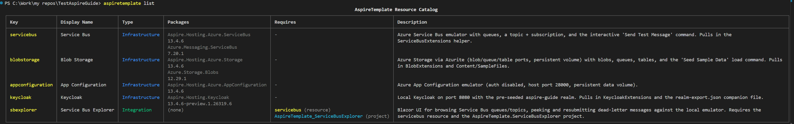
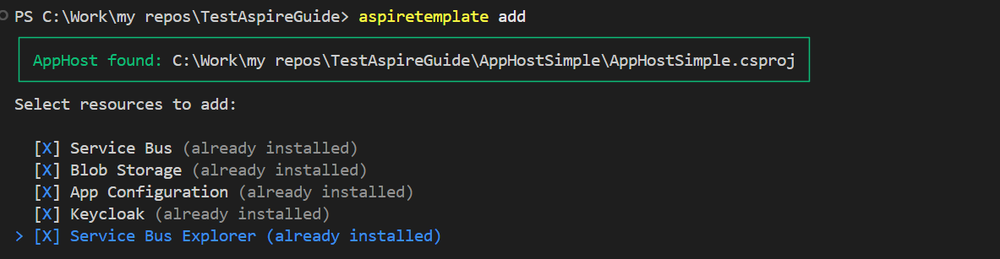

# AspireTemplate

AspireTemplate is a practical reference application for integrating Azure services with .NET Aspire. It includes an Aspire AppHost, a sample API, an isolated-worker Azure Functions app, and an EF Core migration service.

The project is designed to help developers understand the complete local-development workflow: define resources in the AppHost, connect them to application projects, run local emulators and containers, and replace those resources with managed Azure services when deploying.

The AppHost is the source of truth for the local application topology. It provisions development resources, supplies connection strings and environment variables, and coordinates startup dependencies so applications begin only when their required resources are ready.

## What's Included

The repository demonstrates configuration patterns for:

- **Azure Service Bus** — queues, topics, subscriptions, message filtering, and local testing
- **Azure Storage** — Blob, Queue, and Table Storage with Azurite for local development
- **Azure Key Vault** — loading secrets through `DefaultAzureCredential`
- **SQL Server and Azure SQL** — local containers, external connections, and EF Core migrations
- **Azure App Configuration** — key-value settings, refresh, labels, and feature flags
- **Keycloak** — local OpenID Connect authentication for user and machine-to-machine tokens
- **Azure Functions** — isolated-worker HTTP and Service Bus triggers

## Documentation

Use the guides below as step-by-step references when configuring each resource:

- [Service Bus Configuration Guide](docs/Service_Bus_Guide.md) — Add queues, topics, subscriptions, filters, project references, and dashboard test commands.
- [Azure Storage Configuration Guide](docs/Storage_Guide.md) — Configure Azurite, add storage services, seed Blob Storage, and connect applications.
- [Key Vault Configuration Guide](docs/Key_Vault_Guide.md) — Configure a vault URL, authenticate with Azure CLI, assign access, and load secrets.
- [SQL Server Configuration Guide](docs/SQL_Configuration_Guide.md) — Configure local SQL Server, connect to Azure SQL, and run EF Core migrations.
- [App Configuration Setup Guide](docs/App_Configuration_Guide.md) — Create emulator key-values and feature flags, enable refresh, and use labels.
- [Keycloak Authentication Configuration Guide](docs/Keycloak_Token_Generation_Guide.md) — Run Keycloak with Aspire or Docker, import a realm, and test authentication flows.
- [Azure Functions Configuration Guide](docs/Azure_Functions_Guide.md) — Register an isolated-worker Function App and connect HTTP and Service Bus triggers.
- [Azure CLI Authentication Guide](docs/Azure_Login_DevContainer_Guides.md) — Authenticate from a dev container with Azure CLI and understand local versus managed-identity credentials.

## Prerequisites

- .NET 10 SDK
- Docker Desktop, required for the local SQL Server, Service Bus emulator, Azurite, Keycloak, and App Configuration emulator
- Azure Functions Core Tools, only if you want to run the Functions app outside the Aspire AppHost
- Azure CLI, if you need to authenticate to Azure resources during local development

## Run locally

From the repository root, start the AppHost:

```bash
dotnet run --project infrastructure/AspireTemplate.AppHost
```

Open the Aspire dashboard URL printed in the terminal. Use the dashboard to monitor resource health, inspect endpoints and connection details, and run the custom **Send Test Message** and **Seed Sample Data** commands.

The local AppHost uses persistent Docker volumes for SQL Server, Azurite, Keycloak, and App Configuration. Remove the relevant volume only when you need to reset emulator data, because doing so permanently deletes that local state.

## Integration Options

New developers can use AspireTemplate in three ways:

### Option 1: Clone and Run Independently

Clone this repository and run it as a standalone reference application. This approach is best for learning and understanding how to structure an Aspire application.

```bash
git clone https://github.com/your-org/AspireTemplate.git
cd AspireTemplate
dotnet run --project infrastructure/AspireTemplate.AppHost
```

**When to use:**
- You want a complete working example to study and learn from
- You need to understand Aspire patterns before implementing in your own project
- If you're working in a dev container, run AspireTemplate inside your dev container alongside your project, or ensure both are in the same dev container to connect between them
- Connection strings and service endpoints are available in the Aspire dashboard for integration into your applications

### Option 2: Copy Resources into Your AppHost

Extract the specific resources you need from this repository's AppHost and add them to your own application's AppHost. This is the most flexible approach when you want to use only certain resources without the full template.

**Steps:**
1. Open `infrastructure/AspireTemplate.AppHost/AppHost.cs` in this repository
2. Locate the resource definitions you need (e.g., Service Bus, Storage, SQL Server)
3. Copy the relevant code blocks into your AppHost's `Program.cs`
4. Reference the [configuration guides](#documentation) for detailed setup of each resource
5. Install any required NuGet packages in your projects

**When to use:**
- You have an existing AppHost and want to add specific resources
- You need to customize resource configuration for your project
- You prefer manual control over your AppHost setup

### Option 3: Use the AspireTemplate CLI Tool

Install the `AspireTemplate.ResourceCli` tool to interactively scaffold and add pre-configured resources to a new or existing AppHost. This approach automates code generation and dependency management.

**Quick start:**

```bash
# Build the NuGet package
cd infrastructure/AspireTemplate.ResourceCli
dotnet pack -o ./nupkg

# Install the tool locally (recommended for teams)
dotnet new tool-manifest
dotnet tool install --local AspireTemplate.ResourceCli --add-source ./infrastructure/AspireTemplate.ResourceCli/nupkg

# Use the tool
AspireTemplate list        # View available resources
AspireTemplate add         # Interactively add resources
```

For detailed installation and usage instructions, see the [ResourceCli README](infrastructure/AspireTemplate.ResourceCli/README.md).

**When to use:**
- Starting a new AppHost from scratch
- Quickly adding multiple pre-configured resources
- Teams that want consistency across projects

---

## Getting Started

### AppHost configuration

The [AppHost configuration](infrastructure/AspireTemplate.AppHost/AppHost.cs) contains the complete local topology and demonstrates:

- Service Bus queues, topics, subscriptions, and entity properties
- Azure Storage Blob, Queue, and Table services with Azurite
- Optional Key Vault configuration
- SQL Server initialization and EF Core migrations
- App Configuration refresh and feature-flag support
- A local Keycloak realm with API clients and test users
- An Azure Functions app connected to Service Bus and host storage

Use this file as a reference for your own AppHost, or copy individual resource definitions into another Aspire application.

### AspireTemplate.ResourceCli

The ResourceCli is a command-line tool that helps you discover and add Aspire resources to your applications. It serves as a minimum proof-of-concept for automating resource configuration and integration.

**Key features:**

- **List resources** — Discover available resources in the catalog with their types, required packages, and configuration details.
- **Add resources** — Interactively add resources to your AppHost and connect them to your projects with automatic code generation and dependency injection setup.

**Commands:**

```bash
aspiretemplate list
```
Shows all available resources, their packages, prerequisites, and descriptions:



```bash
aspiretemplate add
```
Guides you through selecting and adding resources to your AppHost with dependency resolution and automatic project references:



### Recommended workflow

1. Start with the relevant guide in the [documentation](#documentation).
2. Add or update the resource definition in the AppHost.
3. Reference the resource from the API, migration service, or Functions app.
4. Start the AppHost and verify the resource in the Aspire dashboard.
5. Replace emulators and development credentials with managed Azure resources and managed identities before deployment.

The sample API demonstrates Blob Storage access, Service Bus processors, Key Vault configuration, App Configuration refresh, feature flags, health checks, and protected endpoints. Local Keycloak tokens can be replaced with Microsoft Entra ID tokens through configuration without changing the API's authorization endpoints.

## Configuration and security notes

- Store local secrets such as `Parameters:SqlPassword` in user secrets or another local secret store. Never commit production connection strings, client secrets, passwords, or access tokens.
- `KeyVaultUrl` is optional. When it is empty, the API skips Key Vault registration and continues with its other configuration providers.
- `Authentication__Authority` and `Authentication__Audience` control JWT validation. The AppHost supplies the local Keycloak authority; production deployments should provide Microsoft Entra ID values through secure configuration.
- Emulator authentication settings are for local development only. Use managed Azure resources, Microsoft Entra authentication, and managed identities in deployed environments.
- Grant identities only the data-plane permissions they need, such as `Storage Blob Data Reader`, `Key Vault Secrets User`, or `Azure Service Bus Data Receiver`.
