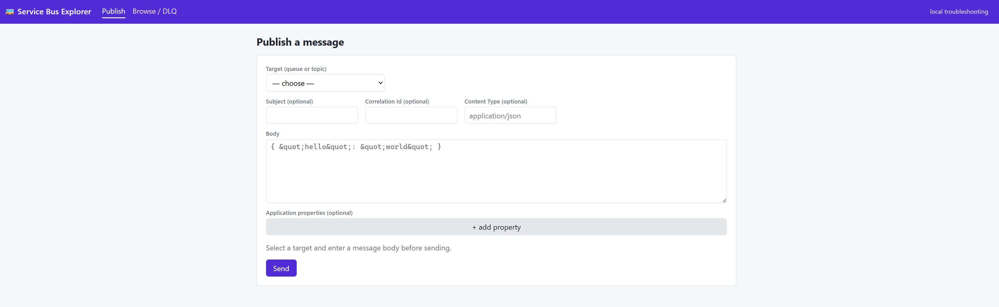
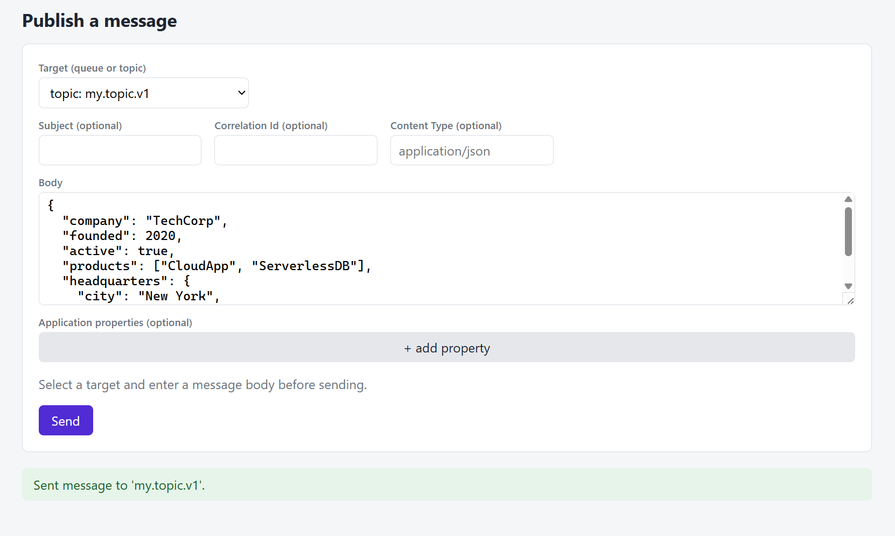
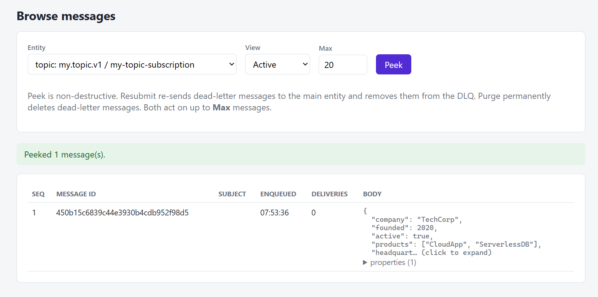
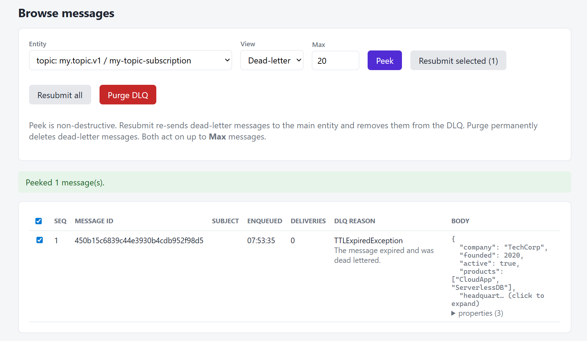

# Service Bus Explorer

Use this guide to add Service Bus Explorer UI to an Aspire AppHost for local development and testing.

## 1. Add the Service Bus Explorer resource

```csharp
// Local troubleshooting UI (Blazor Server): publish messages to queues/topics and
// peek / resubmit / purge dead-letter and active messages against the Service Bus emulator.
builder.AddProject<Projects.AspireTemplate_ServiceBusExplorer>("sb-explorer")
    .WithReference(serviceBus, connectionName: "AzureServiceBus")
    .WaitFor(serviceBus)
    .WithHttpEndpoint(port: 59256, name: "http", isProxied: true);
```

The Service Bus Explorer project is a Blazor Server app that provides a local UI for interacting with the Service Bus emulator. It allows developers to publish messages to queues and topics, as well as peek, resubmit, and purge dead-letter and active messages.

You need to also have a service bus resource defined in the AppHost for the Service Bus Explorer to work. The `WithReference` method is used to link the Service Bus Explorer project to the Service Bus resource, and the `WaitFor` method ensures that the Service Bus resource is available before starting the Service Bus Explorer.

## 2. Add the Service Bus Explorer project

Add the Service Bus Explorer project to your solution. You can do this by copying the `AspireTemplate.ServiceBusExplorer` project from the AspireTemplate repository into your solution. This project contains the Blazor Server app that provides the Service Bus Explorer UI.

## 3. Configure the Service Bus Explorer project

Add the queues and topics you want to explore in the Service Bus Explorer project. You can do this by modifying the `appsettings.json` file in the Service Bus Explorer project. Add the names of the queues and topics you want to explore under the `ServiceBus` section.

```json
{
  "ServiceBus": {
    "Entities": {
      "Queues": ["my.queue.v1", "my.queue.v2"],
      "Topics": [
        {
          "Name": "my.topic.v1",
          "Subscriptions": [
            "my-topic-subscription",
            "sample-function-subscription"
          ]
        }
      ]
    }
  }
}
```

## 4. Run the AppHost

Once you have added the Service Bus Explorer resource and configured the project, you can run the AppHost. The Service Bus Explorer UI will be available at the specified port (e.g., `http://localhost:59256`) and will allow you to interact with the Service Bus emulator.



**Publish a message**

To publish a message, fill in the required fields in the Service Bus Explorer UI and click the "Send" button. This will send the message to the specified queue or topic in the Service Bus emulator.



**Peek Message**

To peek at messages in a queue or subscription, go to the `Browse / DLQ` tab, select the desired entity from the list, in the `View` dropdown select the `Active` option and click the "Peek" button. This will display the messages currently in the queue or subscription without removing them.



**Read message from DLQ**

To read messages from the dead-letter queue (DLQ), go to the `Browse / DLQ` tab, select the desired entity from the list, in the `View` dropdown select the `Dead-Letter` option and click the "Peek" button. This will display the messages currently in the dead-letter queue.



The UI provides options to resubmit selected or all messages back to the original queue or subscription, or to purge them from the dead-letter queue.
