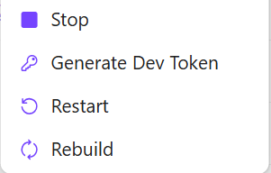
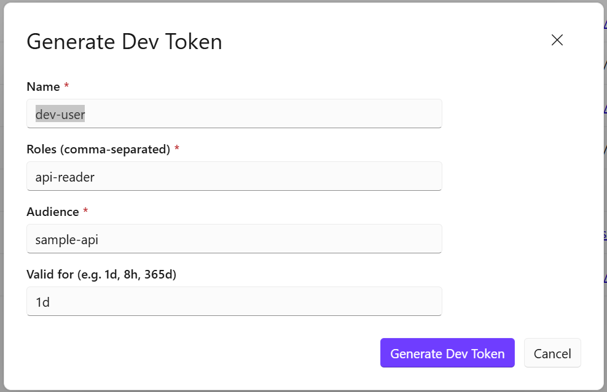
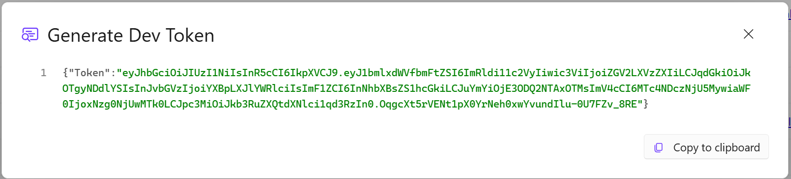

# dotnet user-jwts Authentication Guide

Use this guide when you want to develop and test the API locally **without running a Keycloak Docker container**. The `dotnet user-jwts` tool issues signed JWTs directly using a key stored in your user-secrets — no container, no volume, instant startup.

For the Keycloak-based setup (full OpenID Connect), see [Keycloak_Token_Generation_Guide.md](Keycloak_Token_Generation_Guide.md).

## 1. When to use dotnet user-jwts

|                              | Keycloak             | dotnet user-jwts |
| ---------------------------- | -------------------- | ---------------- |
| Requires Docker              | Yes                  | No               |
| Startup time                 | ~10–30 s (container) | Instant          |
| Supports browser / PKCE flow | Yes                  | No               |
| Token refresh                | Yes                  | No (re-generate) |
| Closest to production        | Yes                  | No               |
| Good for quick API testing   | Yes                  | Yes              |

Use `dotnet user-jwts` when you want a fast feedback loop or are working in an environment where Docker is not available.

## 2. Switch the AppHost to user-jwts mode

In `infrastructure/AspireTemplate.AppHost/AppHost.cs`, the Identity region has two commented-out lines for the Keycloak path. Make sure they are **commented out**:

```csharp
// var keycloak = builder.AddLocalKeycloak();

var api = builder.AddProject<...>("sample-api")
    ...
    .WithUserJwtCommands()               // ← this line must be present
```

No other code changes are needed. The API's `AddApiAuthentication()` in ServiceDefaults detects the user-jwts configuration automatically.

## 3. Generate a token on demand (Aspire dashboard)

1. Start the AppHost:
   ```bash
   dotnet run --project infrastructure/AspireTemplate.AppHost
   ```
2. Open the Aspire dashboard (URL printed on startup).
3. Find the **sample-api** resource and click **Generate Dev Token**.
   <br>
4. A dialog appears with pre-filled inputs:
   <br>
   | Field | Default | Description |
   |---|---|---|
   | Name | `dev-user` | Embedded as the JWT `sub` / `name` claim |
   | Roles | `api-reader` | Comma-separated; e.g. `api-reader, api-writer` |
   | Audience | `sample-api` | Must match the API audience config |
   | Valid for | `1d` | Lifetime: `1d`, `8h`, `365d`, etc. |
5. Click **Generate Dev Token**. The raw token appears in the notification panel — copy it.
   <br>

The first time you generate a token for a given project, `dotnet user-jwts` also writes the issuer config into `src/AspireTemplate.SampleApi/appsettings.Development.json`. This file is safe to commit (it contains only the issuer name, not the signing key).

## 4. Generate tokens in bulk (script)

Run the script from the repo root to create tokens for all three standard identities at once:

```powershell
.\infrastructure\AspireTemplate.AppHost\Scripts\Generate-UserJwts.ps1
```

Optional parameters:

```powershell
.\infrastructure\AspireTemplate.AppHost\Scripts\Generate-UserJwts.ps1 `
    -Project  "src/AspireTemplate.SampleApi" `
    -Audience "sample-api" `
    -ValidFor "365d"
```

Identities created by the script:

| Identity         | Roles                                          | Equivalent Keycloak user |
| ---------------- | ---------------------------------------------- | ------------------------ |
| `dev-user`       | `api-reader`                                   | `dev-user`               |
| `dev-admin`      | `api-reader`, `api-writer`                     | `dev-admin`              |
| `sample-api-m2m` | `api-reader`, `api-writer` + `client_id` claim | `sample-api-m2m` client  |

## 5. Call a protected endpoint

```bash
curl http://localhost:<api-port>/api/secure/whoami \
  -H "Authorization: Bearer <token>"

curl http://localhost:<api-port>/api/secure/files \
  -H "Authorization: Bearer <token>"
```

Replace `<api-port>` with the port shown in the Aspire dashboard for `sample-api`.

## 6. List and inspect existing tokens

```bash
# List all tokens issued for the project
dotnet user-jwts list --project src/AspireTemplate.SampleApi

# Print full details (claims, expiry, compact token)
dotnet user-jwts print <ID> --show-all --project src/AspireTemplate.SampleApi
```

## 7. Reset the signing key

Resetting the key immediately invalidates **all** previously issued tokens. All tokens must be re-generated afterwards.

```bash
dotnet user-jwts key --reset --project src/AspireTemplate.SampleApi
```

## References

- [Generate tokens with dotnet user-jwts | Microsoft Learn](https://learn.microsoft.com/en-us/aspnet/core/security/authentication/jwt-authn)
