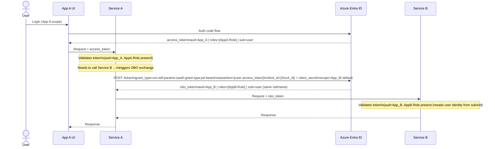
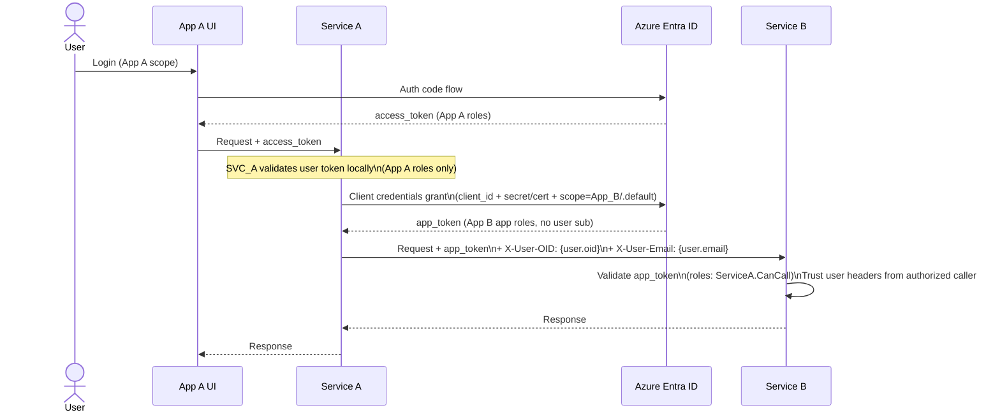
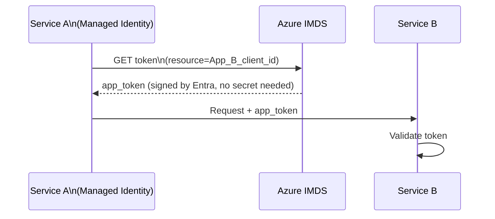
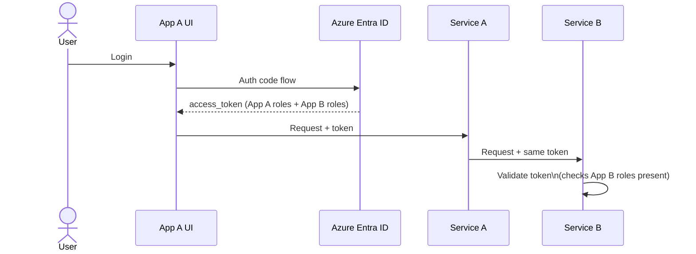

# Cross-Service Authentication in Azure Entra ID

## Context

Two independent apps (App A, App B), each with its own UI and backend service, each using its own Entra app registration and roles. App A's backend needs to call App B's service.

**Problem:** User tokens are scoped per-app — App A's token carries App A roles; App B will reject it.

---

## Option 1: On-Behalf-Of (OBO) Flow

User authenticates against App A and receives a token scoped to App A. When Service A needs to call Service B, it performs an OBO exchange — presenting the user's App A token plus its own client credentials to Entra. Entra issues a **new token**: audience is App B, roles are App B's roles, but `oid`/`sub`/`name` still identify the original user. Service A never forwards the original token.

### Constraints

| # | Constraint |
|---|---|
| 1 | Service A's app registration must have **delegated permission** `user_impersonation` on App B's registration. |
| 2 | The original user token must have been issued with `scp` (delegated), not `roles` (app-only). OBO does **not** work with client-credentials tokens. |
| 3 | The user must have consented (or admin-consented) to Service A acting on their behalf for App B. |
| 4 | Adds a **synchronous Entra round-trip** per call chain. Cache the OBO token (keyed on input token hash) to mitigate. |
| 5 | Token chain depth matters: Entra supports OBO chains but each hop requires explicit permissions. Three-service chains get complex fast. |
| 6 | If App B is multi-tenant, the OBO exchange must target the correct tenant. |

### When to use

Service B needs to make **per-user authorization decisions** — row-level security, user-specific data, compliance audit trails. The user identity must be cryptographically verifiable at Service B.

---

## Option 2: Client Credentials / Machine-to-Machine (M2M)

Service A authenticates as itself using its own client credentials. Service B grants Service A an **App Role**. User context, if needed, is passed as a trusted request header.

### Constraints

| # | Constraint |
|---|---|
| 1 | Service B must define an **App Role** (e.g., `ServiceA.CanCall`) and assign it to Service A's service principal. |
| 2 | User identity in headers (`X-User-OID`, etc.) is **convention, not cryptographic proof**. Service B must fully trust Service A not to spoof it. Enforce with network policy, private endpoints, or a service mesh. |
| 3 | Service A must securely store its client secret or certificate. Prefer **Managed Identity** to eliminate secret management entirely. |
| 4 | Service B **cannot** re-delegate the user's identity further down a call chain — there is no user token to exchange. |
| 5 | App tokens are long-lived (default 1h). Cache them and reuse until near expiry. Do not request a new token per call. |
| 6 | Audit logs in Service B will show Service A as the caller, not the end user — unless you explicitly log the forwarded OID header. |

### Managed Identity variant

If both services run on Azure (App Service, Container Apps, AKS), skip client secrets entirely:

### When to use

Service B only needs to trust **which service** is calling, not who the end user is. Standard microservice pattern. Cleanest operational model — no token chain, no OBO latency, no user-consent requirements.

---

## Option 3: Unified App Registration (Avoid)

A single app registration holds roles for both services. Users are assigned all roles up front.

### Constraints

| # | Constraint |
|---|---|
| 1 | **Tight coupling**: both services share one app registration. Any permission change to either service risks the other. |
| 2 | Tokens carry roles irrelevant to the current context — violates least privilege. |
| 3 | Adding a third service requires updating the shared registration and re-consenting. Does not scale. |
| 4 | Services can't evolve their auth models independently (different token lifetimes, conditional access policies, etc.). |
| 5 | If App B is consumed by external callers too, you can't scope its exposure cleanly. |

### When to use

Never in a proper microservices architecture. Acceptable only for a tightly coupled monolith being split incrementally as a short-term bridge.

---

## Decision Matrix

| Requirement | OBO | M2M + Headers | Unified Reg |
|---|:---:|:---:|:---:|
| User identity cryptographically verifiable at Service B | ✅ | ❌ | ✅ |
| Per-user RBAC in Service B | ✅ | ⚠️ (via headers) | ✅ |
| No user consent required | ❌ | ✅ | ❌ |
| Works with Managed Identity | ❌ | ✅ | ❌ |
| Scales to N services cleanly | ⚠️ | ✅ | ❌ |
| Minimal operational complexity | ❌ | ✅ | ⚠️ |
| Services evolve independently | ✅ | ✅ | ❌ |

**Default choice for microservices: M2M with Managed Identity.**
Fall back to OBO only when Service B has hard requirement on verified user identity.
