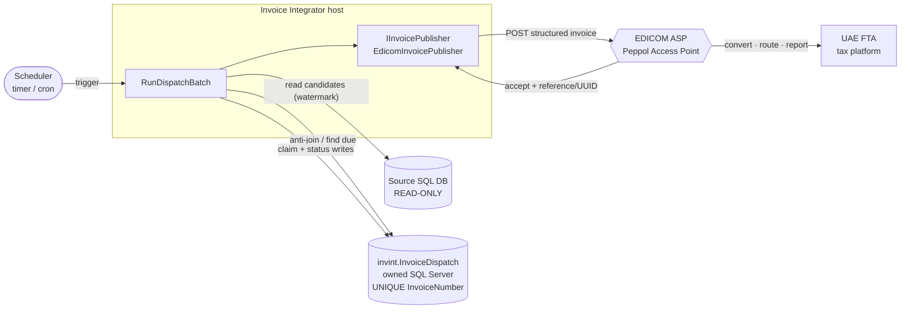

# ADR-001: EDICOM Invoice Integration Service (UAE e-Invoicing)

## Context and Problem Statement

The United Arab Emirates is introducing a mandatory e-invoicing regime built on the **Peppol 5-corner model**. Businesses do not submit invoices directly to the Federal Tax Authority (FTA); instead they transmit them through an **Accredited Service Provider (ASP)** that operates a Peppol Access Point. The ASP converts the document to the required structured format (**AE PINT / UBL XML**), routes it to the buyer's Access Point, and simultaneously reports the tax data to the government platform, which confirms receipt without validating content.

[EDICOM](https://edicomgroup.com/electronic-invoicing/united-arab-emirates) is an officially certified ASP for the UAE and exposes an enterprise REST API for invoice submission. We need an **internal system that extracts invoice datapoints from an existing line-of-business SQL database and publishes them to EDICOM**, so EDICOM can act as the middle-man to the UAE tax authority.

Several hard constraints shape the design:

- **The source SQL database is read-only to us.** We may query it to extract datapoints but must **not** add columns, flags, or tables to track what we have already sent. Duplicate-send prevention must therefore live in a store we own.
- **The invoice number is unique** in the source system and is the natural business key for deduplication.
- **The service is a scheduled, non-interactive worker.** It runs on a trigger at any given time (Azure Function timer trigger by default, or an App Service with a scheduler as an alternative) — it is not a request/response API.
- **EDICOM's exact API contract and resilience guidance are not yet available.** The design must define sensible default resilience behaviour now and leave a clearly-marked seam to adopt EDICOM's official guidance once their API docs arrive.

The core problems to solve are therefore: **(1) how to extract without a source-side marker, (2) how to guarantee an invoice is never sent to EDICOM twice, (3) how to audit every dispatch (success or failure) for a 7-year-retention regime, and (4) how to be resilient to transient EDICOM/network failures so a failed invoice is retried later rather than lost.**

---

## Decision Drivers

- **No writes to the source database.** Deduplication and audit state must be owned by this system, never persisted back to the source.
- **Exactly-once dispatch (effectively).** An invoice number that has already been accepted by EDICOM must never be sent again, even across overlapping or crashed runs.
- **Auditability for compliance.** Every attempt — when we sent it, what EDICOM returned (success reference/UUID or error), how many attempts — must be durably recorded and retained for seven years.
- **Resilience by default.** Transient failures (network, throttling, 5xx) must retry with backoff; exhausted records must be parked for later processing, not dropped.
- **Provider-agnostic seam.** EDICOM's concrete API is behind an interface so its contract, authentication, and retry semantics can be implemented/tuned once documented — without touching extraction or tracking logic.
- **Idempotent, restartable runs.** A run that crashes mid-batch must be safe to re-run; a claim mechanism prevents two concurrent runs sending the same invoice.
- **Deployment flexibility.** The same core must run as an Azure Function (timer trigger) or under an App Service / container with a scheduler, without logic changes.
- **Observability.** A single place for run metrics, per-invoice status, alerting on dead-lettered records, and reconciliation against the source.

---

## Considered Options

### Architecture

- Option A — Inline point-to-point: scheduled job reads source and pushes to EDICOM with no local state
- Option B — Scheduled extractor + owned tracking store + EDICOM publisher (async, status-driven) ✅
- Option C — Change-data-capture / event-driven off the source database

### Deduplication & Tracking Store (sub-decision, applies once Option B is chosen)

- Option 1 — Track state back in the source database
- Option 2 — Dedicated SQL Server schema + table in a database we own ✅
- Option 3 — Azure Table Storage / Cosmos DB tracking store

### Trigger / Hosting

- Option T1 — Azure Function with timer trigger ✅ (default)
- Option T2 — App Service / container host with an in-process scheduler (Quartz / Hangfire)

---

## Decision Outcome

**Chosen architecture: Option B — Scheduled extractor + owned tracking store + EDICOM publisher.** On each run the service extracts candidate invoices from the source database, **left-anti-joins them against our own tracking store** to find invoices not yet successfully dispatched (plus retry-eligible ones), atomically **claims** each one, transforms and submits it to EDICOM through a provider-agnostic port, and records the outcome. This is the only option that satisfies the "no source writes" and "never send twice" constraints simultaneously while producing a complete audit trail.

**Chosen tracking store: Option 2 — a dedicated SQL Server schema + table in a database we own.** A single table (`invint.InvoiceDispatch`) keyed by the unique invoice number, with a **UNIQUE constraint on `InvoiceNumber`** as the hard deduplication guarantee, holds per-invoice status, attempt count, EDICOM reference/UUID, last error, and audit timestamps. SQL Server is chosen over Table/Cosmos because the data is relational and low-volume, transactional claim semantics (`UPDATE … OUTPUT` / row locking) are first-class, the team already operates SQL Server, and reconciliation queries against the source are natural in the same engine.

**Chosen trigger: Option T1 — Azure Function timer trigger by default**, with the hexagonal core deliberately host-agnostic so Option T2 (App Service + scheduler) is a drop-in alternative for environments where a long-running host or in-process scheduling is preferred.

**Resilience:** Because EDICOM's official guidance is not yet available, the service ships with a **default resilience profile** (Polly-based retry with exponential backoff + jitter for transient faults; a status-driven "retry later" path for exhausted attempts; dead-lettering with alerting). This profile lives behind the EDICOM port and configuration, so it can be **replaced or tuned to match EDICOM's documented rate limits, idempotency keys, and error taxonomy** once received — see [Resilience Strategy](#resilience-strategy).

### Consequences

- Good, because the source database is never written to — all state lives in a store we own.
- Good, because the `UNIQUE(InvoiceNumber)` constraint makes double-dispatch impossible at the database level, independent of application logic.
- Good, because every dispatch attempt is durably audited (status, attempts, EDICOM reference/UUID, error, timestamps), satisfying the 7-year retention regime.
- Good, because runs are idempotent and restartable: a crashed run leaves claimed rows that a later run reclaims after a visibility timeout.
- Good, because transient EDICOM/network failures are retried automatically and exhausted records are parked for later processing rather than lost.
- Good, because the EDICOM contract is isolated behind a port; adopting EDICOM's real API and resilience guidance changes one adapter, not the pipeline.
- Good, because the same core runs unchanged as an Azure Function or under an App Service scheduler.
- Bad, because the design depends on the invoice number genuinely being unique and stable in the source; a reused or mutated number would defeat deduplication (mitigated by a content hash — see design).
- Bad, because it introduces and operates a new database/schema and a scheduled service that must be monitored.
- Bad, because "extract every run and anti-join" costs a source query each run; a high-water-mark watermark is added to keep the candidate set bounded (see design). **The watermark field must be confirmed against the source schema** — it requires a monotonically increasing, stable field (e.g. an auto-increment `InvoiceId`, a `CreatedAtUtc` timestamp, or a sequential invoice number that is never recycled or backdated); if no suitable field exists, every run must perform a full scan until one is introduced.
- Bad, because EDICOM specifics (auth, exact payload, error codes) are stubbed until their docs arrive — the first integration milestone is confirming the adapter against real EDICOM sandbox responses.

---

## Confirmation

The decision is being followed if:

- No code path issues an `INSERT`, `UPDATE`, `DELETE`, or DDL against the **source** database — the source connection is opened with a **read-only** login and architecture tests assert the source repository exposes only read methods.
- `invint.InvoiceDispatch` has a `UNIQUE` constraint on `InvoiceNumber`; an integration test proves a second dispatch of the same invoice number is rejected/no-ops rather than producing a second EDICOM submission.
- The EDICOM SDK/HTTP client is referenced **only** in the infrastructure adapter (`EdicomInvoicePublisher`) and nowhere else; `Application` has no dependency on any EDICOM or HTTP library (NetArchTest rule).
- Every invoice that leaves `Sent` has a recorded terminal outcome (`Acknowledged`, `Failed`, or `DeadLettered`) with a timestamp and, on success, the EDICOM reference/UUID.
- A crashed/duplicated run does not produce duplicate submissions (concurrency/claim integration test with two parallel runners over the same candidate set).
- Records that exhaust their retry budget appear in `DeadLettered` and raise an alert — none are silently dropped.

---

## Pros and Cons of the Options

### Option A — Inline point-to-point (no local state)

`Scheduled job queries the source and POSTs each invoice to EDICOM in the same loop, with no persisted tracking.`

- Good, because it is the least code and has no extra store to operate.
- Bad, because there is **no way to know what was already sent** without writing to the source — which is forbidden — so re-runs re-send everything.
- Bad, because a crash mid-run leaves an unknown partial state; recovery is guesswork.
- Bad, because there is no audit trail for a 7-year-retention regime.
- Bad, because a transient EDICOM failure loses the invoice for that run with no structured retry.

### Option B — Scheduled extractor + owned tracking store + EDICOM publisher (chosen)

- Good, because deduplication and audit live in a store we own without touching the source.
- Good, because status-driven processing gives idempotent, restartable runs and a natural retry-later path.
- Good, because it produces a complete, queryable audit trail and reconciliation surface.
- Good, because the EDICOM contract and resilience policy are isolated and swappable.
- Neutral, because it requires one extra source query per run (bounded by a watermark) and a claim step.
- Bad, because it introduces a new store and service to operate and monitor.

### Option C — Change-data-capture / event-driven off the source

`Use SQL CDC / change tracking / triggers on the source to emit invoice events to a queue that the publisher consumes.`

- Good, because it reacts in near-real-time instead of on a schedule.
- Good, because the candidate set is naturally incremental (only changed rows).
- Bad, because enabling CDC/change-tracking or triggers is a **modification of the source database**, which is out of bounds for us.
- Bad, because it adds queue infrastructure and a more complex operational model than the phased, scheduled mandate requires.
- Bad, because ordering/replay and duplicate events still need an owned dedup store — so it does not remove Option B's store, it adds to it. Reconsider only if near-real-time submission becomes a requirement and source-side CDC becomes permissible.

---

### Option 1 — Track state in the source database

- Good, because a single database holds both invoices and their dispatch state, simplifying joins.
- Bad, because it **requires writing to the source** (a new column/table/flag) — explicitly forbidden.
- Bad, because it couples our processing lifecycle to a database we do not own or control the schema of.

### Option 2 — Dedicated SQL Server schema + table (chosen)

`Own database, schema invint, table InvoiceDispatch keyed by InvoiceNumber with UNIQUE constraint.`

- Good, because it never touches the source — state is fully ours.
- Good, because a `UNIQUE(InvoiceNumber)` constraint is a hard, engine-enforced dedup guarantee.
- Good, because transactional claim (`UPDATE … OUTPUT`, row locks) and retry-window queries are first-class in SQL.
- Good, because reconciliation against the source (same engine/toolchain) and 7-year auditing are straightforward.
- Neutral, because it is one more database object to provision, back up, and retain.
- Bad, because at very high volume a single hot table needs index care (mitigated: low invoice volume, indexed status/next-attempt columns).

### Option 3 — Azure Table Storage / Cosmos DB tracking store

- Good, because it is serverless, cheap at scale, and needs no schema migrations.
- Good, because a point lookup by `InvoiceNumber` (partition/row key) is fast for the dedup check.
- Bad, because atomic multi-row claim and "due for retry" range queries are clumsier than a SQL `UPDATE … WHERE status = … AND nextAttempt <= now`.
- Bad, because reconciliation joins against the SQL source now cross two stores/engines.
- Neutral, because it remains a valid swap: `IDispatchStore` is an interface, so a `TableDispatchStore` can replace the SQL adapter if operational preference changes.

---

### Option T1 — Azure Function timer trigger (chosen default)

- Good, because it is fully managed, scales to zero, and the timer schedule is declarative (CRON).
- Good, because it matches a "runs at any given time" batch model with no host to keep alive.
- Neutral, because execution time limits (Consumption plan) require the run to be batch-bounded and resumable — which the claim/status model already provides.
- Bad, because very large catch-up batches may need the Premium/Dedicated plan to avoid timeouts.

### Option T2 — App Service / container + in-process scheduler (Quartz / Hangfire)

- Good, because it suits long-running or high-frequency schedules and gives full control over execution windows.
- Good, because Hangfire adds a built-in dashboard, retries, and job persistence.
- Bad, because it runs an always-on host (cost) and adds a scheduler dependency.
- Neutral, because the hexagonal core is identical — only the driving adapter/composition root differs, so this is a deployment choice, not an architecture change.

---

## Resilience Strategy

> **This section defines the _default_ profile. It is explicitly provisional and must be reconciled with EDICOM's official API documentation and integration guidance once available** — in particular their authentication model, idempotency-key mechanism, rate limits, retry-after semantics, and error taxonomy. Everything here lives behind the `IInvoicePublisher` port and configuration so it can be tuned without touching the extraction/tracking pipeline.

**Fault classification.** Responses from EDICOM are classified into three buckets by the adapter:

| Class         | Examples (assumed until EDICOM confirms)                                     | Action                                                 |
| ------------- | ---------------------------------------------------------------------------- | ------------------------------------------------------ |
| **Transient** | Network timeout, connection reset, HTTP 429, 502/503/504                     | Retry with backoff (in-run, bounded)                   |
| **Permanent** | HTTP 400/422 validation errors, 401/403 auth/permission, business rejections | No in-run retry → mark `Failed`; needs data/config fix |
| **Unknown**   | Anything unmapped                                                            | Treat as transient once, then escalate to `Failed`     |

**In-run retry (Polly).** Transient faults are retried inside the run using **exponential backoff with jitter** (e.g. base 2s, factor 2, ±20% jitter, max ~5 attempts) plus a **circuit breaker** so a sustained EDICOM outage short-circuits the rest of the batch quickly rather than hammering it. Defaults are configuration values.

**Cross-run "retry later".** If in-run retries are exhausted (or the circuit is open), the invoice is **not** dropped: it is written back as `Retryable` with an incremented `AttemptCount` and a computed `NextAttemptAtUtc` (backoff schedule). The **next scheduled run** picks up all rows where `Status = Retryable AND NextAttemptAtUtc <= now`, so recovery is automatic across runs without any queue.

**Dead-lettering.** When `AttemptCount` exceeds the configured maximum (e.g. 8), the row transitions to `DeadLettered`, which raises an alert and is excluded from automatic pick-up. It requires manual inspection/replay (a supported operation resets it to `Retryable`).

**Idempotency toward EDICOM.** The invoice number (and/or the per-invoice UUID) is sent as EDICOM's idempotency/reference key **if EDICOM supports one** (to be confirmed). Combined with our own claim + `UNIQUE(InvoiceNumber)` guard, this makes a retry after an ambiguous timeout safe: we reconcile by querying EDICOM's status for that reference before re-submitting, rather than blindly re-sending.

**Crash safety / claim visibility timeout.** A row is `Claimed` (with a `ClaimedAtUtc`/owner) before submission. If a run crashes after claiming but before recording an outcome, a later run reclaims rows whose claim is older than a visibility timeout — preventing both permanent stranding and concurrent double-send.

**Poison-message protection.** A permanent validation failure never re-enters the transient retry loop; it goes straight to `Failed` with the structured EDICOM error stored for triage.

---

## More Information

### High-Level Flow

```
Scheduler (timer / cron)
  │  trigger run
  ▼
┌──────────────────────────────────────────────────────────────┐
│  Invoice Integrator (worker)                                  │
│  1. Read candidate invoices from SOURCE DB (read-only)        │
│     — bounded by high-water-mark watermark                    │
│  2. Anti-join against invint.InvoiceDispatch                  │
│     — new invoices + rows Retryable & due                     │
│  3. For each candidate:                                       │
│     a. Claim row (Pending/Retryable → Claimed) [atomic]       │
│     b. Map source datapoints → EDICOM payload (AE PINT/UBL)   │
│     c. Submit to EDICOM via IInvoicePublisher                 │
│        · transient error → Polly retry (backoff+jitter)       │
│     d. On accept  → Sent → Acknowledged (+ EDICOM ref/UUID)   │
│        On reject  → Failed (store EDICOM error)               │
│        On exhaust → Retryable (+ NextAttemptAtUtc)            │
│                     or DeadLettered (attempts > max)          │
│  4. Record audit + update watermark                           │
└───────────────────────────────┬──────────────────────────────┘
                                │  REST (structured invoice)
                                ▼
                     ┌────────────────────────┐
                     │  EDICOM (ASP / Peppol   │
                     │  Access Point)          │
                     │  · convert to AE PINT   │
                     │  · route to buyer AP    │
                     │  · report to FTA        │
                     └────────────────────────┘
```



### Invoice Dispatch Status Lifecycle

| Status         | Meaning                                                                                | Terminal?                |
| -------------- | -------------------------------------------------------------------------------------- | ------------------------ |
| `Pending`      | Discovered from source; not yet attempted                                              | no                       |
| `Claimed`      | Reserved by a run for submission (has owner + `ClaimedAtUtc`)                          | no                       |
| `Sent`         | Submitted to EDICOM; awaiting/holding accept confirmation                              | no                       |
| `Acknowledged` | EDICOM accepted; reference/UUID recorded                                               | ✅                       |
| `Failed`       | Permanent rejection (validation/business); needs a fix                                 | ✅ (until manual replay) |
| `Retryable`    | Transient failure or exhausted in-run retries; eligible next run at `NextAttemptAtUtc` | no                       |
| `DeadLettered` | Retry budget exhausted; alert raised; manual intervention                              | ✅ (until manual replay) |

```
Pending ──► Claimed ──► Sent ──► Acknowledged
              │           └──► Retryable ──► (next run) ──► Claimed
              │           └──► Failed
              └──► Retryable ──► DeadLettered (attempts > max)
```

### Deduplication Rules

| Scenario                                                                      | Behaviour                                                                               |
| ----------------------------------------------------------------------------- | --------------------------------------------------------------------------------------- |
| Invoice number not in tracking store                                          | Insert `Pending`, claim, submit                                                         |
| Invoice number present, status `Acknowledged`                                 | Skip — already sent (never re-submit)                                                   |
| Invoice number present, status `Failed`                                       | Skip automatic pick-up — awaits data fix / manual replay                                |
| Invoice number present, status `Retryable` and `NextAttemptAtUtc <= now`      | Claim and re-submit                                                                     |
| Invoice number present, status `Claimed`/`Sent` within visibility timeout     | Skip — in flight in another run                                                         |
| Invoice number present, status `Claimed`/`Sent` older than visibility timeout | Reclaim (previous run assumed crashed)                                                  |
| Concurrent insert race on same invoice number                                 | `UNIQUE(InvoiceNumber)` rejects the second insert — no duplicate row, no duplicate send |

### Tracking Table (owned SQL Server)

```sql
CREATE SCHEMA invint;
GO

CREATE TABLE invint.InvoiceDispatch (
    InvoiceNumber      VARCHAR(64)   NOT NULL,             -- business key from source (unique)
    SourceSystem       VARCHAR(32)   NOT NULL,             -- provenance, for multi-source future
    Status             VARCHAR(20)   NOT NULL,             -- Pending|Claimed|Sent|Acknowledged|Failed|Retryable|DeadLettered
    AttemptCount       INT           NOT NULL DEFAULT 0,
    PayloadHash        CHAR(64)      NULL,                 -- SHA-256 of mapped payload; detects source mutation
    EdicomReference    VARCHAR(128)  NULL,                 -- EDICOM transaction id
    InvoiceUuid        UNIQUEIDENTIFIER NULL,              -- per-invoice UUID (traceability)
    LastErrorCode      VARCHAR(64)   NULL,
    LastErrorMessage   NVARCHAR(2000) NULL,
    ClaimedBy          VARCHAR(64)   NULL,                 -- run/instance id owning the claim
    ClaimedAtUtc       DATETIME2     NULL,
    NextAttemptAtUtc   DATETIME2     NULL,                 -- backoff schedule for Retryable
    CreatedAtUtc       DATETIME2     NOT NULL DEFAULT SYSUTCDATETIME(),
    UpdatedAtUtc       DATETIME2     NOT NULL DEFAULT SYSUTCDATETIME(),
    SentAtUtc          DATETIME2     NULL,
    AcknowledgedAtUtc  DATETIME2     NULL,
    CONSTRAINT PK_InvoiceDispatch PRIMARY KEY (InvoiceNumber),
    CONSTRAINT UQ_InvoiceDispatch_InvoiceNumber UNIQUE (InvoiceNumber)  -- hard dedup guarantee
);
GO

-- Fast "due for processing" scan
CREATE INDEX IX_InvoiceDispatch_Status_NextAttempt
    ON invint.InvoiceDispatch (Status, NextAttemptAtUtc)
    INCLUDE (AttemptCount, ClaimedAtUtc);
```

> The primary key already enforces uniqueness; the explicit `UQ_` constraint is stated to make the dedup guarantee unmistakable in the schema and satisfy the Confirmation check. `PayloadHash` lets a future enhancement detect that a source row changed after acknowledgement (out of scope for v1 — acknowledged invoices are immutable).

> **`SourceSystem` note.** In v1 there is a single source database, so `SourceSystem` will hold one hardcoded value (e.g. `"UAE-ERP"`). The column is reserved for a potential future where multiple source systems feed the same tracking store. If that happens, the current `UNIQUE(InvoiceNumber)` constraint would need to be replaced with `UNIQUE(InvoiceNumber, SourceSystem)` — because two different source systems could independently issue an invoice with the same number. This constraint change is a **breaking schema migration** and must be planned at that point. For v1, the value to use should be agreed with the team and set in configuration, not hardcoded in source.

### Run State Table — High-Water Mark (owned SQL Server)

A second table in the `invint` schema holds the watermark and any other per-run state. It is read at the **start** of every run and updated at the **end** of a successful run.

```sql
CREATE TABLE invint.RunState (
    Key          VARCHAR(64)   NOT NULL,
    Value        VARCHAR(128)  NOT NULL,
    UpdatedAtUtc DATETIME2     NOT NULL DEFAULT SYSUTCDATETIME(),
    CONSTRAINT PK_RunState PRIMARY KEY (Key)
);
GO

-- Seed on first deploy. '0' means "fetch everything from the beginning".
INSERT INTO invint.RunState (Key, Value) VALUES ('HighWaterMark', '0');
```

**How the watermark is used per run:**

| Step | Action |
|---|---|
| Start of run | Read `Value` WHERE `Key = 'HighWaterMark'` → use as `@LastHighWaterMark` in the source query |
| Query source | `WHERE <watermark field> > @LastHighWaterMark` |
| End of successful run | `UPDATE invint.RunState SET Value = <max watermark seen>, UpdatedAtUtc = SYSUTCDATETIME() WHERE Key = 'HighWaterMark'` |
| Crashed run | Watermark is **not** updated — next run re-fetches the same window (safe due to anti-join + `UNIQUE` constraint) |

**Watermark field candidates (to confirm against source schema):**

| Candidate | Type | Use if... |
|---|---|---|
| Auto-increment `InvoiceId` | `BIGINT` / `INT` | IDs are never recycled or backfilled — **preferred** |
| `CreatedAtUtc` / `CreatedDate` | `DATETIME2` | Timestamps are DB-set and never backdated; store as ISO-8601 string |
| Sequential invoice number | `VARCHAR` / `INT` | Guaranteed numeric, ordered, and never reused |
| None available | — | Full scan every run until a suitable field is introduced; flag as performance risk |

> The watermark field must be confirmed with the source DB owner before implementation — see [Open Questions (to close with source DB owner)](#open-questions-to-close-with-source-db-owner).

**Candidate extraction query (illustrative — field names to be confirmed against source schema):**

```sql
-- @LastHighWaterMark  : value from invint.RunState WHERE Key = 'HighWaterMark'
-- @VisibilityTimeout  : DATEADD(MINUTE, -@VisibilityTimeoutMinutes, SYSUTCDATETIME())
--                       computed in application from config (default 10 min)

SELECT
    s.InvoiceNumber,
    s.InvoiceDate,
    s.CustomerName
    -- ... other source fields required for the EDICOM payload
FROM source.Invoices s
LEFT JOIN invint.InvoiceDispatch d ON d.InvoiceNumber = s.InvoiceNumber
WHERE
    -- watermark: only rows newer than last successful run
    s.InvoiceId > @LastHighWaterMark
    AND (
        d.InvoiceNumber IS NULL                                                          -- never seen → insert Pending + claim
        OR (d.Status = 'Retryable'  AND d.NextAttemptAtUtc <= SYSUTCDATETIME())          -- due for retry
        OR (d.Status IN ('Claimed', 'Sent') AND d.ClaimedAtUtc < @VisibilityTimeout)     -- stale claim → previous run crashed, reclaim
    );
-- Rows with Status IN ('Acknowledged','Failed','DeadLettered') are excluded by the above conditions.
```

> `s.InvoiceId` is used as the watermark field in this example — replace with the confirmed monotonically increasing field from the source schema (`CreatedAtUtc`, sequential invoice number, etc.). `@VisibilityTimeoutMinutes` is a configuration value (default `10`); the cutoff is computed in application code as `DateTime.UtcNow.AddMinutes(-visibilityTimeoutMinutes)` and passed as `@VisibilityTimeout`.

### Open Questions (to close with EDICOM)

1. Exact REST endpoint(s), payload schema, and whether EDICOM accepts source-native data and does the AE PINT/UBL conversion, or expects pre-built UBL.
2. Authentication model (API key, OAuth2 client credentials, mTLS certificate).
3. Idempotency-key support and the reconciliation/status-query endpoint for ambiguous timeouts.
4. Rate limits, throttling headers (`Retry-After`), and recommended batch size.
5. Error taxonomy — which codes are permanent vs. transient — to finalise fault classification.
6. Who assigns the invoice **UUID** (us or EDICOM) and how acknowledgements/UUIDs are returned.

### Open Questions (to close with source DB owner)

1. **Watermark field** — Does the source table expose a reliable, monotonically increasing field suitable for use as a high-water-mark? Candidates to confirm:
   - Auto-increment integer primary key (e.g. `InvoiceId`) — preferred if IDs are never recycled or backfilled.
   - `CreatedAtUtc` / `CreatedDate` timestamp — viable if timestamps are set by the database (not the application) and are never backdated.
   - Sequential business invoice number — only if it is guaranteed to be numeric, ordered, and never reused.
   - If none of these exist, the extraction query must perform a full scan every run until a suitable field is available; this should be flagged as a performance risk for large datasets.

### Notes

**UAE e-invoicing mandate — background (per EDICOM; pending confirmation against official FTA guidance).** The following context informed the design but does not drive any architectural decision above. Dates and thresholds are summarised from EDICOM's UAE page and should be confirmed against the primary UAE Ministry of Finance / Federal Tax Authority sources before the ADR is finalised, as the timeline has shifted before.

- The regime is mandated in phases: companies with annual revenue **exceeding AED 50m from 1 Jan 2027**, companies with revenue **below AED 50m from 1 Jul 2027**, and **government entities from 1 Oct 2027**.
- Each electronic invoice must carry both a **sequential invoice number** and a unique **UUID** for traceability and duplicate prevention.
- Invoices must be **retained for seven years**.

Source: [EDICOM — Electronic Invoicing in the United Arab Emirates](https://edicomgroup.com/electronic-invoicing/united-arab-emirates).
