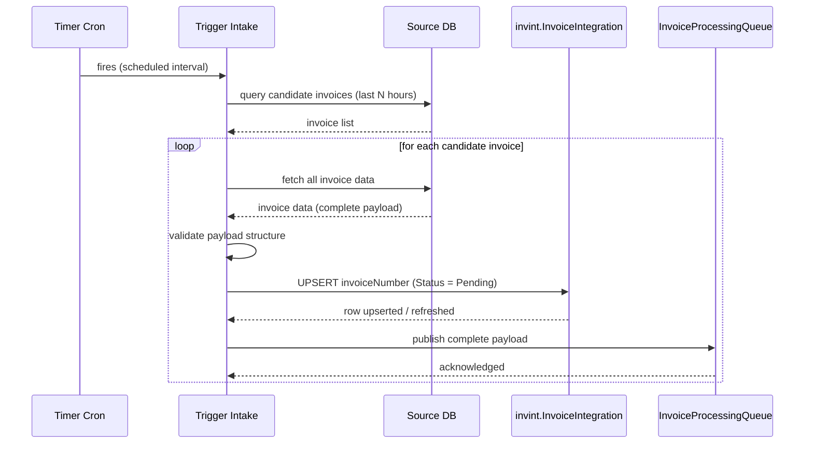
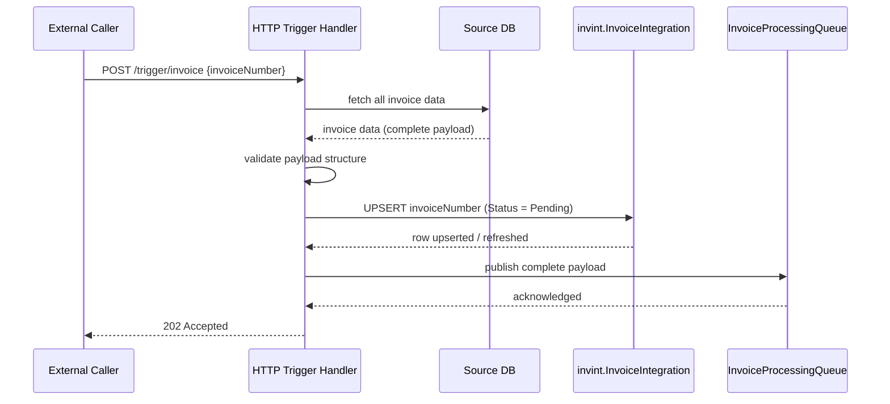
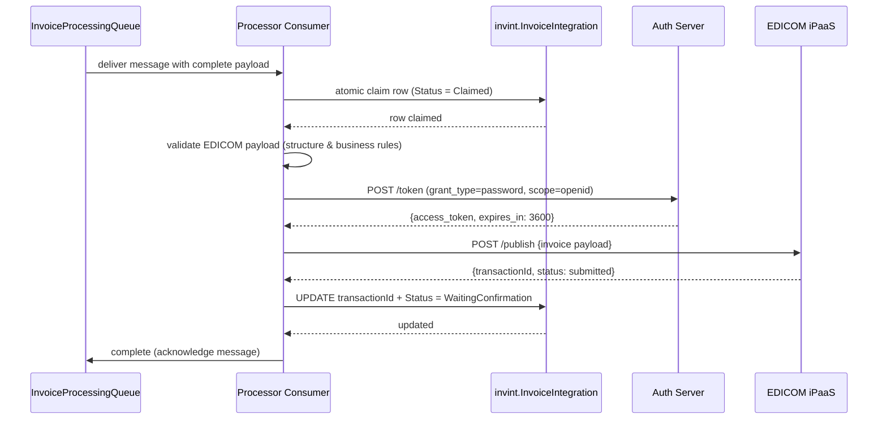
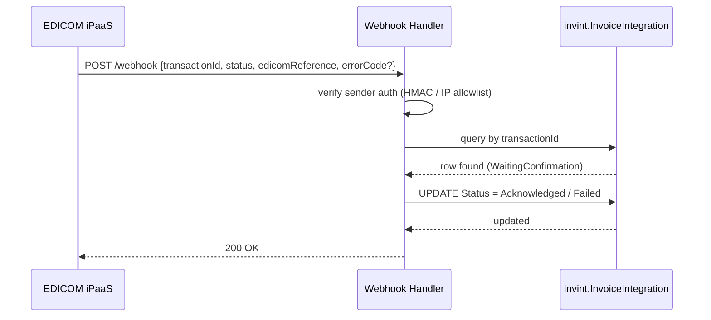
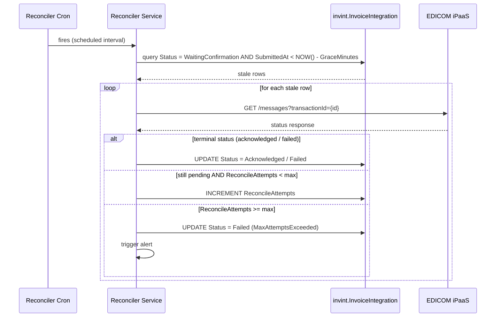

# ADR-001: EDICOM Invoice Integration Service (UAE e-Invoicing)

## Context and Problem Statement

The United Arab Emirates is introducing a mandatory e-invoicing regime built on the **Peppol 5-corner model**. Businesses do not submit invoices directly to the Federal Tax Authority (FTA); instead they transmit them through an **Accredited Service Provider (ASP)** that operates a Peppol Access Point. The ASP converts the document to the required structured format (**AE PINT / UBL XML**), routes it to the buyer's Access Point, and simultaneously reports the tax data to the government platform, which confirms receipt without validating content.

[EDICOM](https://edicomgroup.com/electronic-invoicing/united-arab-emirates) is an officially certified ASP for the UAE and exposes an enterprise REST API for invoice submission. We need an **internal system that extracts invoice datapoints from an existing line-of-business SQL database and publishes them to EDICOM**, so EDICOM can act as the middle-man to the UAE tax authority.

---

## Decision Drivers

- **Exactly-once dispatch.** An invoice number that has already been accepted by EDICOM must never be sent again, even across overlapping or crashed runs.
- **Auditability for compliance.** Every attempt — when we sent it, what EDICOM returned, how many reconcile attempts — must be durably recorded and retained for seven years.
- **Decoupled intake and processing.** Both the cron and HTTP triggers share the same queue-backed processor; neither trigger contains processing logic.
- **Asynchronous completion.** EDICOM does not return a terminal status synchronously on submit. Terminal status arrives via webhook or must be polled.
- **Resilience by default.** Transient EDICOM failures retry with backoff; stuck invoices are recovered by the next cron run; the webhook has a polling fallback.
- **Provider-agnostic seam.** EDICOM's concrete API is behind an interface so its contract, authentication, and retry semantics can be implemented and tuned once documented.
- **Deployment flexibility.** Runs as an Azure Function (timer + HTTP triggers) or under an App Service with an in-process scheduler, without logic changes.
- **Observability.** A single table provides per-invoice status, run metrics, alerting on DLQ depth, and reconciliation surfaces.

---

## Considered Options

### Architecture

- Option A — Inline point-to-point: scheduled job reads source and pushes to EDICOM with no local state
- Option B — Scheduled extractor + owned tracking store, polling-only completion
- **Option C — Per-invoice queue-based processing with webhook + polling fallback ✅**
- Option D — Change-data-capture / event-driven off the source database

### Trigger / Hosting

- Option T1 — Azure Function with timer + HTTP triggers ✅ (default)
- Option T2 — App Service / container host with an in-process scheduler (Quartz / Hangfire)

### Completion mechanism

- Option W1 — Polling-only reconciler (no webhook)
- **Option W2 — Webhook callback (primary) + polling reconciler fallback ✅**

---

## Decision Outcome

**Chosen architecture: per-invoice queue-based processing with pre-assembled payloads, webhook + polling fallback.**

Each invoice — regardless of whether it was discovered by the cron batch or submitted via HTTP — flows through the same intake path: data is gathered from the Source DB, the payload is assembled and validated, then an upsert into `invint.InvoiceIntegration` is made followed by publishing the **complete payload** to `InvoiceProcessingQueue`. The processor consumer claims rows atomically from the queue, validates the EDICOM payload, acquires an OAuth token, and submits each invoice individually to EDICOM, then records the EDICOM `transactionId` and advances status to `WaitingConfirmation`. EDICOM pushes the terminal status via a webhook callback (primary, lowest latency); a polling reconciler cron provides a safety net for any missed callbacks.

**Chosen tracking store: `invint.InvoiceIntegration` in a SQL Server database we own.** A `UNIQUE(InvoiceNumber)` constraint is the hard deduplication guarantee. SQL Server is chosen for first-class transactional claim semantics (`UPDATE … OUTPUT`), natural joins against the source database, and the team's existing operational familiarity.

**Chosen trigger: Azure Function (timer trigger + HTTP trigger) by default**, with the hexagonal core deliberately host-agnostic so an App Service + in-process scheduler is a drop-in alternative.

**Chosen completion: webhook callback (primary) + polling reconciler (fallback).** The webhook delivers terminal status at lowest latency. The reconciler fires on a schedule, querying all rows in `WaitingConfirmation` past the grace period, and polls EDICOM's `GET /messages` endpoint until a terminal status is received or maximum attempts are exhausted.

### Consequences

- Good, because `UNIQUE(InvoiceNumber)` makes double-dispatch impossible at the database level.
- Good, because intake and processing are fully decoupled — both trigger types push to the same queue and share the same processor.
- Good, because the webhook delivers terminal status with minimal latency; the reconciler ensures no invoice is silently stuck if the callback is missed.
- Good, because every invoice lifecycle is durably tracked (status, transactionId, failure reason, timestamps), satisfying the 7-year retention regime.
- Good, because the EDICOM contract is isolated behind a port; adopting the real API changes one adapter.
- Good, because atomic claim prevents duplicate processing across concurrent processor instances.
- Bad, because the design introduces a message broker (queue + DLQ) that must be provisioned and monitored.
- Bad, because EDICOM specifics (auth, exact payload, error codes, webhook format) are stubbed until their docs arrive.

---

## Confirmation

The decision is being followed if:

- `invint.InvoiceIntegration` has a `UNIQUE` constraint on `InvoiceNumber`; an integration test proves a second intake of the same invoice number upserts (not duplicates) the row.
- The EDICOM HTTP client is referenced **only** in the infrastructure adapter and nowhere in the Application layer (NetArchTest rule).
- Every invoice that leaves `WaitingConfirmation` has a recorded terminal outcome (`Acknowledged` or `Failed`) with a timestamp and, on success, the EDICOM `transactionId`.
- A crashed or duplicated run does not produce duplicate EDICOM submissions (concurrency/claim integration test with two parallel processor instances).
- DLQ depth > 0 raises an alert; no messages are silently discarded.
- The reconciler never marks `MaxAttemptsExceeded` without raising an alert.

---

## Trigger & Data Flow

Intake and processing are decoupled. Intake discovers candidates from the Source DB, gathers all invoice data, assembles and validates the payload, then upserts the invoice row and publishes the **complete payload** to the queue. The processor consumes messages, claims the row atomically, validates the EDICOM payload, tokenizes, and submits to EDICOM.


```mermaid
flowchart LR
  subgraph triggers["Triggers"]
    cron([Timer Cron])
    http([HTTP /trigger/invoice])
  end

  subgraph sourcedb_box["Source System"]
    sourcedb[("Source DB")]
  end

  subgraph intake["Trigger Intake"]
    intake_steps["Discover + Gather +<br/>Validate + Upsert"]
  end

  subgraph tracking["Tracking"]
    table[("invint.InvoiceIntegration")]
  end

  subgraph broker["Queue"]
    q[("InvoiceProcessingQueue")]
  end

  subgraph proc["Processor Consumer"]
    proc_steps["Claim + Validate +<br/>Token + Submit"]
  end

  subgraph edicom_sys["EDICOM iPaaS"]
    edicom["API"]
  end

  subgraph completion["Completion"]
    wh["Webhook + Reconciler"]
  end

  triggers -->|discover| sourcedb_box
  sourcedb_box -->|fetch| intake
  intake -->|upsert| tracking
  intake -->|publish| broker
  broker -->|consume| proc
  proc -->|submit| edicom_sys
  edicom_sys -->|callback| completion
  edicom_sys -->|poll| completion
  completion -->|update| tracking
```

---

## Sequence Diagrams

### 1. Timer Cron — Trigger Intake with Data Gathering

Cron fires, discovers candidate invoices from Source DB, gathers all invoice data in a single pass, and publishes one complete payload per invoice to the queue.


```mermaid
sequenceDiagram
  participant Cron as Timer Cron
  participant Intake as Trigger Intake
  participant SrcDB as Source DB
  participant IntDB as invint.InvoiceIntegration
  participant Queue as InvoiceProcessingQueue

  Cron->>Intake: fires (scheduled interval)
  Intake->>SrcDB: query candidate invoices (last N hours)
  SrcDB-->>Intake: invoice list

  loop for each candidate invoice
    Intake->>SrcDB: fetch all invoice data
    SrcDB-->>Intake: invoice data (complete payload)

    Intake->>Intake: validate payload structure

    Intake->>IntDB: UPSERT invoiceNumber (Status = Pending)
    IntDB-->>Intake: row upserted / refreshed
    Intake->>Queue: publish complete payload
    Queue-->>Intake: acknowledged
  end
```

### 2. HTTP Manual Trigger — Intake with Data Gathering

An external caller submits a single invoice number. The trigger handler gathers all invoice data using the same logic as the cron intake and publishes one complete payload.


```mermaid
sequenceDiagram
  participant Caller as External Caller
  participant Handler as HTTP Trigger Handler
  participant SrcDB as Source DB
  participant IntDB as invint.InvoiceIntegration
  participant Queue as InvoiceProcessingQueue

  Caller->>Handler: POST /trigger/invoice {invoiceNumber}

  Handler->>SrcDB: fetch all invoice data
  SrcDB-->>Handler: invoice data (complete payload)

  Handler->>Handler: validate payload structure

  Handler->>IntDB: UPSERT invoiceNumber (Status = Pending)
  IntDB-->>Handler: row upserted / refreshed
  Handler->>Queue: publish complete payload
  Queue-->>Handler: acknowledged
  Handler-->>Caller: 202 Accepted
```

### 3. Processor Consumer — Validate and Submit

The processor consumes a queue message (containing the complete payload), claims the row, validates the EDICOM payload, acquires a token, and submits to EDICOM.


```mermaid
sequenceDiagram
  participant Queue as InvoiceProcessingQueue
  participant Proc as Processor Consumer
  participant IntDB as invint.InvoiceIntegration
  participant Auth as Auth Server
  participant Edicom as EDICOM iPaaS

  Queue->>Proc: deliver message with complete payload
  Proc->>IntDB: atomic claim row (Status = Claimed)
  IntDB-->>Proc: row claimed

  Proc->>Proc: validate EDICOM payload (structure & business rules)

  Proc->>Auth: POST /token (grant_type=password, scope=openid)
  Auth-->>Proc: {access_token, expires_in: 3600}

  Proc->>Edicom: POST /publish {invoice payload}
  Edicom-->>Proc: {transactionId, status: submitted}

  Proc->>IntDB: UPDATE transactionId + Status = WaitingConfirmation
  IntDB-->>Proc: updated
  Proc->>Queue: complete (acknowledge message)
```

### 4. Completion — Webhook Callback (primary) and Polling Reconciler (fallback)

EDICOM pushes the terminal status via webhook. If the callback never arrives, the reconciler polls until a terminal status is received or maximum attempts are exhausted.

#### 4a. Webhook callback


```mermaid
sequenceDiagram
  participant Edicom as EDICOM iPaaS
  participant WH as Webhook Handler
  participant IntDB as invint.InvoiceIntegration

  Edicom->>WH: POST /webhook {transactionId, status, edicomReference, errorCode?}
  WH->>WH: verify sender auth (HMAC / IP allowlist)
  WH->>IntDB: query by transactionId
  IntDB-->>WH: row found (WaitingConfirmation)
  WH->>IntDB: UPDATE Status = Acknowledged / Failed
  IntDB-->>WH: updated
  WH-->>Edicom: 200 OK
```

#### 4b. Polling reconciler (fallback)


```mermaid
sequenceDiagram
  participant RCron as Reconciler Cron
  participant Rec as Reconciler Service
  participant IntDB as invint.InvoiceIntegration
  participant Edicom as EDICOM iPaaS

  RCron->>Rec: fires (scheduled interval)
  Rec->>IntDB: query Status = WaitingConfirmation AND SubmittedAt < NOW() - GraceMinutes
  IntDB-->>Rec: stale rows

  loop for each stale row
    Rec->>Edicom: GET /messages?transactionId={id}
    Edicom-->>Rec: status response

    alt terminal status (acknowledged / failed)
      Rec->>IntDB: UPDATE Status = Acknowledged / Failed
    else still pending AND ReconcileAttempts < max
      Rec->>IntDB: INCREMENT ReconcileAttempts
    else ReconcileAttempts >= max
      Rec->>IntDB: UPDATE Status = Failed (MaxAttemptsExceeded)
      Rec->>Rec: trigger alert
    end
  end
```

---

## Invoice Status Definitions & Flows

### Statuses

| Status                | Type       | Meaning                                                                           |
| --------------------- | ---------- | --------------------------------------------------------------------------------- |
| `Pending`             | In-flight  | Upserted by intake; ready to be consumed from queue                               |
| `Claimed`             | In-flight  | Processor owns the row; work in progress                                          |
| `WaitingConfirmation` | In-flight  | Successfully submitted to EDICOM; awaiting terminal status via webhook or polling |
| `Acknowledged`        | Terminal ✓ | EDICOM confirmed the invoice                                                      |
| `Failed`              | Terminal ✗ | Processing ended with an error; see `FailureReason`                               |

### `FailureReason` values

| Value                 | When                                                              |
| --------------------- | ----------------------------------------------------------------- |
| `ValidationFailed`    | Payload failed AE PINT validation before any EDICOM call          |
| `SubmitRejected`      | EDICOM returned 400 / 422 — malformed payload, do not retry       |
| `MaxAttemptsExceeded` | Reconciler exhausted all polling attempts with no terminal status |

> `CircuitOpen` is **not** a valid `FailureReason`. When the circuit breaker opens the row stays `Claimed` — it is a transient condition recovered by the next cron run, not a terminal failure.

### Status Lifecycle

```
Intake (cron or HTTP)
  └─ Discover + gather + validate payload
  └─ UPSERT → Pending → published to queue (with complete payload)

Processor receives message
  └─ Claimed → validate + tokenize + submit to EDICOM
  └─ WaitingConfirmation (transactionId recorded)

Completion
  └─ Webhook arrives           → Acknowledged ✓ / Failed ✗
     OR
  └─ Reconciler polls EDICOM   → Acknowledged ✓ / Failed ✗
```

### Failure Flows

**Validation fails**

```
Processor receives message
  └─ Claimed → payload validation fails
  └─ Failed (ValidationFailed)
  └─ Message acknowledged — no retry
```

**EDICOM rejects payload (400 / 422)**

```
Processor receives message
  └─ Claimed → POST /publish → 400 / 422
  └─ Failed (SubmitRejected)
  └─ Message acknowledged — no retry
```

**Reconciler exhausted**

```
WaitingConfirmation past GraceMinutes
  └─ Reconciler polls GET /messages each interval
  └─ ReconcileAttempts >= max → Failed (MaxAttemptsExceeded) + alert
```

**EDICOM persistently down**

```
Processor receives message (with complete payload)
  └─ Claimed → POST /publish → Polly retries (1s, 2s, 4s) → all fail
  └─ Circuit breaker opens → processor aborts
  └─ Message NOT acknowledged → queue redelivers
  └─ Row stays Claimed, queue empties, processor goes idle

Next day cron fires
  └─ Re-discovers same invoice from Source DB
  └─ Gathers data, validates payload
  └─ UPSERT resets → Pending
  └─ Re-published to queue (with complete payload) → processor retries
```

**Processor crash / DLQ**

```
Processor receives message (with complete payload)
  └─ Claimed → crashes before acknowledging
  └─ Queue redelivers (count 2, 3, 4, 5)
  └─ Each redelivery: row is Claimed, not stale → processor cannot claim → abandons
  └─ After 5 deliveries → message → DLQ, row stays Claimed
  └─ Alert: DLQ depth > 0

Next day cron fires
  └─ Re-discovers invoice → gathers data, validates payload
  └─ UPSERT resets → Pending → re-published (with complete payload)
  └─ Only recovers if root cause (processor bug) is fixed first
```

---

## Retry & Resiliency

Each layer of the pipeline can fail independently. The table below maps failure modes to their recovery mechanism.

| Failure                                       | Recovery mechanism                                                  |
| --------------------------------------------- | ------------------------------------------------------------------- |
| Transient EDICOM submit error (5xx / timeout) | Polly retry with exponential backoff                                |
| EDICOM persistently unavailable               | Circuit breaker → abort run → stale claim recovery                  |
| Processor crash after claim, before submit    | Stale claim reset in next processor run                             |
| Processor crash after submit, before record   | Message redelivered; idempotent state transition prevents duplicate |
| Webhook callback never arrives                | Polling reconciler fires after `GraceMinutes`                       |
| WaitingConfirmation never resolves            | Reconciler max-attempts → mark `Failed` + alert                     |
| Token endpoint unavailable                    | Retry token fetch → abort run → stale claim recovery                |
| Partial batch failure                         | Per-invoice tracking; failed invoices recover via stale claim reset |
| Queue message fails repeatedly                | Dead-letter queue (DLQ) → alert on DLQ depth                        |

### Submit retry — Polly

Every `POST /publish` call goes through a **retry + circuit-breaker** policy:

```
Retry:           3 attempts, exponential backoff — 1 s → 2 s → 4 s
Retry triggers:  HTTP 429, 5xx, network timeout
Circuit breaker: open after 5 consecutive failures; half-open probe after 30 s
```

When the circuit breaker opens, the processor aborts the current run; already-claimed invoices are recovered by stale claim reset on the next cron run.

Do **not** retry HTTP 400 / 422 — these indicate a malformed payload. Log the error, write `Failed` to `invint.InvoiceIntegration`, and move on.

### Stale claim recovery

> **Important:** The stale claim reset is embedded in the processor's claim query — it only runs when the processor consumes a message from the queue. With a once-a-day cron trigger, the processor goes idle once the queue is empty. There is no background process waking the processor up every 30 minutes.

**What actually happens when EDICOM is down:**

```
DAY 1 — Cron fires (08:00, once)
─────────────────────────────────────────────────────────
  08:00  Cron fires → discovers INV-001
         └─ Gathers data, validates payload
         └─ UPSERT Status = Pending
         └─ Publishes INV-001 (complete payload) to queue

  08:02  Processor wakes up (queue message received)
         └─ Claim query runs → Status = Claimed, ClaimedAt = 08:02
         └─ POST /publish → EDICOM DOWN
            ├─ Retry 1 (1s)  → fails
            ├─ Retry 2 (2s)  → fails
            ├─ Retry 3 (4s)  → fails
            └─ Circuit breaker opens → processor aborts
               Queue empty → processor goes idle

  INV-001 stays: Status = Claimed, ClaimedAt = 08:02
  Queue empty → processor idle for the rest of the day

─────────────────────────────────────────────────────────
DAY 2 — Cron fires (08:00, once)
─────────────────────────────────────────────────────────
  08:00  Cron fires → queries Source DB
         └─ Finds INV-001 (still unprocessed) + INV-002 (new)
         └─ Gathers data for both, validates payloads
         └─ UPSERT INV-001 → resets Status = Pending  ← cron drives the retry
         └─ UPSERT INV-002 → Status = Pending
         └─ Publishes both (complete payloads) to queue
```

> **Result:** Stuck invoices are retried the next day when new invoices arrive and wake the processor. If no new invoices come in, the stuck invoice waits until the next cron run that finds any pending work.

## Design Notes

### Token handling

Acquire a token once per processor run (`POST https://accounts.edicomgroup.com/token`, scope `openid`). Cache it with its `expires_in` value and refresh proactively before expiry. Never request a new token per invoice.

### Idempotency

Use `UNIQUE(InvoiceNumber)` on `invint.InvoiceIntegration` to collapse duplicate trigger events and keep one lifecycle row per invoice.

If the processor crashes after submit but before writing `WaitingConfirmation`, the same invoice may be retried; atomic state transitions and the uniqueness constraint keep persistence idempotent.

### Claim pattern

Use a single `UPDATE … SET Status = 'Claimed', ClaimedAt = NOW() WHERE Status = 'Pending' [OR stale claimed]` with `OUTPUT` / `RETURNING` to atomically claim a row and prevent double-processing across concurrent instances.

### EDICOM status endpoint

Until the webhook integration is confirmed, treat the `GET /messages` response as the authoritative status source. The reconciler polls this for all `WaitingConfirmation` rows.

### Webhook registration

**Endpoint:** `POST /subscription` or similar (details TBD with EDICOM team)

Register or update the webhook callback URL so EDICOM knows where to push terminal status. May be a one-time setup or managed via the EDICOM portal.

> **Confirm with EDICOM:** Webhook retry policy, timeout, payload format, and authentication method (HMAC / IP allowlist).

---

## Tracking Table Schema

```sql
CREATE SCHEMA invint;
GO

CREATE TABLE invint.InvoiceIntegration (
    InvoiceNumber        VARCHAR(64)     NOT NULL,
    Status               VARCHAR(24)     NOT NULL,             -- Pending|Claimed|WaitingConfirmation|Acknowledged|Failed
    FailureReason        VARCHAR(32)     NULL,                 -- ValidationFailed|SubmitRejected|MaxAttemptsExceeded
    TransactionId        VARCHAR(128)    NULL,                 -- EDICOM transaction id (set after submit)
    EdicomReference      VARCHAR(128)    NULL,                 -- EDICOM document reference (set on Acknowledged)
    ClaimedAt            DATETIME2       NULL,
    SubmittedAt          DATETIME2       NULL,
    AcknowledgedAt       DATETIME2       NULL,
    ReconcileAttempts    INT             NOT NULL DEFAULT 0,
    StaleResetCount      INT             NOT NULL DEFAULT 0,
    LastErrorCode        VARCHAR(64)     NULL,
    LastErrorMessage     NVARCHAR(2000)  NULL,
    CreatedAt            DATETIME2       NOT NULL DEFAULT SYSUTCDATETIME(),
    UpdatedAt            DATETIME2       NOT NULL DEFAULT SYSUTCDATETIME(),
    CONSTRAINT PK_InvoiceIntegration PRIMARY KEY (InvoiceNumber),
    CONSTRAINT UQ_InvoiceIntegration_InvoiceNumber UNIQUE (InvoiceNumber)
);
GO

-- Fast status scans (processor claim, reconciler, monitoring)
CREATE INDEX IX_InvoiceIntegration_Status_ClaimedAt
    ON invint.InvoiceIntegration (Status, ClaimedAt)
    INCLUDE (StaleResetCount, TransactionId);

CREATE INDEX IX_InvoiceIntegration_Status_SubmittedAt
    ON invint.InvoiceIntegration (Status, SubmittedAt)
    INCLUDE (TransactionId, ReconcileAttempts);
```

> The primary key already enforces uniqueness; the explicit `UQ_` constraint makes the dedup guarantee unmistakable and satisfies the Confirmation check. `StaleResetCount` tracks how many times a stale `Claimed` row was reset to `Pending`; `ReconcileAttempts` tracks polling rounds in the fallback reconciler.

---

## Pros and Cons of the Options

### Option A — Inline point-to-point (no local state)

- Good, because it is the least code and has no extra store to operate.
- Bad, because there is **no way to know what was already sent** without writing to the source — which is forbidden.
- Bad, because a crash mid-run leaves an unknown partial state; recovery is guesswork.
- Bad, because there is no audit trail for a 7-year-retention regime.
- Bad, because there is no mechanism to receive EDICOM's asynchronous terminal status.

### Option B — Scheduled extractor + owned tracking store, polling-only completion

- Good, because deduplication and audit live in a store we own without touching the source.
- Bad, because polling-only completion requires the reconciler to fire repeatedly until EDICOM responds; there is no low-latency path for the happy case.
- Neutral, because webhook support can be added later without architecture changes.

### Option C — Per-invoice queue-based processing with webhook + polling fallback (chosen)

- Good, because intake and processing are fully decoupled — both trigger types share the same pipeline.
- Good, because the webhook delivers terminal status at lowest latency; the reconciler covers the failure case.
- Good, because per-invoice queue messages give natural retry and DLQ semantics.
- Good, because the processor is stateless and horizontally scalable.
- Bad, because it introduces a message broker (queue + DLQ) to provision and operate.
- Neutral, because it requires confirming the webhook contract with EDICOM before the completion path is fully exercised.

### Option D — Change-data-capture / event-driven off the source

- Good, because it reacts in near-real-time.
- Bad, because enabling CDC/change-tracking is a **modification of the source database**, which is out of bounds.
- Bad, because it adds queue infrastructure without removing Option C's tracking store.

---

### Option T1 — Azure Function timer + HTTP triggers (chosen default)

- Good, because it is fully managed, scales to zero, and the trigger schedule is declarative.
- Good, because the HTTP trigger gives a built-in single-invoice submission endpoint.
- Neutral, because execution time limits (Consumption plan) require bounded batches — which the per-invoice queue model already provides.

### Option T2 — App Service / container + in-process scheduler (Quartz / Hangfire)

- Good, because it suits long-running or high-frequency schedules.
- Good, because Hangfire adds a built-in dashboard and job persistence.
- Bad, because it runs an always-on host (cost).
- Neutral, because the hexagonal core is identical — only the driving adapter differs.

---

### Option W1 — Polling-only reconciler (no webhook)

- Good, because it removes the need to register and verify a webhook endpoint with EDICOM.
- Bad, because every invoice must wait for the next reconciler interval to learn its terminal status — no low-latency happy path.
- Neutral, because this remains a valid fallback if EDICOM does not support webhooks.

### Option W2 — Webhook callback (primary) + polling reconciler fallback (chosen)

- Good, because the webhook delivers terminal status immediately on the happy path.
- Good, because the reconciler covers missed or delayed callbacks without requiring any change to the processor.
- Bad, because it requires confirming the webhook contract, payload format, and authentication method with EDICOM.

---

## Open Questions

### To close with EDICOM

1. Exact REST endpoint(s), payload schema, and whether EDICOM accepts source-native data or expects pre-built AE PINT/UBL.
2. Authentication model (API key, OAuth2 client credentials, mTLS certificate).
3. Webhook payload format, authentication (HMAC / IP allowlist), retry policy, and registration endpoint.
4. Idempotency-key support and the status-query endpoint (`GET /messages`) format for the reconciler.
5. Rate limits, throttling headers (`Retry-After`), and recommended concurrency.
6. Error taxonomy — which codes are permanent vs. transient — to finalise fault classification.
7. Who assigns the invoice UUID (us or EDICOM) and how it is returned on acknowledgement.
