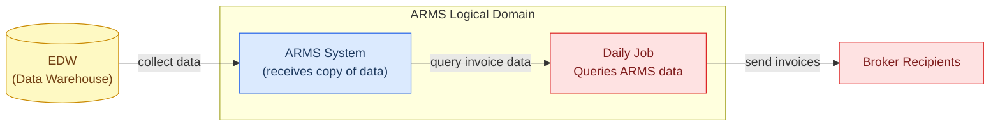
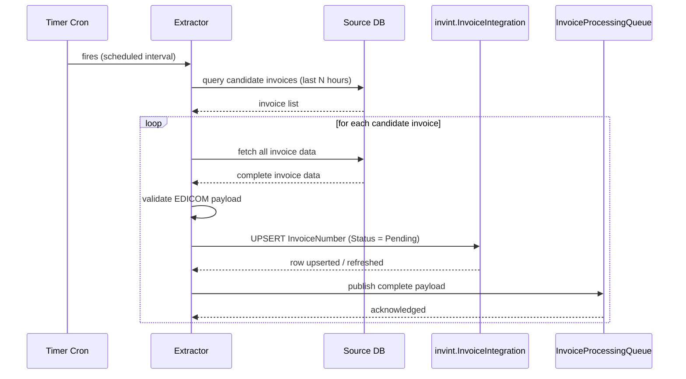
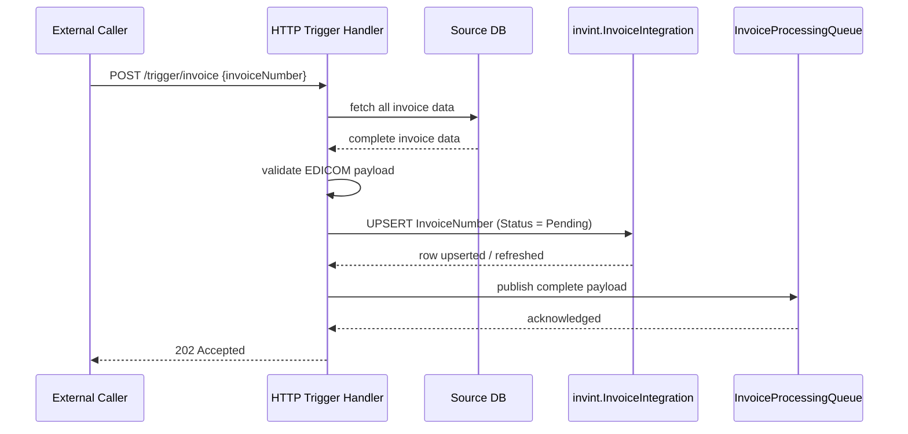
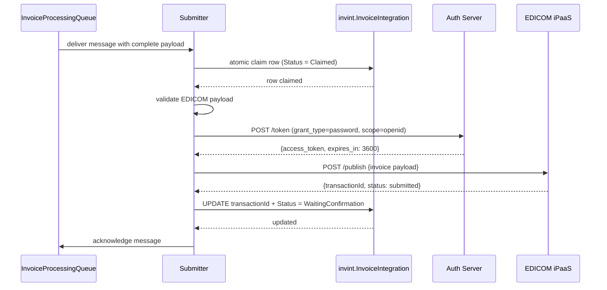
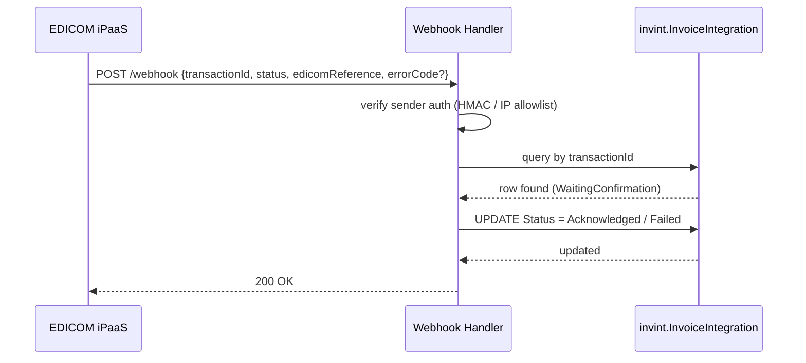
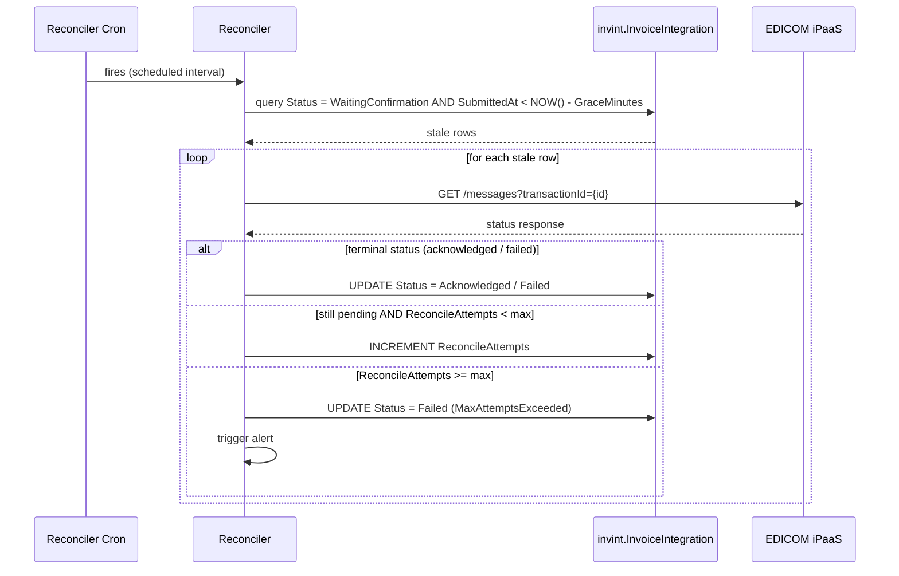

# EDICOM Invoice Integration Service (UAE e-Invoicing)

* Status: Proposed — Architecture Review pending
* Date: 2026-07-30
* Author: Camilo Torres
* ADR Number: ADR-0025

## Context and Problem Statement

The United Arab Emirates is introducing a mandatory e-invoicing regime built on the **Peppol 5-corner model**. Businesses must transmit invoices through an **Accredited Service Provider (ASP)** that operates a Peppol Access Point. [EDICOM](https://edicomgroup.com/electronic-invoicing/united-arab-emirates) is an officially certified ASP for the UAE and exposes an enterprise REST API for invoice submission.

We need an **internal system that extracts invoice datapoints from an existing line-of-business SQL database and publishes them to EDICOM**, with full auditability, exactly-once delivery, and resilience to transient failures.

## Current Process (AS-IS)

**Current state:** EDW collects data and sends a copy to ARMS. A manual daily job within ARMS queries the data and sends invoices directly to broker recipients with no audit trail, no deduplication mechanism, and tight coupling between data aggregation and delivery.

## Decision Drivers

* **Exactly-once dispatch:** An invoice number that has already been accepted by EDICOM must never be sent again, even across overlapping or crashed runs
* **Auditability for compliance:** Every attempt — submission time, EDICOM response, reconciliation attempts — must be durably recorded and retained for seven years
* **Decoupled triggers:** Both cron and HTTP triggers share the same queue-backed processor; neither trigger contains processing logic
* **Asynchronous completion:** EDICOM does not return terminal status synchronously; it arrives via webhook or must be polled
* **Resilience by default:** Transient EDICOM failures retry with backoff; stuck invoices are recovered by the next cron run; webhooks have polling fallback
* **Provider-agnostic abstraction:** EDICOM API is behind an interface so contract, auth, and retry semantics can be tuned once documented
* **Deployment flexibility:** Runs as Azure Function (timer + HTTP) or App Service with in-process scheduler without logic changes
* **Observability:** Single tracking table provides per-invoice status, batch metrics, alerting on dead-letter depth, and reconciliation surfaces

## Considered Options

* Option 1 — Two-service queue-based pipeline with Service Bus and dedicated tracking store
* Option 2 — Single monolithic Azure Function (intake + processing + completion in one service)
* Option 3 — Minimal direct submission (scheduled extractor + direct EDICOM submit, no queue)

## Decision Outcome

**Chosen option: Option 1 — Two-service queue-based pipeline with Service Bus and dedicated tracking store**

Two independently deployable Azure Function services (.NET 10) are introduced:

**SOA.InvoiceExtractor** — queries broker list from SQL Server, discovers candidate invoices for EDICOM submission (last N hours), gathers complete invoice data, assembles and validates the EDICOM payload, upserts status to `invint.InvoiceIntegration` with `UNIQUE(InvoiceNumber)` constraint (deduplication guarantee), and publishes the complete payload to `InvoiceProcessingQueue`.

**BHSI.InvoiceSubmitter** — consumes messages from the queue, atomically claims rows to prevent double-processing, validates the EDICOM payload, acquires an OAuth token, submits to EDICOM, records the `transactionId`, and advances status to `WaitingConfirmation`. EDICOM pushes terminal status via webhook (primary, lowest latency); a polling reconciler cron provides fallback for any missed callbacks.

This option is chosen because it decouples intake from submission at a durable message boundary, makes each service independently deployable and testable, provides permanent audit trails in Table Storage, and makes the submission pipeline reusable by any team with a compliant payload.

### Consequences

* Good — Independent deployability: either service can be deployed or rolled back without affecting the other
* Good — Full auditability: every intake attempt and submission is recorded in Table Storage
* Good — Atomic claim prevents duplicate processing across concurrent instances
* Good — Safe retries: `UNIQUE(InvoiceNumber)` and idempotency checks make any retry safe with no duplicate submissions
* Good — No silent failures: missing data or validation errors are detected at intake and recorded
* Good — Reusable submission pipeline: any team writing a compliant payload can trigger submission without modifying the Submitter service
* Bad — Eventual consistency: observable delay between intake and submission completion; acceptable for a daily batch
* Bad — Sequential throughput ceiling: processing invoices one at a time may become a bottleneck at scale; planned mitigation is bounded concurrency via `SemaphoreSlim` once a dedicated SQL replica is available
* Bad — Single email provider dependency: no automatic fallback if EDICOM is unavailable; mitigation is dead-letter queue retention + Datadog alerts + replay once service recovers

## System Architecture

```mermaid
flowchart LR
  subgraph arms_box["ARMS System"]
    arms[("ARMS<br/>(Data Source)")]
  end

  subgraph sourcedb_box["Source System"]
    sourcedb[("Source DB<br/>(populated by ARMS)")]
  end

  subgraph triggers["Triggers"]
    cron([Timer Cron])
    http([HTTP /trigger/invoice])
  end

  subgraph extractor["Invoice Extractor - SOA.InvoiceExtractor"]
    extractor_steps["Discover + Gather +<br/>Validate + Upsert"]
  end

  subgraph tracking_ex["Tracking Storage"]
    table_ex[("invint.InvoiceIntegration")]
  end

  subgraph broker["Azure Service Bus"]
    q[("InvoiceProcessingQueue")]
    dlq[("Dead-Letter Queue")]
  end

  subgraph submitter["Invoice Submitter - BHSI.InvoiceSubmitter"]
    submitter_steps["Claim + Validate +<br/>Token + Submit"]
  end

  subgraph tracking_su["Transaction Log"]
    table_su[("TransactionLog<br/>WebhookEvents")]
  end

  subgraph edicom_sys["EDICOM iPaaS"]
    edicom["API"]
  end

  subgraph completion["Completion"]
    wh["Webhook + Reconciler"]
  end

  subgraph obs["Observability"]
    kv["Azure Key Vault"]
    datadog["Datadog Logs & Traces"]
  end

  arms -->|"store data"| sourcedb_box
  triggers -->|"1. trigger"| sourcedb_box
  sourcedb_box -->|"2. fetch candidates"| extractor
  extractor -->|"3. upsert"| tracking_ex
  extractor -->|"4. publish payload"| broker
  broker -->|"5. consume"| submitter
  submitter -->|"6. claim + validate"| tracking_ex
  submitter -->|"7. get token"| kv
  submitter -->|"8. submit"| edicom_sys
  submitter -->|"9. log dispatch"| tracking_su
  edicom_sys -->|"10. callback"| completion
  edicom_sys -->|"11. poll"| completion
  completion -->|"12. update status"| tracking_su
  extractor -.->|"logs & traces"| datadog
  submitter -.->|"logs & traces"| datadog

  style arms_box fill:#FFF7ED,stroke:#EA580C,color:#7C2D12
  style triggers fill:#DBEAFE,stroke:#2563EB,color:#1E3A5F
  style extractor fill:#D1FAE5,stroke:#059669,color:#064E3B
  style submitter fill:#EDE9FE,stroke:#7C3AED,color:#3B0764
  style broker fill:#FCE7F3,stroke:#DB2777,color:#831843
  style tracking_ex fill:#FEF9C3,stroke:#CA8A04,color:#713F12
  style tracking_su fill:#FEF9C3,stroke:#CA8A04,color:#713F12
  style edicom_sys fill:#DCFCE7,stroke:#16A34A,color:#14532D
  style obs fill:#E0F2FE,stroke:#0284C7,color:#0C4A6E
  style sourcedb_box fill:#FEF9C3,stroke:#CA8A04,color:#713F12
```

**Diagram colour key:**

| Colour | Component |
|---|---|
| 🟠 Orange | ARMS System (data source) |
| 🔵 Blue | Triggers (Timer / HTTP) |
| 🟢 Green | Invoice Extractor (SOA.InvoiceExtractor) |
| 🟣 Purple | Invoice Submitter (BHSI.InvoiceSubmitter) |
| 🩷 Pink | Azure Service Bus queues |
| 🟡 Yellow | Azure Table Storage and SourceDB |
| 🩵 Light Blue | Observability (Datadog, Azure Key Vault) |
| ⬜ Light Green | External systems (EDICOM) |

### Sequence Diagrams

#### Timer Cron — Intake with Data Gathering

#### HTTP Manual Trigger — Intake with Data Gathering

#### Submitter — Validate, Claim, and Submit

#### Completion — Webhook Callback (primary) and Polling Reconciler (fallback)

## Options Analysis

### Option 1 — Two-service queue-based pipeline (Chosen)

* Good — Clean service boundary: extraction and submission are independently owned and deployable
* Good — Durable decoupling: Service Bus provides guaranteed delivery and natural retry with dead-letter support
* Good — Permanent audit record: Table Storage persists all intake and submission events
* Good — Reusability: Submitter has no knowledge of invoices; it processes any compliant payload
* Good — Idempotency: `UNIQUE(InvoiceNumber)` prevents duplicate submissions on retry
* Neutral — Operational complexity: two services and queue infrastructure to monitor
* Bad — Eventual consistency delay between extraction and submission (acceptable for daily batch)

### Option 2 — Single monolithic Azure Function

* Good — Simpler initial deployment: one service, one pipeline
* Bad — No clean service boundary: submission logic is tightly coupled to extraction and cannot be reused by other teams
* Bad — Independent deployment is impossible: a change to submission templates requires redeploying the entire function
* Bad — Failure blast radius: a submission failure can stall or corrupt extraction state
* Bad — No separation of concerns for audit: extraction and submission events are interleaved in one log stream

### Option 3 — Minimal direct submission (scheduled extractor + direct EDICOM submit, no queue)

* Good — Simpler infrastructure: no Service Bus queue, no dead-letter queue to provision and monitor
* Good — Lower operational overhead: one service handles both extraction and submission sequentially
* Good — Lower latency on happy path: no intermediate queue storage or message consumption delay
* Bad — No resilience to EDICOM failures: if EDICOM is down during the batch window, all invoices fail with no recovery mechanism
* Bad — All-or-nothing batch semantics: a crash mid-batch leaves unknown partial state; recovery requires manual intervention or full re-run
* Bad — Limited audit trail for mid-batch recovery: no way to resume from invoice N without starting over
* Bad — No independent scaling: submission throughput is bounded by single-function execution time, making region expansion difficult
* Bad — No reusability: if another team needs to submit data to EDICOM, they must duplicate this submission logic

---

## Open Questions

### To close with EDICOM

1. Exact REST endpoint(s), payload schema, and whether EDICOM accepts source-native data or expects pre-built AE PINT/UBL XML.
2. Authentication model (API key, OAuth2 client credentials, mTLS certificate).
3. Webhook payload format, authentication (HMAC / IP allowlist), retry policy, and registration endpoint.
4. Idempotency-key support and the status-query endpoint (`GET /messages`) format for reconciliation.
5. Rate limits, throttling headers (`Retry-After`), and recommended concurrency.
6. Error taxonomy — which codes are permanent vs. transient — to finalize fault classification.
7. Who assigns the invoice UUID (us or EDICOM) and how it is returned on acknowledgment.

### To close internally

1. Source database schema — which tables and columns contain invoice data.
2. Retention period and compliance requirements for audit logs — 7 years vs. other governance policy.
3. Monitoring and alerting policy — Datadog dashboard and alert thresholds for submission latency, failure rates, and dead-letter depth.
