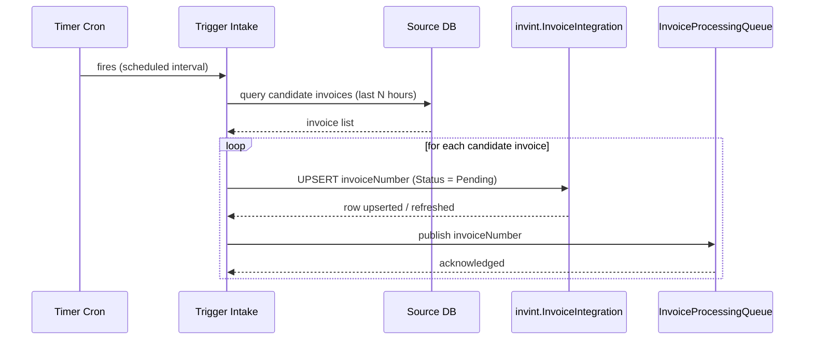
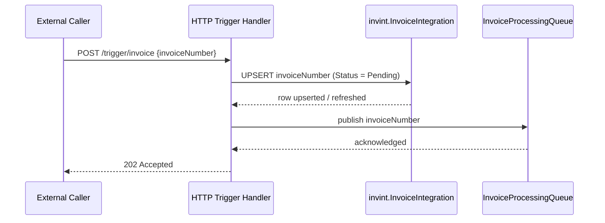
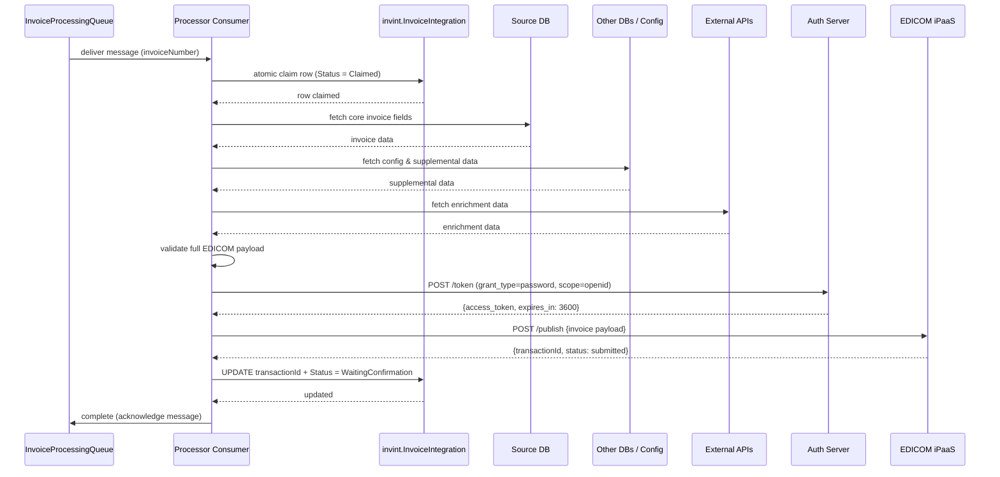
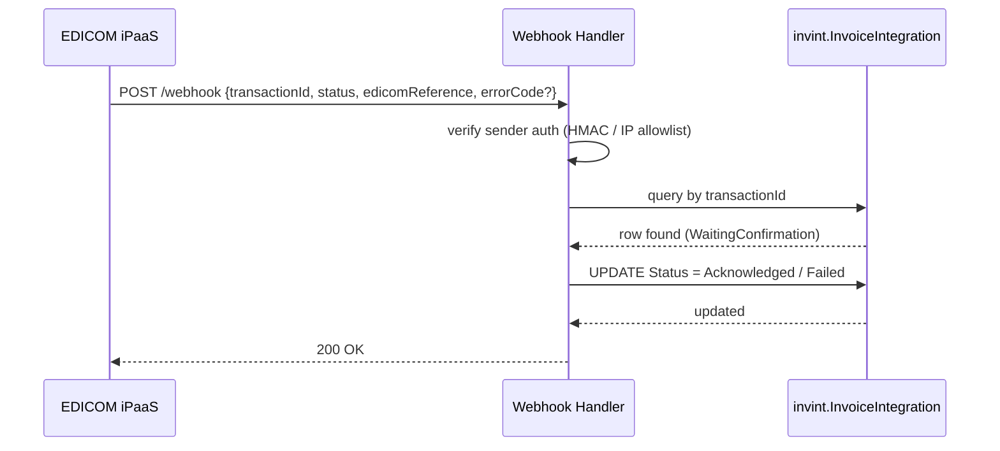
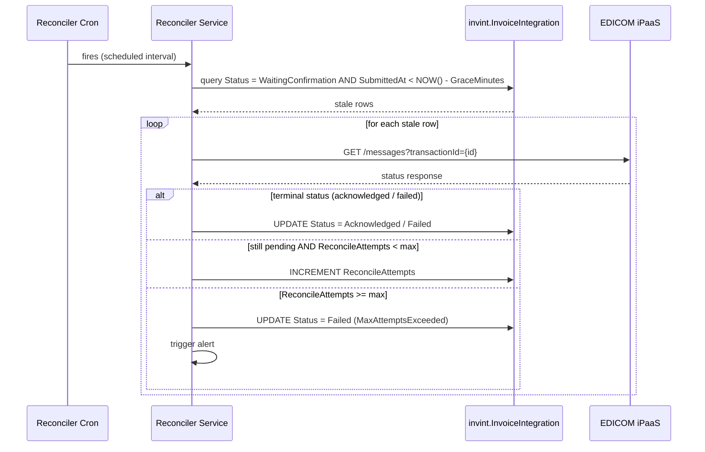

# Invoice Integration — Option 1 Architecture

## Overview

**Per-Invoice Submission with Webhook + Polling Fallback**

Each invoice is submitted individually to EDICOM. Both trigger types (cron batch and HTTP single-invoice) flow through the same intake path, then the same processor pipeline. Status is received via webhook callback (primary, lowest latency) with an async polling reconciler as a safety net for any missed callbacks.

> **Implementation plan:** see [IMPLEMENTATION-PHASES.md](IMPLEMENTATION-PHASES.md) for the phased delivery approach — payload builder first, EDICOM client behind an interface, triggers last.

---

## Trigger & Data Flow

Trigger intake and processing are decoupled. Intake always upserts the invoice row in the integration table and then publishes a processor message. The processor consumes messages, claims the row atomically, and runs the same EDICOM flow.

```mermaid
flowchart LR
  subgraph triggers["Triggers"]
    direction TB
    cron([Timer Cron])
    http([HTTP /trigger/invoice])
  end

  subgraph intake["Trigger Intake — executes on each trigger"]
    direction TB
    discover["Find candidate invoices\nfrom Source DB"]
    upsert["Upsert invint.InvoiceIntegration\nStatus = Pending"]
    publish[Publish invoiceNumber to queue]
  end

  subgraph broker["Message Broker"]
    direction TB
    q[(InvoiceProcessingQueue)]
    dlq[(Dead-Letter Queue)]
  end

  subgraph proc["Processor Consumer — executes per message"]
    direction TB
    consume[Consume message]
    claim["Atomic claim row\nStatus = Claimed"]
    gather[Gather invoice data]
    validate[Validate EDICOM payload]
    token[Acquire / refresh OAuth token]
    submit["POST /publish · per invoice"]
    record["Record transactionId\nStatus = WaitingConfirmation"]
  end

  edicom{{EDICOM iPaaS}}

  subgraph completion["Completion"]
    direction TB
    wh["Webhook handler\nVerify · write terminal status"]
    rc([Reconciler Cron])
    poll["Poll GET /messages\nby transactionId"]
  end

  sourcedb[(Source DB)]
  extapi[(External APIs)]
  otherdb[(Other DBs / Config)]
  table[(invint.InvoiceIntegration)]

  cron -->|fires| discover
  sourcedb -->|"query candidates"| discover
  http -->|"fires with invoiceNumber"| upsert
  discover --> upsert
  upsert -->|persist| table
  upsert --> publish
  publish --> q
  q -. max retries .-> dlq

  q -->|delivers message| consume
  consume --> claim
  claim -->|persist| table
  claim --> gather
  sourcedb -->|"core invoice fields"| gather
  extapi -->|"enrichment data"| gather
  otherdb -->|"config & supplemental"| gather
  gather --> validate
  validate --> token
  token --> submit
  submit -->|POST| edicom
  submit --> record
  record -->|persist| table

  edicom -->|"POST callback — primary"| wh
  wh -->|"write Acknowledged / Failed"| table

  rc -->|"polls WaitingConfirmation past grace period"| poll
  poll -->|GET /messages| edicom
  poll -->|"write Acknowledged / Failed"| table
```



---

## Sequence Diagrams

### 1. Timer Cron — Trigger Intake

Cron fires, discovers candidate invoices from Source DB, and publishes one message per invoice to the queue.



---

### 2. HTTP Manual Trigger — Intake

An external caller submits a single invoice number. Intake upserts one row and publishes one message.



---

### 3. Processor Consumer — Claim, Enrich, and Submit

The processor consumes a queue message, claims the row, gathers all data from multiple sources, and submits to EDICOM.



---

### 4. Completion — Webhook Callback (primary) and Polling Reconciler (fallback)

EDICOM pushes the terminal status via webhook. If the callback never arrives, the reconciler polls until a terminal status is received or max attempts are exhausted.

#### 4a. Webhook callback



#### 4b. Polling reconciler (fallback)



---

## Retry & Resiliency

Each layer of the pipeline can fail independently. The table below maps failure modes to their recovery mechanism.

| Failure                                        | Recovery mechanism                                                  |
| ---------------------------------------------- | ------------------------------------------------------------------- |
| Transient EDICOM submit error (5xx / timeout)  | Polly retry with exponential backoff                                |
| EDICOM persistently unavailable                | Circuit breaker → abort run → stale claim recovery                  |
| Processor crash after claim, before submit     | Stale claim reset in next processor run                             |
| Processor crash after submit, before record    | Message redelivered; idempotent state transition prevents duplicate |
| Webhook callback never arrives                 | Polling reconciler fires after `GraceMinutes`                       |
| WaitingConfirmation never resolves             | Reconciler max-attempts → mark `Failed` + alert                     |
| Token endpoint unavailable                     | Retry token fetch → abort run → stale claim recovery                |
| Partial batch failure                          | Per-invoice tracking; failed invoices recover via stale claim reset |
| Queue message fails repeatedly                 | Dead-letter queue (DLQ) → alert on DLQ depth                        |

---

### Submit retry — Polly

Every `POST /publish` call goes through a **retry + circuit-breaker** policy:

```
Retry:           3 attempts, exponential backoff — 1 s → 2 s → 4 s
Retry triggers:  HTTP 429, 5xx, network timeout
Circuit breaker: open after 5 consecutive failures; half-open probe after 30 s
```

When the circuit breaker opens, the processor aborts the current run; already-claimed invoices are recovered by stale claim reset.

Do **not** retry HTTP 400 / 422 — these indicate a malformed payload. Log the error, write `Failed` to `invint.InvoiceIntegration`, and move on.

---

### Stale claim recovery

The claim query always includes a timeout window so crashed or abandoned claims are automatically recycled:

```sql
UPDATE invint.InvoiceIntegration
SET    Status = 'Claimed', ClaimedAt = GETUTCDATE()
OUTPUT inserted.*
WHERE  Status = 'Pending'
   OR (Status = 'Claimed' AND ClaimedAt < DATEADD(MINUTE, -@ClaimTimeoutMinutes, GETUTCDATE()))
```

`ClaimTimeoutMinutes` (default: 30) must exceed the worst-case run duration. A failed submit for invoice _k_ does not roll back claims for _k+1 … N_ — each invoice is tracked independently.

---

### WaitingConfirmation timeout — reconciler

See sequence diagram 4b for the full flow. Key configuration parameters:

- `GraceMinutes` — how long to wait before polling begins; must exceed EDICOM's typical callback latency (e.g., 15 min).
- `MaxReconcilerAttempts` (default: 10) — after this many polling cycles with no terminal status, the row is written to `Failed` with reason `MaxAttemptsExceeded` and an alert is triggered.

---

### Token acquisition failure

Token fetch is retried up to 3 times with a short backoff before the processor run aborts. If the token endpoint is unavailable, claimed rows are left as `Claimed` and recovered by the stale claim reset on the next successful run. Alert on repeated token failures — this indicates an auth configuration issue, not a transient blip.

---

### Missed webhook delivery

EDICOM may not retry a webhook if the endpoint is unreachable or returns non-2xx. The polling reconciler (sequence diagram 4b) is the safety net that covers this case. The webhook handler must be idempotent — a duplicate callback for the same `transactionId` must not produce a duplicate state transition.

---

### Dead-letter queue

Configure the message broker (e.g., Azure Service Bus) with `MaxDeliveryCount = 5`. After 5 failed delivery attempts the message moves to the **dead-letter queue (DLQ)**:

- Alert when DLQ depth > 0.
- A DLQ message typically signals a poison payload (schema mismatch, corrupted data), not a transient error — inspect before replaying.
- The corresponding row remains `Claimed` in `invint.InvoiceIntegration`. After investigation, either fix and re-enqueue or reset the row to `Pending`.

The processor must only acknowledge a message **after** successfully writing `WaitingConfirmation`. A crash between submit and record triggers redelivery; idempotent state transitions prevent duplicate lifecycle progression.

---

## EDICOM iPaaS API Reference

Below are the endpoints used at each step of the pipeline. All endpoints require an OAuth 2.0 bearer token (acquired via the token endpoint). Reference: [EDICOM iPaaS Docs](https://ipaas-docs.edicomgroup.com/docs/openapi/eipaas-server-api/)

### Step 1: Authenticate

**Endpoint:** `POST https://accounts.edicomgroup.com/token`

**Purpose:** Acquire an OAuth 2.0 access token for subsequent API calls.

**Request:**

```
POST /token HTTP/1.1
Host: accounts.edicomgroup.com
Content-Type: application/x-www-form-urlencoded

grant_type=password
&username={username}
&password={password}
&scope=openid
```

**Response:**

```json
{
  "access_token": "eyJ0eXAiOiJKV1QiLCJhbGc...",
  "token_type": "Bearer",
  "expires_in": 3600
}
```

**Processor action:** Cache the token and refresh proactively ~30 seconds before expiry. Do not request a new token per invoice.

---

### Step 2: Submit Invoice

**Endpoint:** `POST /publish`

**Purpose:** Submit a single invoice document to EDICOM for processing.

**Request headers:**

```
Authorization: Bearer {access_token}
Content-Type: application/json
```

**Request body** (inferred from integration pattern):

```json
{
  "document": {
    "invoiceNumber": "INV-12345",
    "invoiceDate": "2026-07-22",
    "amount": 1500.00,
    "currency": "USD",
    "... other invoice fields ..."
  }
}
```

**Response** (expected):

```json
{
  "transactionId": "TXN-abc123def456",
  "status": "submitted",
  "timestamp": "2026-07-22T10:30:00Z"
}
```

**Processor action:** Extract `transactionId`, update `invint.InvoiceIntegration` with `Status = WaitingConfirmation`.

> **Note:** EDICOM does not expose a batch endpoint. Submit invoices individually or concurrently under a single token (see Options 3/4/5b for concurrent patterns).

---

### Step 3: Receive Status — Webhook (Option 1)

**Endpoint:** `POST {your-webhook-url}` (inbound from EDICOM)

**Purpose:** EDICOM pushes the final status of an invoice when processing completes.

**Inbound request body** (expected):

```json
{
  "transactionId": "TXN-abc123def456",
  "invoiceNumber": "INV-12345",
  "status": "acknowledged|rejected|failed",
  "edicomReference": "REF-xyz789",
  "errorCode": "ERR_001",
  "errorMessage": "Invalid amount"
}
```

**Webhook handler action:**

1. Validate the request is from EDICOM (HMAC signature, IP allowlist, or bearer token).
2. Query `invint.InvoiceIntegration` for the `transactionId`.
3. Update `Status = Acknowledged` or `Failed`, record `EdicomReference` if present.
4. Return HTTP 200 to confirm delivery.

> **Requirements:** Publicly reachable HTTPS endpoint. Idempotent — duplicate callbacks for the same transactionId must not create duplicate records.

---

### Step 4: Poll Status — Reconciler (All Options)

**Endpoint:** `GET /messages`

**Purpose:** Query the status of submitted invoices. Acts as the primary mechanism for polling-only options (2, 4) or fallback safety net for webhook options (1, 3, 5).

**Request:**

```
GET /messages?transactionId={transactionId}&status=*
Authorization: Bearer {access_token}
```

**Response** (expected):

```json
{
  "messages": [
    {
      "transactionId": "TXN-abc123def456",
      "documentId": "DOC-12345",
      "status": "acknowledged|pending|failed",
      "edicomReference": "REF-xyz789",
      "errorCode": "ERR_001",
      "errorMessage": "Invalid amount",
      "processedAt": "2026-07-22T10:35:00Z"
    }
  ]
}
```

**Reconciler action:**

1. Query `invint.InvoiceIntegration` for `Status = WaitingConfirmation AND SubmittedAt < NOW() - @GraceMinutes`.
2. For each `transactionId`, call `GET /messages`.
3. If status is `acknowledged` → update the row to `Acknowledged`.
4. If status is `failed` → update the row to `Failed` with error code/message.
5. If still `pending` → increment `ReconcileAttempts`; if >= max, write `Failed` + alert.

**Polling interval:** 5–15 minutes (configurable per option).

---

### Step 5: Optional — Subscription / Webhook Registration

**Endpoint:** `POST /subscription` or similar (details TBD with EDICOM team)

**Purpose:** Register or update webhook callbacks so EDICOM knows where to push status.

**Action:** Coordinate with EDICOM ops to register the webhook URL. May be a one-time setup or managed via their UI.

> **Confirm with EDICOM:** Webhook retry policy, timeout, payload format, and authentication method.

---

## Shared Design Notes

### Token handling

Acquire a token once per processor run (`POST https://accounts.edicomgroup.com/token`, scope `openid`). Cache it with its `expires_in` value and refresh proactively before expiry. Never request a new token per invoice.

### Idempotency

Use `invint.InvoiceIntegration.UNIQUE(InvoiceNumber)` to collapse duplicate trigger events and keep one lifecycle row per invoice.

If the processor crashes after submit but before writing `WaitingConfirmation`, the same invoice may be retried; atomic state transitions and uniqueness keep persistence idempotent.

### Claim pattern in integration table

Use a single `UPDATE ... SET Status = 'Claimed', ClaimedAt = NOW() WHERE Status = 'Pending' [OR stale claimed]` with `OUTPUT` / `RETURNING` to atomically claim rows and prevent double-processing across concurrent runs.

For cron discovery, source rows can still be marked `Claimed` (or equivalent) in the source system before upserting integration rows; HTTP trigger creates/refreshes one integration row directly.

### EDICOM status endpoint

Until the webhook integration is confirmed, treat the `GET /messages` response (messages linked to a document / subscription messages) as the authoritative status source. The reconciler polls this for all `WaitingConfirmation` rows.
