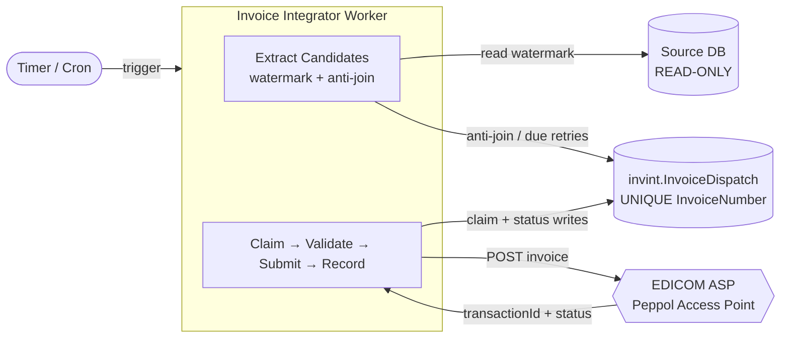
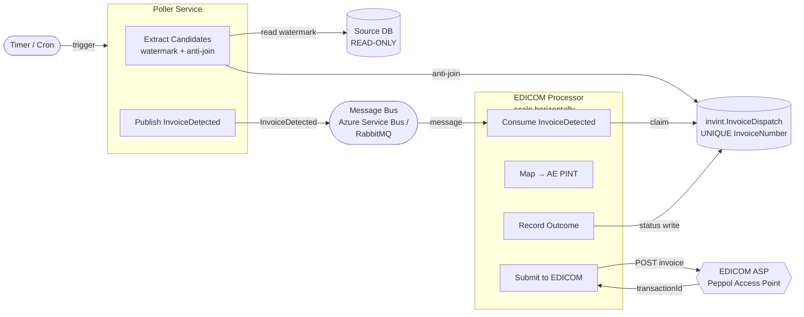
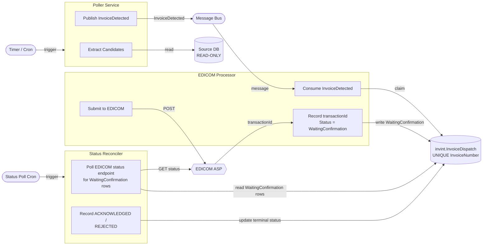
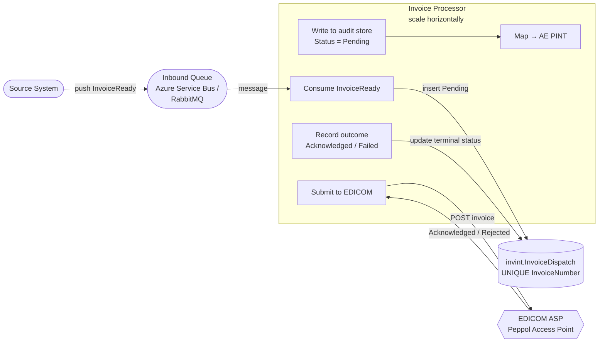
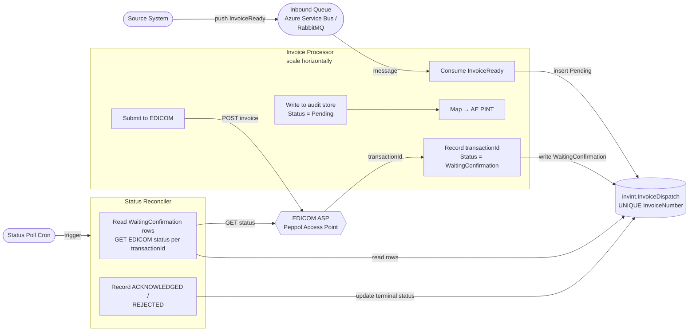
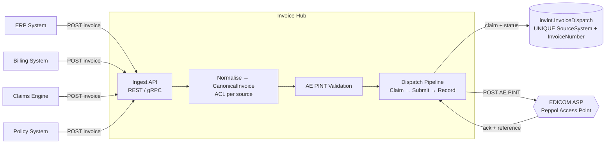
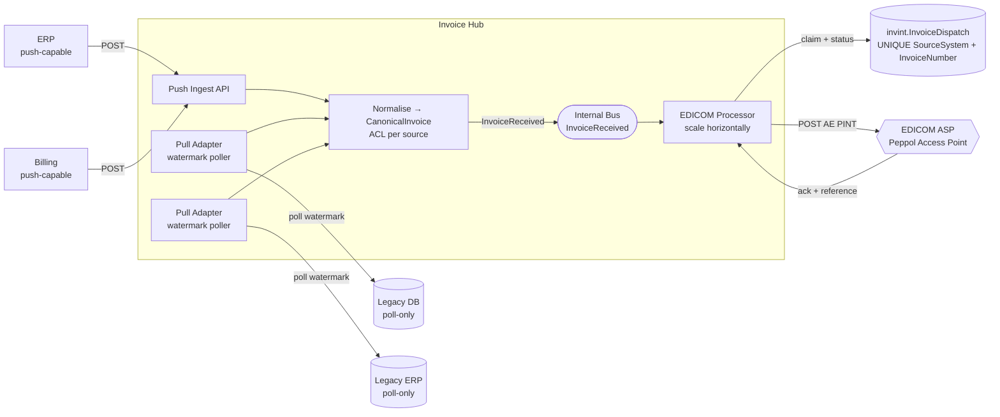

# Invoice Integration — Architecture Options

## Scenario A — Existing Source Database

### Option A1 — Direct Scheduled Extractor

---

### Option A2 — Polling Extractor + Message Bus + EDICOM Processor

> **Backpressure risk.** If the timer is delayed or misses runs, the poller may publish a large burst of messages at once. If the processor drains slower than the poller publishes (e.g. EDICOM throttling, circuit breaker open), the queue depth grows and can hit Service Bus size limits. Mitigate by capping the poller's batch size per run (`TOP N`) so the watermark advances incrementally, and scale out processor instances to drain faster.

---

### Option A3 — Polling Extractor + Bus + EDICOM Processor + Async Status Reconciler

> **Backpressure risk.** Same as A2 — a large catch-up burst from the poller can flood the bus faster than the processor drains it, compounded here by the reconciler adding its own EDICOM polling load. Apply the same batch size cap on the poller and scale out processor instances independently of the reconciler.

---

### Option A4 — Source-Notified: Source Pushes to Queue → Invoice Processor → EDICOM

The source system notifies us when an invoice is ready by placing it on a queue directly — no polling, no timer. The Invoice Processor picks it up, writes it to the audit store with `Status = Pending`, then submits to EDICOM.

Two sub-options depending on how EDICOM responds:

---

#### Option A4a — Synchronous EDICOM Response

EDICOM returns the final outcome (`ACKNOWLEDGED` / `REJECTED`) on the same HTTP call. The processor writes the terminal status immediately.

> **No backpressure from a poller** — the source controls the publish rate. If the source floods the queue the same processor scale-out applies. The `UNIQUE(InvoiceNumber)` constraint on the audit store prevents duplicates if the source sends the same invoice twice.

---

#### Option A4b — Asynchronous EDICOM Response (with Status Reconciler)

EDICOM returns only a `transactionId` on the POST. A separate reconciler polls the status endpoint until the invoice reaches a terminal state.

> **Choose A4b over A4a** when EDICOM's POST only confirms receipt (not final acceptance) — see [EDICOM-Info.md](EDICOM-Info.md) open question #11. If confirmed that the POST returns the final outcome synchronously, A4a is sufficient and simpler.

---

## Scenario B — No Existing Data Source (Invoice Hub)

### Option B1 — Invoice Hub with Push Ingest + EDICOM Publisher

---

### Option B2 — Invoice Hub with Mixed Push + Pull Adapters, Bus, EDICOM Publisher

Option B2 is the most complex scenario — designed for an insurance company with no single source of truth, where invoices come from multiple systems, some modern enough to push and some legacy that can only be polled.

**Ingest phase** — two modes running in parallel

Push path: modern systems (ERP, billing) call the Hub's ingest API directly when an invoice is ready. The Hub receives it immediately.
Pull path: legacy systems (old policy engine, legacy ERP) can't call out, so the Hub runs a dedicated poller per legacy source, using the same watermark pattern from ADR-001 to incrementally read new rows.
Both paths feed into the same normalisation step.

**Normalisation**

Each source has its own ACL adapter that maps its native schema to a single CanonicalInvoice contract. This is the critical seam — the rest of the pipeline never knows which system the invoice came from, only that it conforms to the canonical shape.

**Bus**

Once normalised, an InvoiceReceived message is published to the internal bus. From here the flow is identical regardless of whether the invoice arrived via push or pull.

**Processor**

Subscribes to InvoiceReceived, claims the row in invint.InvoiceDispatch (keyed on SourceSystem + InvoiceNumber to avoid collisions across sources), maps to AE PINT, submits to EDICOM, records the transactionId with Status = WaitingForConfirmation.

**Reconciler**

Same as A3 — polls EDICOM's status endpoint for all WaitingForConfirmation rows, writes the final Acknowledged or Failed outcome.

**Key difference from B1**

B1 only has the push path — all source systems must be capable of calling the Hub API. B2 adds the pull adapters for systems that can't, making it suitable for an insurance company with a mix of modern and legacy platforms generating invoices (policy renewals, claims settlements, premium adjustments, etc.).

The tradeoff is operational complexity: you're running push adapters, pull pollers, a bus, a processor, and a reconciler — five moving parts instead of one.

---

## Option Comparison Matrix

| Option                                          | Source assumption          | Event-driven? | Complexity  | Scales horizontally? | Best fit                                                  |
| ----------------------------------------------- | -------------------------- | :-----------: | :---------: | :------------------: | --------------------------------------------------------- |
| **A1** Direct Extractor                         | Single source DB           |  No (batch)   |     Low     |          No          | Simple, fastest to ship                                   |
| **A2** Extractor + Bus + Processor              | Single source DB           |      Yes      |   Medium    |   Yes (processor)    | Medium volume, clean separation of concerns               |
| **A3** Extractor + Bus + Async Status           | Single source DB           |      Yes      | Medium-High |         Yes          | Async EDICOM confirmation is critical                     |
| **A4a** Source-notified + Sync EDICOM           | Source pushes to queue     |      Yes      |   Medium    |   Yes (processor)    | Source can notify; EDICOM confirms synchronously on POST  |
| **A4b** Source-notified + Async Status          | Source pushes to queue     |      Yes      | Medium-High |         Yes          | Source can notify; EDICOM POST is receipt-only, not final |
| **B1** Invoice Hub (push)                       | None / multiple push       |    Partial    |   Medium    |         Yes          | Greenfield, all sources can push                          |
| **B2** Invoice Hub (push + pull)                | None / mixed               |      Yes      |    High     |         Yes          | Heterogeneous landscape with legacy systems               |
