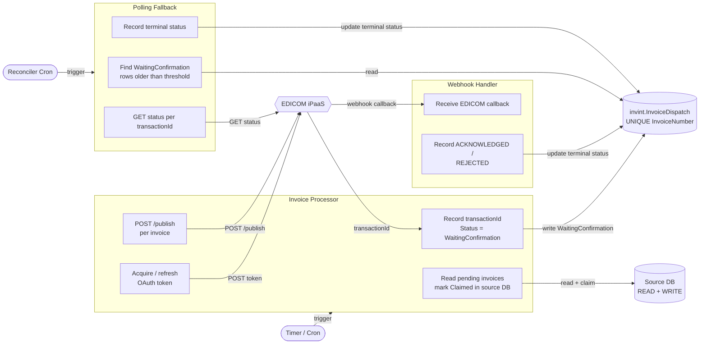
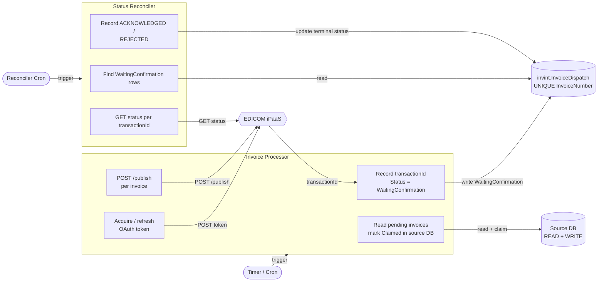
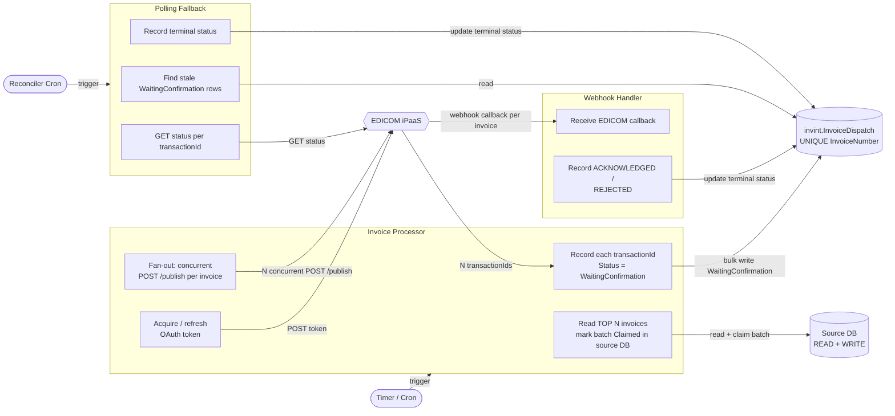
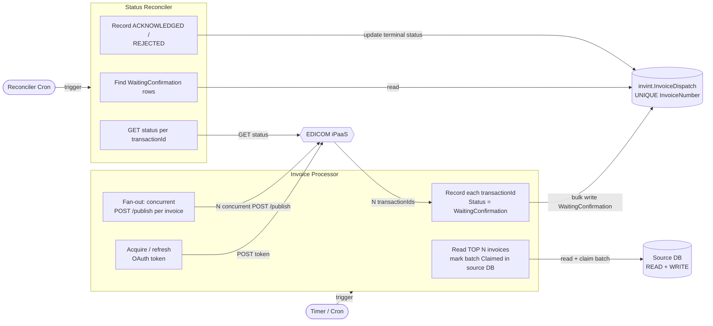
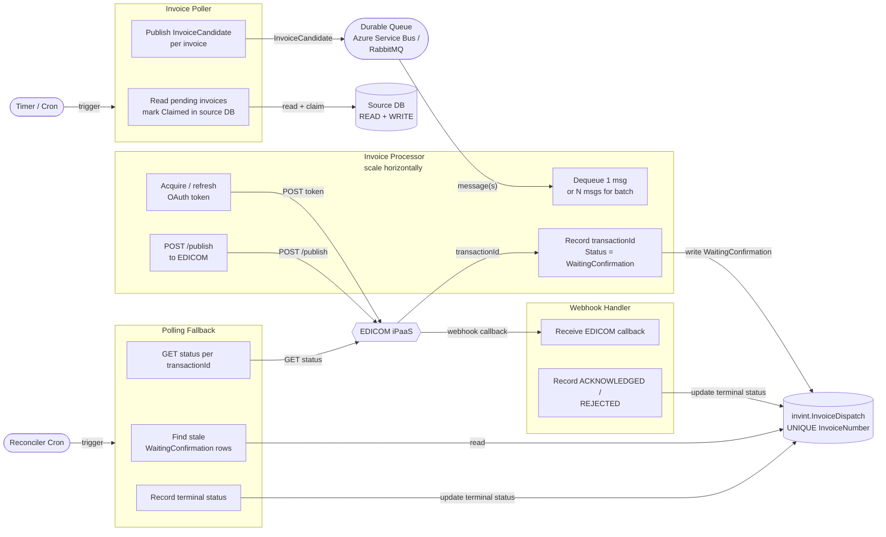

# Invoice Integration — Architecture Options

## Context

All options share the same core flow:

1. A **timer/cron** wakes up the processor.
2. The processor reads pending invoices from the **source DB** and marks them as claimed (write permission is available).
3. The processor acquires an **EDICOM OAuth 2.0 token** (`POST https://accounts.edicomgroup.com/token`) — cached until expiry, not per-invoice.
4. Invoices are **submitted to EDICOM** (`POST /publish`).
5. Final status is resolved via **webhook** (EDICOM calls us back) and/or **polling** (we call EDICOM's status endpoint).

The two orthogonal decisions are:

| Dimension           | Choice A                    | Choice B                              |
| ------------------- | --------------------------- | ------------------------------------- |
| **Processing unit** | One invoice per submit      | Batch of N invoices per run           |
| **Status channel**  | Webhook (EDICOM pushes us)  | Polling (we pull) — or webhook + poll fallback |

The four options below cover the practical combinations.

---

## Option 1 — Per-Invoice · Webhook + Polling Fallback

Each invoice is submitted individually. EDICOM calls our webhook with the final status. A background reconciler polls for any invoices that never received a callback (timeout guard).



**Tradeoffs**

- Lowest latency for status — EDICOM pushes the result the moment it's available.
- Requires a publicly reachable webhook endpoint (HTTPS, auth on the inbound call).
- The polling fallback is a safety net only; in steady state it should rarely fire.
- Token is acquired once per processor run and reused across all invoice submits in that run.
- If the source DB has many pending invoices the processor loops through them one by one — throughput is limited by the timer interval and single-threaded submit rate.

---

## Option 2 — Per-Invoice · Polling Only

Same as Option 1 but the webhook handler is removed. Status is always resolved by the reconciler polling EDICOM's status endpoint.



**Tradeoffs**

- Simplest to deploy — no inbound webhook surface, no firewall rules to open.
- Status latency is bounded by the reconciler interval (e.g., every 5 minutes), not real-time.
- Higher EDICOM API call volume if there are many `WaitingConfirmation` rows; may hit rate limits at scale.
- Correct choice if EDICOM's POST only returns a receipt (`transactionId`) and confirmation comes minutes later — polling is the only reliable mechanism regardless.

---

## Option 3 — Batch Submit · Webhook + Polling Fallback

The processor reads N invoices per run and submits them to EDICOM in parallel (concurrent HTTP calls under the same token). Each invoice is still a separate EDICOM publish call — "batch" here refers to the DB read window and the concurrent submit fan-out, not a single multi-document EDICOM payload.



**Tradeoffs**

- Significantly higher throughput than Option 1/2 — a single timer run can drain a large backlog.
- Concurrent submits must respect EDICOM rate limits; use a semaphore or throttle (e.g., max 10 in-flight at a time).
- Batch claiming in the source DB reduces the risk of another processor instance picking the same invoices (important if running multiple instances).
- The token is acquired once for the whole batch — do not re-request per invoice.
- Same webhook + polling fallback pattern as Option 1.

> **Batch size cap.** Always bound `TOP N` (e.g. 100–500 per run). Unbounded reads risk memory pressure and a large claim window that blocks retries if the run fails mid-batch.

---

## Option 4 — Batch Submit · Polling Only

Combines the batch fan-out from Option 3 with the polling-only status resolution from Option 2. Simplest end-to-end deployment.



**Tradeoffs**

- Best throughput with lowest operational surface — no inbound webhook, no TLS termination for callbacks.
- Same rate-limit and batch-size-cap concerns as Option 3.
- Status latency is reconciler-interval bounded (not real-time).

---

## Option 5 — Poller + Queue + Processor (Per-Invoice or Batch) · Webhook + Polling Fallback

Splits finding and submitting into two independent services connected by a durable queue. The poller's only job is to find candidates and publish them fast; one or more processor instances consume from the queue at their own pace. Horizontal scale-out is trivial — add processor instances to increase EDICOM throughput without touching the poller.

Works in two sub-modes depending on how the processor consumes the queue:

- **5a — Per-invoice**: processor dequeues one message at a time, submits one invoice to EDICOM per dequeue.
- **5b — Batch**: processor dequeues N messages at once, fan-out submits them concurrently under a single token.



**Tradeoffs**

- **Handles large backlogs gracefully** — if the poller finds 1 000 invoices it publishes 1 000 messages in seconds and is done; the processor(s) drain them at whatever rate EDICOM allows without any single run timing out.
- **Horizontal scale-out** — add processor instances to increase throughput; the queue is the natural backpressure valve.
- **Durable** — if a processor instance crashes mid-run the unacknowledged messages return to the queue and are retried by another instance; no invoices are lost.
- **5b batch mode** reuses one OAuth token per dequeue batch, keeping token request volume low even at high throughput.
- Extra moving part compared to Options 1–4 — requires a message broker (Azure Service Bus or RabbitMQ).
- Queue message visibility timeout must be longer than the worst-case EDICOM submit time to avoid duplicate delivery.

> **Batch size cap (5b).** Keep the dequeue window bounded (e.g. 50–200 per pull). Too large and a partial processor failure leaves a big unacknowledged window; too small and you lose the throughput benefit.

---

## Per-Invoice vs Batch — Decision Guide

| Factor                              | Per-Invoice (1 & 2)              | Batch (3 & 4)                          |
| ----------------------------------- | -------------------------------- | -------------------------------------- |
| **Expected daily volume**           | < ~500 invoices/day              | > 500 invoices/day or catch-up bursts  |
| **Implementation effort**           | Lower                            | Slightly higher (throttle, batch claim)|
| **EDICOM rate limit exposure**      | Lower per run                    | Higher per run — need throttle guard   |
| **Backlog drain speed**             | One per cycle                    | N per cycle (configurable)             |
| **Partial-batch failure handling**  | Simple — one invoice, one retry  | Must track which in batch succeeded    |

**Recommendation:** start with **Option 2** (per-invoice, polling) to ship quickly and validate the full pipeline. If volume or backlog drain time becomes a concern, migrate to **Option 4** (batch, polling) or **Option 5b** (queue + batch processor) if you also need resilience against large catch-up bursts or want horizontal scale-out. Add webhook support (Options 1 / 3 / 5 with webhook) only if EDICOM's confirmed turnaround is real-time and status polling latency is unacceptable.

---

## Option Comparison Matrix

| Option                                          | Processing unit      | Status channel          | Complexity  | Throughput | Best fit                                                     |
| ----------------------------------------------- | -------------------- | ----------------------- | :---------: | :--------: | ------------------------------------------------------------ |
| **1** Per-Invoice · Webhook + Poll guard        | Single invoice       | Webhook (poll fallback) |   Medium    |    Low     | Low volume, real-time status required                        |
| **2** Per-Invoice · Polling Only                | Single invoice       | Poll                    |     Low     |    Low     | Low volume, simplest to ship, status latency OK              |
| **3** Batch · Webhook + Poll guard              | Batch of N           | Webhook (poll fallback) |    High     |    High    | High volume, real-time status required                       |
| **4** Batch · Polling Only                      | Batch of N           | Poll                    |   Medium    |    High    | High volume, no webhook infrastructure, latency OK           |
| **5a** Queue · Per-Invoice · Webhook + Poll     | Single invoice       | Webhook (poll fallback) |    High     |    High    | High volume + scale-out + resilience, real-time status       |
| **5b** Queue · Batch · Webhook + Poll           | Batch of N per pull  | Webhook (poll fallback) |    High     |  Very High | High volume + scale-out + resilience, large backlog bursts   |

---

## Retry & Resiliency

Each layer of the pipeline can fail independently. The table below maps failure modes to their recovery mechanism before the full explanations.

| Failure                                      | Recovery mechanism                                      | Applies to       |
| -------------------------------------------- | ------------------------------------------------------- | ---------------- |
| Transient EDICOM submit error (5xx / timeout)| Polly retry with exponential backoff                    | All options      |
| EDICOM persistently unavailable              | Circuit breaker → abort run → stale claim recovery      | All options      |
| Processor crash after claim, before submit   | Stale claim reset in next processor run                 | All options      |
| Processor crash after submit, before record  | UNIQUE constraint prevents duplicate; reconciler covers | All options      |
| Webhook callback never arrives               | Polling reconciler (polling fallback or primary)        | Options 1, 3, 5  |
| WaitingConfirmation never resolves           | Reconciler max-attempts → mark Failed + alert           | All options      |
| Token endpoint unavailable                   | Retry token fetch → abort run → stale claim recovery    | All options      |
| Batch partial failure (some succeed, some not)| Per-invoice tracking; failed invoices reset by stale claim | Options 3, 4, 5b |
| Queue message fails repeatedly (Option 5)   | Dead-letter queue (DLQ) → alert on DLQ depth            | Option 5 only    |

---

### Submit retry — Polly (all options)

Every `POST /publish` call goes through a **retry + circuit-breaker** policy:

```
Retry:          3 attempts, exponential backoff — 1 s → 2 s → 4 s
Retry triggers: HTTP 429, 5xx, network timeout
Circuit breaker: open after 5 consecutive failures; half-open probe after 30 s
```

The circuit breaker prevents a full batch run from hammering a degraded EDICOM endpoint. When the breaker is open the processor aborts the current run; any already-claimed invoices are recovered by stale claim reset (see below).

Do **not** retry HTTP 400 / 422 — these indicate a malformed payload and retrying will always fail. Log the error, write `Failed` to the tracking table, and move on.

---

### Stale claim recovery (all options)

The source DB claim query always includes a timeout window:

```sql
UPDATE SourceInvoices
SET    Status = 'Claimed', ClaimedAt = GETUTCDATE()
OUTPUT inserted.*
WHERE  Status = 'Pending'
   OR (Status = 'Claimed' AND ClaimedAt < DATEADD(MINUTE, -@ClaimTimeoutMinutes, GETUTCDATE()))
```

`ClaimTimeoutMinutes` (default: 30) must be larger than the worst-case run duration. Any invoice whose claim window expires — whether the processor crashed, the circuit breaker fired, or a batch submit timed out — is automatically re-entered into the next run without manual intervention.

> **Batch note (Options 3, 4, 5b).** Track each invoice's submit result individually. A failed submit for invoice _k_ does not roll back the claims for invoices _k+1 … N_. Succeeded ones stay `WaitingConfirmation`; failed ones stay `Claimed` and expire normally.

---

### WaitingConfirmation timeout — reconciler (all options)

The reconciler acts as the last line of defence for invoices that never reach a terminal state:

1. Query `invint.InvoiceDispatch WHERE Status = 'WaitingConfirmation' AND SubmittedAt < NOW() - @GraceMinutes`.
2. Call `GET /messages` for each `transactionId`.
3. If EDICOM returns a terminal status → write `Acknowledged` or `Failed`.
4. If EDICOM returns _still pending_ → increment `ReconcileAttempts`.
5. If `ReconcileAttempts >= @MaxReconcilerAttempts` (default: 10) → write `Failed` with reason `MaxAttemptsExceeded` and trigger an alert.

`GraceMinutes` for **webhook options** (1, 3, 5) should be longer than EDICOM's typical callback latency (e.g., 15 min) to avoid premature polling. For **polling-only options** (2, 4) set it to the desired status check interval (e.g., 5 min).

---

### Token acquisition failure (all options)

Token fetch is retried up to 3 times with a short backoff before the processor run aborts. If the token endpoint is unavailable:

- Do **not** proceed to claim or submit — no invoices are touched.
- All previously claimed invoices (from an earlier run) remain claimed and are recovered by the stale claim reset on the next successful run.
- Alert on repeated token failures — this indicates an auth configuration issue, not a transient blip.

---

### Missed webhook delivery (Options 1, 3, 5)

EDICOM may not retry a webhook if our endpoint is unreachable or returns a non-2xx. This is the primary reason the polling fallback must always be enabled alongside the webhook. The sequence is:

```
EDICOM callback arrives  →  webhook handler writes terminal status  (fast path)
Callback never arrives   →  reconciler fires after GraceMinutes     (safety net)
```

If the webhook handler itself crashes after receiving but before writing, the reconciler will still recover the invoice within one reconciler interval. The handler should be idempotent — a duplicate callback for the same `transactionId` must not create a duplicate record (rely on the `UNIQUE(InvoiceNumber)` constraint and an upsert-style update).

---

### Dead-letter queue — Option 5 only

Configure Azure Service Bus (or equivalent) with `MaxDeliveryCount = 5`. After 5 failed delivery attempts the message is moved to the **dead-letter queue (DLQ)**:

- Set up an alert when DLQ depth > 0.
- A message lands in DLQ when the processor throws an unhandled exception on every delivery attempt. This typically signals a poison payload (schema mismatch, corrupted data) rather than a transient error — inspect before replaying.
- The corresponding invoice remains `Claimed` in the source DB. After manual investigation, either fix and re-enqueue the message or reset the claim to `Pending` to allow re-discovery.

The processor must only acknowledge (complete) a message **after** successfully writing `WaitingConfirmation` to the tracking table. A crash between submit and record causes the message to be redelivered; the EDICOM submit will be retried and the UNIQUE constraint prevents a duplicate dispatch record.

---

## Shared Design Notes

### Token handling
Acquire a token once per processor run (`POST https://accounts.edicomgroup.com/token`, scope `openid`). Cache it with its `expires_in` value and refresh proactively before expiry. Never request a new token per invoice.

### Idempotency
The `invint.InvoiceDispatch` table must carry a `UNIQUE(InvoiceNumber)` constraint. If the processor crashes after submitting to EDICOM but before writing `WaitingConfirmation`, the retry will hit a duplicate-key error on the source DB claim — safe to skip.

### Claim pattern in source DB
Use a single `UPDATE ... SET Status = 'Claimed', ClaimedAt = NOW() WHERE Status = 'Pending' [AND ClaimedAt < NOW() - retry_timeout]` with `OUTPUT` / `RETURNING` to atomically claim invoices and prevent double-processing across concurrent runs.

### EDICOM status endpoint
Until the webhook integration is confirmed, treat the `GET /messages` response (messages linked to a document / subscription messages) as the authoritative status source. The reconciler polls this for all `WaitingConfirmation` rows.
