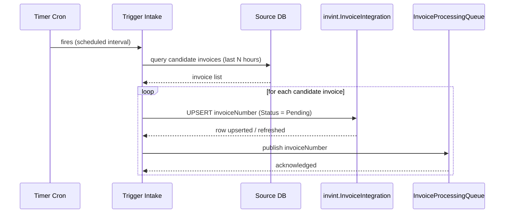
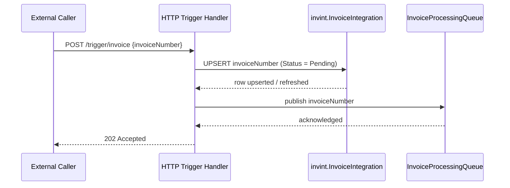
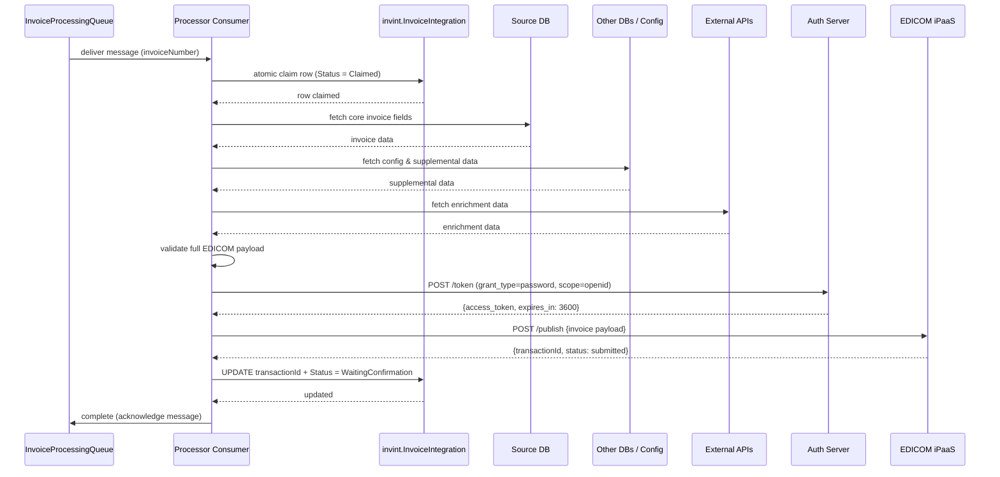
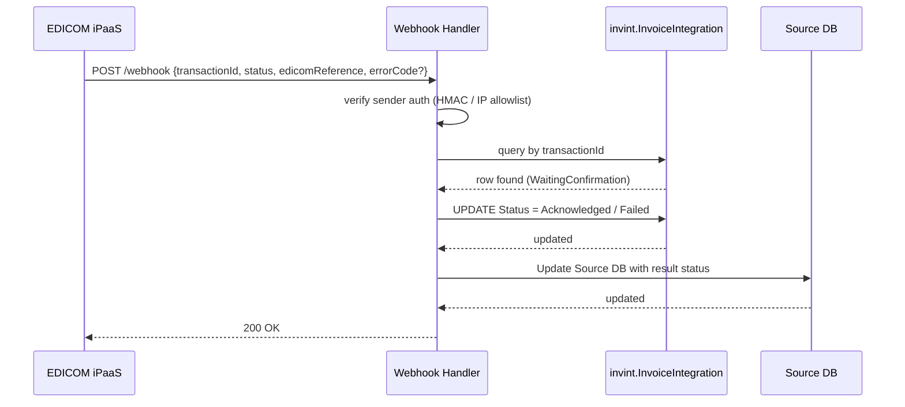
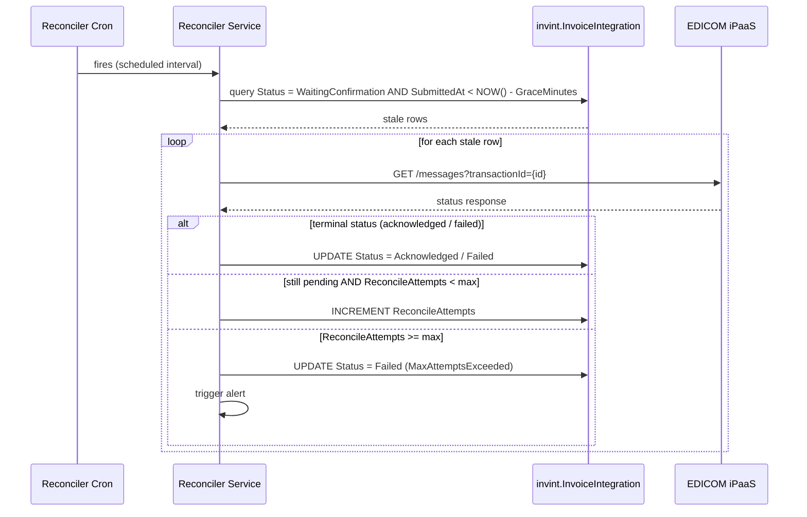

# Invoice Integration — Option 1 Architecture

## Overview

**Per-Invoice Submission with Webhook + Polling Fallback**

Each invoice is submitted individually to EDICOM. Both trigger types (cron batch and HTTP single-invoice) flow through the same intake path, then the same processor pipeline. Status is received via webhook callback (primary, lowest latency) with an async polling reconciler as a safety net for any missed callbacks.

> **Implementation plan:** see [IMPLEMENTATION-PHASES.md](IMPLEMENTATION-PHASES.md) for the phased delivery approach — payload builder first, EDICOM client behind an interface, triggers last.

---

## Trigger & Data Flow

Trigger intake and processing are decoupled. Intake always upserts the invoice row in the integration table and then publishes a processor message. The processor consumes messages, claims the row atomically, and runs the same EDICOM flow.


---

## Sequence Diagrams

### 1. Timer Cron — Trigger Intake

Cron fires, discovers candidate invoices from Source DB, and publishes one message per invoice to the queue.



---

### 2. HTTP Manual Trigger — Intake

An external caller submits a single invoice number. Intake upserts one row and publishes one message.



---

### 3. Processor Consumer — Claim, Enrich, and Submit

The processor consumes a queue message, claims the row, gathers all data from multiple sources, and submits to EDICOM.



---

### 4. Completion — Webhook Callback (primary) and Polling Reconciler (fallback)

EDICOM pushes the terminal status via webhook. If the callback never arrives, the reconciler polls until a terminal status is received or max attempts are exhausted.

#### 4a. Webhook callback



<br>

#### 4b. Polling reconciler (fallback)



---

## Retry & Resiliency

Each layer of the pipeline can fail independently. The table below maps failure modes to their recovery mechanism.

| Failure                                       | Recovery mechanism                                                  |
| --------------------------------------------- | ------------------------------------------------------------------- |
| Transient EDICOM submit error (5xx / timeout) | Polly retry with exponential backoff                                |
| EDICOM persistently unavailable               | Circuit breaker → abort run → stale claim recovery                  |
| Processor crash after claim, before submit    | Stale claim reset in next processor run                             |
| Processor crash after submit, before record   | Message redelivered; idempotent state transition prevents duplicate |
| Webhook callback never arrives                | Polling reconciler fires after `GraceMinutes`                       |
| WaitingConfirmation never resolves            | Reconciler max-attempts → mark `Failed` + alert                     |
| Token endpoint unavailable                    | Retry token fetch → abort run → stale claim recovery                |
| Partial batch failure                         | Per-invoice tracking; failed invoices recover via stale claim reset |
| Queue message fails repeatedly                | Dead-letter queue (DLQ) → alert on DLQ depth                        |

---

### Submit retry — Polly

Every `POST /publish` call goes through a **retry + circuit-breaker** policy:

```
Retry:           3 attempts, exponential backoff — 1 s → 2 s → 4 s
Retry triggers:  HTTP 429, 5xx, network timeout
Circuit breaker: open after 5 consecutive failures; half-open probe after 30 s
```

When the circuit breaker opens, the processor aborts the current run; already-claimed invoices are recovered by stale claim reset.

Do **not** retry HTTP 400 / 422 — these indicate a malformed payload. Log the error, write `Failed` to `invint.InvoiceIntegration`, and move on.

---

### Stale claim recovery — behavior with once-a-day trigger

> **Important:** The stale claim reset is embedded in the processor's claim query — it only runs when the processor consumes a message from the queue. With a once-a-day cron trigger, the processor goes idle once the queue is empty. There is no background process waking the processor up every 30 minutes.

**What actually happens when EDICOM is down:**

```
DAY 1 — Cron fires (08:00, once)
─────────────────────────────────────────────────────────
  08:00  Cron fires → discovers INV-001 → UPSERT Status = Pending
         └─ Publishes INV-001 to queue

  08:02  Processor wakes up (queue message received)
         └─ Claim query runs → Status = Claimed, ClaimedAt = 08:02
         └─ Gathers data, builds payload
         └─ POST /publish → EDICOM DOWN
            ├─ Retry 1 (1s)  → fails
            ├─ Retry 2 (2s)  → fails
            ├─ Retry 3 (4s)  → fails
            └─ Circuit breaker opens → processor aborts
               Queue empty → processor goes idle

  INV-001 stays: Status = Claimed, ClaimedAt = 08:02
  Queue empty → processor idle for the rest of the day

─────────────────────────────────────────────────────────
DAY 2 — Cron fires (08:00, once)
─────────────────────────────────────────────────────────
  08:00  Cron fires → queries Source DB
         └─ Finds INV-001 (still unprocessed in Source DB) + INV-002 (new)
         └─ UPSERT INV-001 → resets Status = Pending   ← cron drives the retry, not the processor
         └─ UPSERT INV-002 → Status = Pending
         └─ Publishes INV-001 to queue
         └─ Publishes INV-002 to queue

  08:02  Processor wakes up (INV-001 message received)
         └─ Atomic claim → Status = Claimed
         └─ POST /publish → EDICOM still down → fails
         └─ Queue still has INV-002

  08:02  Processor wakes up (INV-002 message received)
         └─ Atomic claim → Status = Claimed
         └─ POST /publish → EDICOM still down → fails
         └─ Queue empty → processor idle again
```

> **Result:** Stuck invoices are retried the next day when new invoices arrive and wake the processor. If no new invoices come in, the stuck invoice waits indefinitely.

---

### Options to improve observability and recovery

**Option A — Housekeeping cron (operational)**

Add a lightweight scheduled job (every 30 min) that re-publishes stale `Claimed` rows back to the queue independently of the daily trigger. This keeps retry cadence at 30 min regardless of whether new invoices arrive.

```
Every 30 min:
  Query: Status = Claimed AND ClaimedAt < NOW() - ClaimTimeoutMinutes
         AND StaleResetCount < MaxStaleResets
  For each stale row:
    └─ Increment StaleResetCount
    └─ Reset Status = Pending
    └─ Re-publish invoiceNumber to queue
  If StaleResetCount >= MaxStaleResets:
    └─ Status = Blocked
    └─ Trigger alert
```

**Option B — Dashboard / monitoring (observability)**

Without adding a new cron, expose stuck invoices via a query or monitoring alert so ops can act manually:

```sql
-- Invoices stuck in Claimed with multiple reset attempts
SELECT InvoiceNumber, ClaimedAt, StaleResetCount, FailureReason
FROM   invint.InvoiceIntegration
WHERE  Status = 'Claimed'
  AND  StaleResetCount >= 2
ORDER  BY ClaimedAt ASC
```

Surface this in a dashboard or alert (e.g. alert when any row has `StaleResetCount >= 2`). Ops can investigate EDICOM health and manually reset rows to `Pending` when the service recovers.

> **Recommendation:** Option B has zero infrastructure cost and covers the observable failure. Add Option A only if next-day retry violates your SLA.
---


### Step 5: Optional — Subscription / Webhook Registration

**Endpoint:** `POST /subscription` or similar (details TBD with EDICOM team)

**Purpose:** Register or update webhook callbacks so EDICOM knows where to push status.

**Action:** Coordinate with EDICOM ops to register the webhook URL. May be a one-time setup or managed via their UI.

> **Confirm with EDICOM:** Webhook retry policy, timeout, payload format, and authentication method.

---

## Invoice Status Definitions & Flows

### Statuses

| Status | Type | Meaning |
|--------|------|---------|
| `Pending` | In-flight | Upserted by cron; ready to be consumed from queue |
| `Claimed` | In-flight | Processor owns the row; work in progress |
| `WaitingConfirmation` | In-flight | Successfully submitted to EDICOM; awaiting terminal status |
| `Acknowledged` | Terminal ✓ | EDICOM confirmed the invoice |
| `Failed` | Terminal ✗ | Processing ended with an error; see `FailureReason` |

### `FailureReason` values

| Value | When |
|-------|------|
| `ValidationFailed` | Payload failed AE PINT validation before any EDICOM call |
| `SubmitRejected` | EDICOM returned 400 / 422 — malformed payload, do not retry |
| `MaxAttemptsExceeded` | Reconciler exhausted all polling attempts with no terminal status |

> `CircuitOpen` is **not** a valid `FailureReason`. When the circuit breaker opens the row stays `Claimed` — it is a transient condition recovered by the next cron run, not a terminal failure.

---

### Flows

**Happy path**
```
Cron discovers invoice
  └─ UPSERT → Pending → published to queue

Processor receives message
  └─ Claimed → gather + validate + submit to EDICOM
  └─ WaitingConfirmation (transactionId recorded)

Completion
  └─ Webhook arrives           → Acknowledged ✓
     OR
  └─ Reconciler polls EDICOM   → Acknowledged ✓
```

**Validation fails**
```
Processor receives message
  └─ Claimed → payload validation fails
  └─ Failed (ValidationFailed)
  └─ Message acknowledged — no retry
```

**EDICOM rejects payload (400 / 422)**
```
Processor receives message
  └─ Claimed → POST /publish → 400 / 422
  └─ Failed (SubmitRejected)
  └─ Message acknowledged — no retry
```

**Reconciler exhausted**
```
WaitingConfirmation past GraceMinutes
  └─ Reconciler polls GET /messages each interval
  └─ ReconcileAttempts >= max → Failed (MaxAttemptsExceeded) + alert
```

**EDICOM persistently down**
```
Processor receives message
  └─ Claimed → POST /publish → Polly retries (1s, 2s, 4s) → all fail
  └─ Circuit breaker opens → processor aborts
  └─ Message NOT acknowledged → queue redelivers
  └─ Row stays Claimed, queue empties, processor goes idle

Next day cron fires
  └─ Re-discovers same invoice from Source DB
  └─ UPSERT resets → Pending, StaleResetCount++
  └─ Re-published to queue → processor retries
```

**Processor crash / DLQ**
```
Processor receives message
  └─ Claimed → crashes before acknowledging
  └─ Queue redelivers (count 2, 3, 4, 5)
  └─ Each redelivery: row is Claimed, not stale → processor cannot claim → abandons
  └─ After 5 deliveries → message → DLQ, row stays Claimed
  └─ Alert: DLQ depth > 0

Next day cron fires
  └─ Re-discovers invoice → UPSERT resets → Pending → re-published
  └─ Only recovers if root cause (processor bug) is fixed first
     otherwise → DLQ again
```

---

## Shared Design Notes

### Token handling

Acquire a token once per processor run (`POST https://accounts.edicomgroup.com/token`, scope `openid`). Cache it with its `expires_in` value and refresh proactively before expiry. Never request a new token per invoice.

### Idempotency

Use `invint.InvoiceIntegration.UNIQUE(InvoiceNumber)` to collapse duplicate trigger events and keep one lifecycle row per invoice.

If the processor crashes after submit but before writing `WaitingConfirmation`, the same invoice may be retried; atomic state transitions and uniqueness keep persistence idempotent.

### Claim pattern in integration table

Use a single `UPDATE ... SET Status = 'Claimed', ClaimedAt = NOW() WHERE Status = 'Pending' [OR stale claimed]` with `OUTPUT` / `RETURNING` to atomically claim rows and prevent double-processing across concurrent runs.

For cron discovery, source rows can still be marked `Claimed` (or equivalent) in the source system before upserting integration rows; HTTP trigger creates/refreshes one integration row directly.

### EDICOM status endpoint

Until the webhook integration is confirmed, treat the `GET /messages` response (messages linked to a document / subscription messages) as the authoritative status source. The reconciler polls this for all `WaitingConfirmation` rows.
