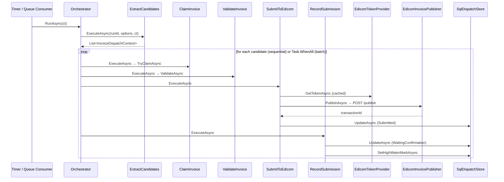
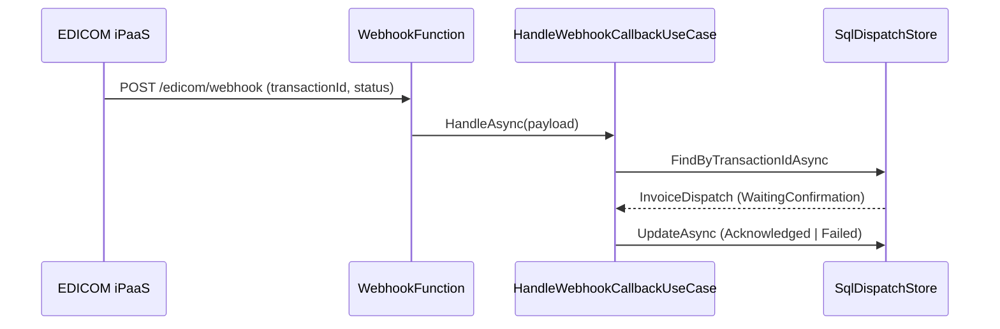
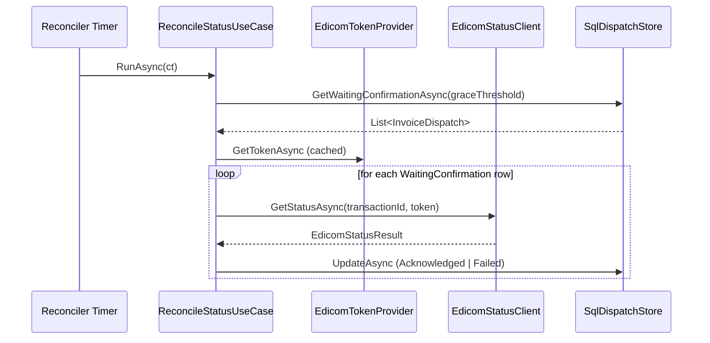

# Invoice Integration Service — Technical Design

## Overview

This document describes the internal architecture of the **Invoice Integration Service**: a scheduled worker that extracts invoice data from a source SQL database (read + write) and dispatches it to EDICOM (UAE ASP / Peppol Access Point) via the EDICOM iPaaS REST API.

The design supports all architecture options defined in [ARCHITECTURE-OPTIONS.md](ARCHITECTURE-OPTIONS.md). The core domain and application layers are identical across all options. What varies per option is:

| Dimension | Options | Variation point |
|---|---|---|
| **Processing unit** | 1, 2 → per-invoice · 3, 4 → batch · 5a, 5b → queue-fed | Orchestrator + queue adapters |
| **Status channel** | 1, 3, 5 → webhook + poll fallback · 2, 4 → poll only | WebhookHandler + StatusReconciler |
| **Token strategy** | All | `IEdicomTokenProvider` — cached OAuth 2.0 |

The architecture combines two complementary patterns:

- **Hexagonal Architecture (Ports & Adapters)** — defines the structural seams. The domain and application cores have zero knowledge of EDICOM, SQL Server, Azure Functions, or any message broker. All external contracts are hidden behind interfaces (ports) and injected via adapters.
- **Step Pipeline + State Machine** — defines the workflow shape inside the application layer. Each processing step is an explicit use case with a typed input/output contract. Status transitions are governed by a state machine in the domain, not scattered ad-hoc conditionals.

---

## Architecture Layers

```
┌────────────────────────────────────────────────────────────────────────────────────┐
│  Driving Adapters (Infrastructure)                                                 │
│  AzureFunctionTimerAdapter  │  QueueConsumerAdapter (Option 5)                     │
│  WebhookHandlerAdapter      │  ManualTriggerAdapter (dev/test)                     │
└──────────────┬──────────────────────────┬──────────────────────────────────────────┘
               │ calls                    │ calls
               ▼                          ▼
┌──────────────────────────┐  ┌───────────────────────────────────────────────────────┐
│  Application Layer       │  │  Application Layer                                    │
│                          │  │                                                       │
│  RunDispatchBatchUseCase │  │  HandleWebhookCallbackUseCase                         │
│  (orchestrator)          │  │  ReconcileStatusUseCase                               │
│    │                     │  │                                                       │
│    ├─► ExtractCandidates │  │  Driven Ports (interfaces)                            │
│    ├─► ClaimInvoice      │  │  ISourceInvoiceRepository  IDispatchStore             │
│    ├─► ValidateInvoice   │  │  IInvoicePublisher         IEdicomTokenProvider        │
│    ├─► SubmitToEdicom    │  │  IRunStateStore             IPayloadMapper             │
│    └─► RecordSubmission  │  │  IInvoiceQueuePublisher    IEdicomStatusClient         │
└──────────────────────────┘  └───────────────────────────────────────────────────────┘
        │                                      │
        ▼                                      ▼
┌────────────┐  ┌──────────────┐  ┌──────────────────────────────────────────────────┐
│  Domain    │  │  SQL         │  │  Driven Adapters (Infrastructure)                │
│  Layer     │  │  Adapters    │  │                                                  │
│            │  │              │  │  EdicomInvoicePublisher  (IInvoicePublisher)      │
│ Entities   │  │ SqlSource    │  │  EdicomTokenProvider     (IEdicomTokenProvider)   │
│ ValueObjs  │  │ InvoiceRepo  │  │  EdicomStatusClient      (IEdicomStatusClient)    │
│ State      │  │ SqlDispatch  │  │  EdicomPayloadMapper     (IPayloadMapper)         │
│ Machine    │  │ Store        │  │  ServiceBusQueuePublisher (IInvoiceQueuePublisher)│
│            │  │ SqlRunState  │  │  (Azure Service Bus / RabbitMQ adapters)          │
│            │  │ Store        │  │                                                  │
└────────────┘  └──────────────┘  └──────────────────────────────────────────────────┘
```

---

## Folder / Namespace Layout

```
InvoiceIntegrator/
│
├── Domain/
│   ├── Entities/
│   │   ├── InvoiceDispatch.cs          # dispatch record aggregate
│   │   └── SourceInvoice.cs            # read model from source DB
│   ├── ValueObjects/
│   │   └── DispatchStatus.cs           # enum + state machine transitions
│   └── Exceptions/
│       ├── InvalidStatusTransitionException.cs
│       └── DuplicateDispatchException.cs
│
├── Application/
│   ├── Ports/                          # driven ports (interfaces)
│   │   ├── ISourceInvoiceRepository.cs
│   │   ├── IDispatchStore.cs
│   │   ├── IInvoicePublisher.cs
│   │   ├── IEdicomTokenProvider.cs     # OAuth 2.0 token cache
│   │   ├── IEdicomStatusClient.cs      # poll EDICOM status per transactionId
│   │   ├── IRunStateStore.cs
│   │   ├── IPayloadMapper.cs
│   │   └── IInvoiceQueuePublisher.cs   # Option 5 only — publish candidates to queue
│   │
│   ├── Pipeline/                       # step abstraction + context
│   │   ├── IDispatchStep.cs
│   │   ├── InvoiceDispatchContext.cs
│   │   └── StepOutcome.cs
│   │
│   ├── UseCases/
│   │   ├── ExtractCandidatesUseCase.cs
│   │   ├── ClaimInvoiceUseCase.cs
│   │   ├── ValidateInvoiceUseCase.cs
│   │   ├── SubmitToEdicomUseCase.cs
│   │   ├── RecordSubmissionUseCase.cs  # records transactionId + WaitingConfirmation
│   │   ├── HandleWebhookCallbackUseCase.cs  # Options 1, 3, 5
│   │   └── ReconcileStatusUseCase.cs        # all options (primary or fallback)
│   │
│   └── Orchestration/
│       ├── RunDispatchBatchUseCase.cs  # per-invoice sequential (Options 1, 2)
│       ├── RunDispatchBatchBatchUseCase.cs  # batch fan-out (Options 3, 4)
│       └── PublishCandidatesToQueueUseCase.cs  # Option 5 — poller side
│
└── Infrastructure/
    ├── Persistence/
    │   ├── SqlSourceInvoiceRepository.cs
    │   ├── SqlDispatchStore.cs
    │   └── SqlRunStateStore.cs
    ├── Edicom/
    │   ├── EdicomInvoicePublisher.cs   # IInvoicePublisher adapter + Polly
    │   ├── EdicomTokenProvider.cs      # OAuth 2.0 token cache
    │   ├── EdicomStatusClient.cs       # IEdicomStatusClient adapter
    │   └── EdicomPayloadMapper.cs      # IPayloadMapper adapter (ACL)
    ├── Messaging/
    │   └── ServiceBusQueuePublisher.cs # IInvoiceQueuePublisher (Option 5)
    └── Host/
        ├── AzureFunctionTimerAdapter.cs       # drives RunDispatchBatchUseCase
        ├── AzureFunctionReconcilerAdapter.cs  # drives ReconcileStatusUseCase
        ├── AzureFunctionWebhookAdapter.cs     # drives HandleWebhookCallbackUseCase (Options 1, 3, 5)
        ├── AzureFunctionQueueConsumerAdapter.cs  # drives processor from queue (Option 5)
        └── DependencyInjection.cs
```

---

## Domain Layer

The domain layer contains only pure C# — no NuGet dependencies, no framework references.

### `DispatchStatus` — State Machine

`WaitingConfirmation` is added to represent the state after EDICOM accepts the submission but before it returns a final outcome. This is the normal intermediate state in all options — webhook or reconciler resolves it to a terminal state.

```csharp
// Domain/ValueObjects/DispatchStatus.cs
public enum DispatchStatus
{
    Pending,
    Claimed,
    Submitted,              // EDICOM POST accepted, transactionId recorded
    WaitingConfirmation,    // transactionId stored, awaiting final EDICOM outcome
    Acknowledged,           // terminal
    Failed,                 // terminal (until manual replay)
    Retryable,
    DeadLettered            // terminal (until manual replay)
}

public static class DispatchStatusTransitions
{
    private static readonly HashSet<(DispatchStatus, DispatchStatus)> _allowed = new()
    {
        (DispatchStatus.Pending,              DispatchStatus.Claimed),
        (DispatchStatus.Retryable,            DispatchStatus.Claimed),
        (DispatchStatus.Claimed,              DispatchStatus.Submitted),
        (DispatchStatus.Submitted,            DispatchStatus.WaitingConfirmation),
        (DispatchStatus.WaitingConfirmation,  DispatchStatus.Acknowledged),
        (DispatchStatus.WaitingConfirmation,  DispatchStatus.Failed),
        (DispatchStatus.Submitted,            DispatchStatus.Retryable),   // transient EDICOM error
        (DispatchStatus.Retryable,            DispatchStatus.DeadLettered),
        (DispatchStatus.Failed,               DispatchStatus.Retryable),   // manual replay
        (DispatchStatus.DeadLettered,         DispatchStatus.Retryable),
    };

    public static bool IsAllowed(DispatchStatus from, DispatchStatus to)
        => _allowed.Contains((from, to));
}
```

**State flow:**

```
Pending ──► Claimed ──► Submitted ──► WaitingConfirmation ──► Acknowledged
                   │                                      └──► Failed
                   └──► Retryable ──► (Claimed again on next run)
                              └──► DeadLettered
```

### `InvoiceDispatch` — Aggregate

```csharp
// Domain/Entities/InvoiceDispatch.cs
public sealed class InvoiceDispatch
{
    public string         InvoiceNumber       { get; private set; }
    public string         SourceSystem        { get; private set; }
    public DispatchStatus Status              { get; private set; }
    public int            AttemptCount        { get; private set; }
    public string?        PayloadHash         { get; private set; }
    public string?        EdicomTransactionId { get; private set; }  // set on Submitted
    public string?        EdicomReference     { get; private set; }  // set on Acknowledged
    public string?        LastErrorCode       { get; private set; }
    public string?        LastErrorMessage    { get; private set; }
    public string?        ClaimedBy           { get; private set; }
    public DateTime?      ClaimedAtUtc        { get; private set; }
    public DateTime?      NextAttemptAtUtc    { get; private set; }
    public DateTime       CreatedAtUtc        { get; private set; }
    public DateTime       UpdatedAtUtc        { get; private set; }
    public DateTime?      AcknowledgedAtUtc   { get; private set; }

    public static InvoiceDispatch CreatePending(string invoiceNumber, string sourceSystem) => ...;

    public void Transition(DispatchStatus to, Action<InvoiceDispatch> mutate) { ... }

    public void Claim(string runId) => ...;
    public void MarkSubmitted(string payloadHash, string transactionId)
        => Transition(DispatchStatus.Submitted, d =>
        {
            d.PayloadHash         = payloadHash;
            d.EdicomTransactionId = transactionId;
            d.AttemptCount++;
        });

    public void MarkWaitingConfirmation()
        => Transition(DispatchStatus.WaitingConfirmation, _ => { });

    public void Acknowledge(string edicomReference)
        => Transition(DispatchStatus.Acknowledged, d =>
        {
            d.EdicomReference   = edicomReference;
            d.AcknowledgedAtUtc = DateTime.UtcNow;
        });

    public void Fail(string errorCode, string errorMessage) => ...;
    public void ScheduleRetry(DateTime nextAttempt) => ...;
    public void DeadLetter(string reason) => ...;
}
```

### `SourceInvoice` — Read Model

```csharp
// Domain/Entities/SourceInvoice.cs
public sealed class SourceInvoice
{
    public required string   InvoiceNumber  { get; init; }
    public required long     WatermarkValue { get; init; }
    public required DateTime InvoiceDate    { get; init; }
    public required string   CustomerName   { get; init; }
    public required string   CustomerVatId  { get; init; }
    public required decimal  TotalAmount    { get; init; }
    public required string   CurrencyCode   { get; init; }
    // ... additional fields confirmed with source DB owner
}
```

---

## Application Layer

### Driven Ports

```csharp
// ISourceInvoiceRepository.cs — read-only; enforced by NetArchTest
public interface ISourceInvoiceRepository
{
    Task<IReadOnlyList<SourceInvoice>> GetCandidatesAsync(long lastHighWaterMark, CancellationToken ct);
}

// IDispatchStore.cs
public interface IDispatchStore
{
    Task<InvoiceDispatch?> FindByInvoiceNumberAsync(string invoiceNumber, CancellationToken ct);
    Task InsertPendingAsync(InvoiceDispatch dispatch, CancellationToken ct);
    Task<bool> TryClaimAsync(string invoiceNumber, string runId, CancellationToken ct);
    Task UpdateAsync(InvoiceDispatch dispatch, CancellationToken ct);
    Task<IReadOnlyList<InvoiceDispatch>> GetDueForProcessingAsync(DateTime visibilityTimeout, CancellationToken ct);

    // Used by reconciler — returns WaitingConfirmation rows older than graceThreshold
    Task<IReadOnlyList<InvoiceDispatch>> GetWaitingConfirmationAsync(DateTime graceThreshold, CancellationToken ct);
}

// IEdicomTokenProvider.cs — OAuth 2.0 token cache; one token per run, not per invoice
public interface IEdicomTokenProvider
{
    // Returns a valid Bearer token, refreshing proactively when near expiry.
    Task<string> GetTokenAsync(CancellationToken ct);
}

// IInvoicePublisher.cs
public interface IInvoicePublisher
{
    // Returns EDICOM-assigned transactionId on success.
    // Throws PublisherTransientException or PublisherPermanentException on failure.
    Task<string> PublishAsync(SourceInvoice invoice, string bearerToken, CancellationToken ct);
}

// IEdicomStatusClient.cs — used by reconciler and webhook fallback
public interface IEdicomStatusClient
{
    // Polls EDICOM status endpoint for the given transactionId.
    Task<EdicomStatusResult> GetStatusAsync(string transactionId, string bearerToken, CancellationToken ct);
}

// IRunStateStore.cs
public interface IRunStateStore
{
    Task<long> GetHighWaterMarkAsync(CancellationToken ct);
    Task SetHighWaterMarkAsync(long value, CancellationToken ct);
}

// IPayloadMapper.cs
public interface IPayloadMapper
{
    Task<IReadOnlyList<string>> ValidateAsync(SourceInvoice invoice, CancellationToken ct);
    Task<object> MapAsync(SourceInvoice invoice, CancellationToken ct);
}

// IInvoiceQueuePublisher.cs — Option 5 only
public interface IInvoiceQueuePublisher
{
    Task PublishCandidateAsync(SourceInvoice invoice, CancellationToken ct);
    Task PublishCandidatesBatchAsync(IReadOnlyList<SourceInvoice> invoices, CancellationToken ct);
}
```

---

### Step Pipeline Abstraction

Unchanged from the original design. `InvoiceDispatchContext`, `StepOutcome`, and `IDispatchStep` remain the same. The pipeline flows:

```
Claim → Validate → Submit → RecordSubmission
```

`RecordSubmission` replaces the former `RecordOutcome`. It records the `transactionId` and sets `WaitingConfirmation`. Final status (`Acknowledged` / `Failed`) is resolved outside the pipeline by the **WebhookHandler** or **StatusReconciler**.

---

### Use Cases (Steps)

#### Step 1 — `ExtractCandidatesUseCase` (unchanged)
Reads from source DB using watermark + due-retries merge. Not a pipeline step — runs once per batch.

#### Step 2 — `ClaimInvoiceUseCase` (unchanged)
Atomically claims `Pending` / `Retryable` rows. Returns `Skip` if race-lost.

#### Step 3 — `ValidateInvoiceUseCase` (unchanged)
Maps and validates against AE PINT schema. Returns `Abort(Failed)` on permanent validation error.

#### Step 4 — `SubmitToEdicomUseCase`

Acquires a token via `IEdicomTokenProvider` (cached — not per-invoice), submits, records the transactionId. Polly retry + circuit breaker live in the `EdicomInvoicePublisher` adapter.

```csharp
public async Task<StepOutcome> ExecuteAsync(InvoiceDispatchContext ctx, CancellationToken ct)
{
    var token       = await _tokenProvider.GetTokenAsync(ct);
    var payloadHash = ComputeHash(ctx.Source);

    try
    {
        var transactionId = await _publisher.PublishAsync(ctx.Source, token, ct);
        ctx.Dispatch.MarkSubmitted(payloadHash, transactionId);
        ctx.TransactionId = transactionId;
        await _store.UpdateAsync(ctx.Dispatch, ct);
        return StepOutcome.Continue();
    }
    catch (PublisherTransientException ex) when (ctx.Dispatch.AttemptCount < _options.MaxAttempts)
    {
        ctx.Dispatch.ScheduleRetry(DateTime.UtcNow.Add(BackoffSchedule.Next(ctx.Dispatch.AttemptCount, _options)));
        await _store.UpdateAsync(ctx.Dispatch, ct);
        return StepOutcome.Abort($"Transient, retry scheduled: {ex.Message}");
    }
    catch (PublisherTransientException ex)
    {
        ctx.Dispatch.DeadLetter($"Max attempts exceeded: {ex.Message}");
        await _store.UpdateAsync(ctx.Dispatch, ct);
        return StepOutcome.Abort("Dead-lettered");
    }
    catch (PublisherPermanentException ex)
    {
        ctx.Dispatch.Fail(ex.ErrorCode, ex.ErrorMessage);
        await _store.UpdateAsync(ctx.Dispatch, ct);
        return StepOutcome.Abort($"Permanent failure: {ex.ErrorCode}");
    }
}
```

#### Step 5 — `RecordSubmissionUseCase` (replaces `RecordOutcomeUseCase`)

Records `WaitingConfirmation` and advances the watermark. Final status is resolved by webhook or reconciler — not here.

```csharp
public async Task<StepOutcome> ExecuteAsync(InvoiceDispatchContext ctx, CancellationToken ct)
{
    ctx.Dispatch.MarkWaitingConfirmation();
    await _store.UpdateAsync(ctx.Dispatch, ct);
    await _runState.SetHighWaterMarkAsync(ctx.Source.WatermarkValue, ct);
    return StepOutcome.Continue();
}
```

---

### Status Resolution Use Cases

These run independently of the submission pipeline — driven by their own Azure Function triggers.

#### `HandleWebhookCallbackUseCase` (Options 1, 3, 5)

```csharp
// Called by AzureFunctionWebhookAdapter when EDICOM POSTs a callback.
public async Task HandleAsync(WebhookPayload payload, CancellationToken ct)
{
    var dispatch = await _store.FindByTransactionIdAsync(payload.TransactionId, ct);
    if (dispatch is null) return; // unknown or already terminal — ignore

    if (payload.IsAcknowledged)
        dispatch.Acknowledge(payload.EdicomReference);
    else
        dispatch.Fail(payload.ErrorCode, payload.ErrorMessage);

    await _store.UpdateAsync(dispatch, ct);
}
```

#### `ReconcileStatusUseCase` (all options — primary for 2/4, fallback for 1/3/5)

Runs on a separate cron timer. Finds `WaitingConfirmation` rows older than the grace period (giving webhook time to arrive first), polls EDICOM, and writes terminal status.

```csharp
public async Task RunAsync(CancellationToken ct)
{
    var token    = await _tokenProvider.GetTokenAsync(ct);
    var grace    = DateTime.UtcNow.AddMinutes(-_options.WebhookGraceMinutes);
    var pending  = await _store.GetWaitingConfirmationAsync(grace, ct);

    foreach (var dispatch in pending)
    {
        var result = await _statusClient.GetStatusAsync(dispatch.EdicomTransactionId!, token, ct);

        if (result.IsTerminal)
        {
            if (result.IsAcknowledged)
                dispatch.Acknowledge(result.EdicomReference);
            else
                dispatch.Fail(result.ErrorCode, result.ErrorMessage);

            await _store.UpdateAsync(dispatch, ct);
        }
    }
}
```

> For Options 2 and 4 (polling-only), set `WebhookGraceMinutes = 0` so the reconciler picks up rows immediately. For Options 1, 3, 5 (webhook + fallback), set it to e.g. 10–30 minutes so webhooks have time to arrive first.

---

### Orchestrators

#### `RunDispatchBatchUseCase` — Per-Invoice Sequential (Options 1, 2)

Unchanged in structure — loops through candidates one by one through the pipeline.

#### `RunDispatchBatchBatchUseCase` — Batch Fan-Out (Options 3, 4)

Same steps, but reads up to `BatchSize` candidates at once and submits them concurrently with a semaphore to respect EDICOM rate limits.

```csharp
public async Task RunAsync(CancellationToken ct)
{
    var runId      = Guid.NewGuid().ToString("N");
    var candidates = await _extract.ExecuteAsync(runId, _options, ct);
    var semaphore  = new SemaphoreSlim(_options.MaxConcurrentSubmits); // e.g. 10

    var tasks = candidates.Select(async ctx =>
    {
        await semaphore.WaitAsync(ct);
        try { await RunPipelineAsync(ctx, ct); }
        finally { semaphore.Release(); }
    });

    await Task.WhenAll(tasks);
}
```

#### `PublishCandidatesToQueueUseCase` — Queue Poller (Option 5)

Runs on the same timer as the batch orchestrators but only publishes to the queue — it does not submit to EDICOM.

```csharp
public async Task RunAsync(CancellationToken ct)
{
    var watermark  = await _runState.GetHighWaterMarkAsync(ct);
    var candidates = await _source.GetCandidatesAsync(watermark, ct);

    // Claim all candidates atomically in the source DB before publishing
    await _sourceInvoiceRepository.MarkClaimedAsync(candidates, ct);
    await _queuePublisher.PublishCandidatesBatchAsync(candidates, ct);
}
```

The **queue consumer** (`AzureFunctionQueueConsumerAdapter`) drives either `RunDispatchBatchUseCase` (5a, per-invoice) or `RunDispatchBatchBatchUseCase` (5b, batch) — same steps, different trigger.

---

## Infrastructure Layer

### `EdicomTokenProvider` — OAuth 2.0 Token Cache

```csharp
// Infrastructure/Edicom/EdicomTokenProvider.cs
public sealed class EdicomTokenProvider : IEdicomTokenProvider
{
    private string?  _cachedToken;
    private DateTime _expiresAt = DateTime.MinValue;

    public async Task<string> GetTokenAsync(CancellationToken ct)
    {
        if (_cachedToken is not null && DateTime.UtcNow < _expiresAt.AddSeconds(-30))
            return _cachedToken;

        var response = await _http.PostAsync("https://accounts.edicomgroup.com/token",
            new FormUrlEncodedContent(new Dictionary<string, string>
            {
                ["grant_type"] = "password",
                ["username"]   = _options.Username,
                ["password"]   = _options.Password,
                ["scope"]      = "openid",
            }), ct);

        var json = await response.Content.ReadFromJsonAsync<TokenResponse>(ct);
        _cachedToken = json!.AccessToken;
        _expiresAt   = DateTime.UtcNow.AddSeconds(json.ExpiresIn);
        return _cachedToken;
    }
}
```

### `EdicomInvoicePublisher` — Driven Adapter

Accepts a `bearerToken` parameter — the token is owned by `IEdicomTokenProvider`, not re-fetched here. Polly retry + circuit breaker unchanged.

### `EdicomStatusClient` — Driven Adapter

```csharp
// Infrastructure/Edicom/EdicomStatusClient.cs
public sealed class EdicomStatusClient : IEdicomStatusClient
{
    public async Task<EdicomStatusResult> GetStatusAsync(
        string transactionId, string bearerToken, CancellationToken ct)
    {
        _http.DefaultRequestHeaders.Authorization =
            new AuthenticationHeaderValue("Bearer", bearerToken);

        var response = await _http.GetAsync($"/messages?transactionId={transactionId}", ct);
        // parse and return EdicomStatusResult
    }
}
```

### `AzureFunctionWebhookAdapter` — Driving Adapter (Options 1, 3, 5)

```csharp
// Infrastructure/Host/AzureFunctionWebhookAdapter.cs
public class InvoiceWebhookFunction
{
    private readonly HandleWebhookCallbackUseCase _handler;

    [Function("EdicomWebhook")]
    public async Task<IActionResult> Run(
        [HttpTrigger(AuthorizationLevel.Function, "post", Route = "edicom/webhook")] HttpRequest req,
        FunctionContext context)
    {
        // Validate HMAC / shared secret on inbound request
        var payload = await req.ReadFromJsonAsync<WebhookPayload>();
        await _handler.HandleAsync(payload!, context.CancellationToken);
        return new OkResult();
    }
}
```

### `AzureFunctionReconcilerAdapter` — Driving Adapter (all options)

```csharp
// Infrastructure/Host/AzureFunctionReconcilerAdapter.cs
public class InvoiceReconcilerFunction
{
    private readonly ReconcileStatusUseCase _reconciler;

    [Function("InvoiceStatusReconciler")]
    public async Task Run(
        [TimerTrigger("%ReconcilerCron%")] TimerInfo timer,
        FunctionContext context)
    {
        using var cts = new CancellationTokenSource(TimeSpan.FromMinutes(5));
        await _reconciler.RunAsync(cts.Token);
    }
}
```

---

## End-to-End Flows

### Submission Flow (all options)



### Status Resolution — Webhook Path (Options 1, 3, 5)



### Status Resolution — Reconciler Path (all options)



---

## Operating Mode Selection

The three dimensions are wired at the composition root — no code changes in domain or application:

| Option | Orchestrator | Queue adapters | Webhook function | Reconciler grace |
|---|---|---|---|---|
| 1 — Per-invoice + webhook | `RunDispatchBatchUseCase` | None | Registered | > 0 min |
| 2 — Per-invoice + poll | `RunDispatchBatchUseCase` | None | Not registered | 0 min |
| 3 — Batch + webhook | `RunDispatchBatchBatchUseCase` | None | Registered | > 0 min |
| 4 — Batch + poll | `RunDispatchBatchBatchUseCase` | None | Not registered | 0 min |
| 5a — Queue per-invoice + webhook | `PublishCandidatesToQueueUseCase` (timer) + `RunDispatchBatchUseCase` (queue) | `ServiceBusQueuePublisher` | Registered | > 0 min |
| 5b — Queue batch + webhook | `PublishCandidatesToQueueUseCase` (timer) + `RunDispatchBatchBatchUseCase` (queue) | `ServiceBusQueuePublisher` | Registered | > 0 min |

---

## Configuration

```csharp
public sealed class DispatchOptions
{
    public string SourceSystem             { get; init; } = "UAE-ERP";
    public int    VisibilityTimeoutMinutes { get; init; } = 10;
    public int    MaxAttempts              { get; init; } = 8;
    public int    RetryBaseSeconds         { get; init; } = 2;
    public int    InRunMaxRetries          { get; init; } = 3;
    public int    CircuitBreakerBreakSec   { get; init; } = 60;
    public int    MaxConcurrentSubmits     { get; init; } = 10;   // batch options
    public int    BatchSize                { get; init; } = 100;  // batch options
    public int    WebhookGraceMinutes      { get; init; } = 0;    // 0 = polling only; >0 = webhook + fallback
}
```

---

## Testing Strategy

| Layer | What to test | How |
|---|---|---|
| **Domain** | All allowed/disallowed state transitions including `WaitingConfirmation` paths | Pure unit tests |
| **Each step** | Happy path + every `Skip`/`Abort` branch | Unit tests with mocked ports |
| **`RunDispatchBatchUseCase`** | Step ordering, break-on-Skip/Abort | Unit tests with fake step list |
| **`RunDispatchBatchBatchUseCase`** | Concurrency, semaphore limit respected | Unit tests with delay-injected fake publisher |
| **`HandleWebhookCallbackUseCase`** | Acknowledged + Failed branches, unknown transactionId no-op | Unit tests |
| **`ReconcileStatusUseCase`** | Grace period filter, terminal write, non-terminal no-op | Unit tests |
| **`EdicomTokenProvider`** | Cache hit, proactive refresh, expired token | Unit tests with fake HTTP |
| **`EdicomInvoicePublisher`** | Polly retry on transient, circuit breaker trips, error classification | Integration tests vs WireMock |
| **`SqlDispatchStore`** | `TryClaimAsync` race, `UNIQUE(InvoiceNumber)` rejects duplicate | Integration tests vs LocalDB / Testcontainers |
| **Architecture** | Application never references Infrastructure | NetArchTest |
| **Architecture** | `ISourceInvoiceRepository` has no write methods | NetArchTest |
| **Concurrency** | Two parallel runs on same candidate set → zero duplicate EDICOM submits | End-to-end test |

---

## Key Design Invariants

1. **Domain never imports infrastructure.** `InvoiceDispatch` and `SourceInvoice` have zero NuGet references beyond BCL.
2. **Steps are the only place state transitions happen.** No `dispatch.Status = ...` outside a `Transition(...)` call.
3. **Token is never fetched per-invoice.** `IEdicomTokenProvider` is called once per run and cached; all submits within a run share the same token.
4. **`WaitingConfirmation` is the normal post-submit state.** Steps never write `Acknowledged` directly — only the `WebhookHandler` or `Reconciler` do.
5. **Pipeline order is declared once** — in the DI composition root.
6. **The ACL is `EdicomPayloadMapper`.** All knowledge of AE PINT / UBL XML lives there.
7. **`IInvoicePublisher` throws typed exceptions**, never raw `HttpRequestException`.
8. **No writes to the source DB from the processor.** The source DB claim (`MarkClaimed`) is only issued from the poller/extractor, never from within pipeline steps.
9. **Operating mode is a composition root concern.** Switching Options 1–5 requires only DI wiring changes, never domain or application code changes.
