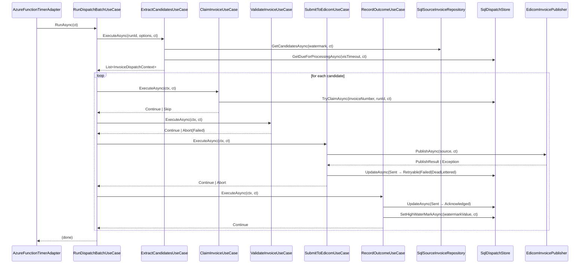

# Invoice Integration Service — Technical Design

## Overview

This document describes the internal architecture of the **Invoice Integration Service**: a scheduled batch worker that extracts invoice data from a read-only source SQL database and dispatches it to EDICOM (UAE ASP / Peppol Access Point).

The architecture combines two complementary patterns:

- **Hexagonal Architecture (Ports & Adapters)** — defines the structural seams. The domain and application cores have zero knowledge of EDICOM, SQL Server, or Azure Functions. All external contracts are hidden behind interfaces (ports) and injected via adapters.
- **Step Pipeline + State Machine** — defines the workflow shape inside the application layer. Each processing step is an explicit use case with a typed input/output contract. Status transitions are governed by a state machine in the domain, not scattered ad-hoc conditionals.

These two concerns are orthogonal: hexagonal answers *where the seams are*; the step pipeline answers *how the workflow is orchestrated*.

---

## Architecture Layers

```
┌──────────────────────────────────────────────────────────────────────┐
│  Driving Adapters (Infrastructure)                                   │
│  AzureFunctionTimerAdapter  │  ManualTriggerAdapter (dev/test)       │
└────────────────────┬─────────────────────────────────────────────────┘
                     │  calls
                     ▼
┌──────────────────────────────────────────────────────────────────────┐
│  Application Layer                                                   │
│                                                                      │
│  RunDispatchBatchUseCase  (orchestrator)                             │
│    │                                                                 │
│    ├─► ExtractCandidatesUseCase   (step 1)                           │
│    ├─► ClaimInvoiceUseCase        (step 2)                           │
│    ├─► ValidateInvoiceUseCase     (step 3)                           │
│    ├─► SubmitToEdicomUseCase      (step 4)                           │
│    └─► RecordOutcomeUseCase       (step 5)                           │
│                                                                      │
│  Driven Ports (interfaces)                                           │
│  ISourceInvoiceRepository  IDispatchStore  IInvoicePublisher         │
│  IRunStateStore             IPayloadMapper                           │
└───────┬───────────────┬──────────────┬───────────────────────────────┘
        │               │              │
        ▼               ▼              ▼
┌────────────┐  ┌──────────────┐  ┌──────────────────────────┐
│  Domain    │  │  Driven      │  │  Driven Adapters         │
│  Layer     │  │  Adapters    │  │  (Infrastructure)        │
│            │  │  (SQL)       │  │                          │
│ Entities   │  │ SqlSource    │  │ EdicomInvoicePublisher   │
│ ValueObjs  │  │ InvoiceRepo  │  │ EdicomPayloadMapper      │
│ State      │  │ SqlDispatch  │  │                          │
│ Machine    │  │ Store        │  │                          │
│            │  │ SqlRunState  │  │                          │
│            │  │ Store        │  │                          │
└────────────┘  └──────────────┘  └──────────────────────────┘
```

---

## Folder / Namespace Layout

```
InvoiceIntegrator/
│
├── Domain/
│   ├── Entities/
│   │   ├── InvoiceDispatch.cs          # dispatch record aggregate
│   │   └── SourceInvoice.cs            # read model from source DB
│   ├── ValueObjects/
│   │   └── DispatchStatus.cs           # enum + state machine transitions
│   └── Exceptions/
│       ├── InvalidStatusTransitionException.cs
│       └── DuplicateDispatchException.cs
│
├── Application/
│   ├── Ports/                          # driven ports (interfaces)
│   │   ├── ISourceInvoiceRepository.cs
│   │   ├── IDispatchStore.cs
│   │   ├── IInvoicePublisher.cs
│   │   ├── IRunStateStore.cs
│   │   └── IPayloadMapper.cs
│   │
│   ├── Pipeline/                       # step abstraction + context
│   │   ├── IDispatchStep.cs
│   │   ├── InvoiceDispatchContext.cs
│   │   └── StepOutcome.cs
│   │
│   ├── UseCases/                       # one file per step = one use case
│   │   ├── ExtractCandidatesUseCase.cs
│   │   ├── ClaimInvoiceUseCase.cs
│   │   ├── ValidateInvoiceUseCase.cs
│   │   ├── SubmitToEdicomUseCase.cs
│   │   └── RecordOutcomeUseCase.cs
│   │
│   └── Orchestration/
│       └── RunDispatchBatchUseCase.cs  # composes the five steps
│
└── Infrastructure/
    ├── Persistence/
    │   ├── SqlSourceInvoiceRepository.cs
    │   ├── SqlDispatchStore.cs
    │   └── SqlRunStateStore.cs
    ├── Edicom/
    │   ├── EdicomInvoicePublisher.cs   # IInvoicePublisher adapter + Polly
    │   └── EdicomPayloadMapper.cs      # IPayloadMapper adapter
    └── Host/
        ├── AzureFunctionTimerAdapter.cs
        └── DependencyInjection.cs      # composition root
```

---

## Domain Layer

The domain layer contains only pure C# — no NuGet dependencies, no framework references.

### `DispatchStatus` — State Machine

The state machine lives in the domain so transitions are enforced in one place.

```csharp
// Domain/ValueObjects/DispatchStatus.cs
public enum DispatchStatus
{
    Pending,
    Claimed,
    Sent,
    Acknowledged,   // terminal
    Failed,         // terminal (until manual replay)
    Retryable,
    DeadLettered    // terminal (until manual replay)
}

public static class DispatchStatusTransitions
{
    // Valid (from, to) pairs — enforced by InvoiceDispatch aggregate
    private static readonly HashSet<(DispatchStatus, DispatchStatus)> _allowed = new()
    {
        (DispatchStatus.Pending,    DispatchStatus.Claimed),
        (DispatchStatus.Retryable,  DispatchStatus.Claimed),
        (DispatchStatus.Claimed,    DispatchStatus.Sent),
        (DispatchStatus.Sent,       DispatchStatus.Acknowledged),
        (DispatchStatus.Sent,       DispatchStatus.Failed),
        (DispatchStatus.Sent,       DispatchStatus.Retryable),
        (DispatchStatus.Retryable,  DispatchStatus.DeadLettered),
        // Manual replay resets to Retryable
        (DispatchStatus.Failed,       DispatchStatus.Retryable),
        (DispatchStatus.DeadLettered, DispatchStatus.Retryable),
    };

    public static bool IsAllowed(DispatchStatus from, DispatchStatus to)
        => _allowed.Contains((from, to));
}
```

### `InvoiceDispatch` — Aggregate

```csharp
// Domain/Entities/InvoiceDispatch.cs
public sealed class InvoiceDispatch
{
    public string        InvoiceNumber    { get; private set; }
    public string        SourceSystem     { get; private set; }
    public DispatchStatus Status          { get; private set; }
    public int           AttemptCount     { get; private set; }
    public string?       PayloadHash      { get; private set; }
    public string?       EdicomReference  { get; private set; }
    public Guid?         InvoiceUuid      { get; private set; }
    public string?       LastErrorCode    { get; private set; }
    public string?       LastErrorMessage { get; private set; }
    public string?       ClaimedBy        { get; private set; }
    public DateTime?     ClaimedAtUtc     { get; private set; }
    public DateTime?     NextAttemptAtUtc { get; private set; }
    public DateTime      CreatedAtUtc     { get; private set; }
    public DateTime      UpdatedAtUtc     { get; private set; }
    public DateTime?     AcknowledgedAtUtc { get; private set; }

    // Factory — called when a new invoice is first discovered
    public static InvoiceDispatch CreatePending(string invoiceNumber, string sourceSystem)
        => new() { InvoiceNumber = invoiceNumber, SourceSystem = sourceSystem,
                   Status = DispatchStatus.Pending, CreatedAtUtc = DateTime.UtcNow,
                   UpdatedAtUtc = DateTime.UtcNow };

    // All state changes go through Transition — enforces the state machine
    public void Transition(DispatchStatus to, Action<InvoiceDispatch> mutate)
    {
        if (!DispatchStatusTransitions.IsAllowed(Status, to))
            throw new InvalidStatusTransitionException(InvoiceNumber, Status, to);

        mutate(this);
        Status      = to;
        UpdatedAtUtc = DateTime.UtcNow;
    }

    public void Claim(string runId)
        => Transition(DispatchStatus.Claimed, d => { d.ClaimedBy = runId; d.ClaimedAtUtc = DateTime.UtcNow; });

    public void MarkSent(string payloadHash)
        => Transition(DispatchStatus.Sent, d => { d.PayloadHash = payloadHash; d.AttemptCount++; });

    public void Acknowledge(string edicomReference, Guid invoiceUuid)
        => Transition(DispatchStatus.Acknowledged, d =>
        {
            d.EdicomReference   = edicomReference;
            d.InvoiceUuid       = invoiceUuid;
            d.AcknowledgedAtUtc = DateTime.UtcNow;
        });

    public void Fail(string errorCode, string errorMessage)
        => Transition(DispatchStatus.Failed, d => { d.LastErrorCode = errorCode; d.LastErrorMessage = errorMessage; });

    public void ScheduleRetry(DateTime nextAttempt)
        => Transition(DispatchStatus.Retryable, d => d.NextAttemptAtUtc = nextAttempt);

    public void DeadLetter(string reason)
        => Transition(DispatchStatus.DeadLettered, d => d.LastErrorMessage = reason);
}
```

### `SourceInvoice` — Read Model

```csharp
// Domain/Entities/SourceInvoice.cs
// Pure data carrier — no behaviour. Fields are confirmed against the source schema.
public sealed class SourceInvoice
{
    public required string   InvoiceNumber  { get; init; }
    public required long     WatermarkValue { get; init; }  // confirmed monotonic field
    public required DateTime InvoiceDate    { get; init; }
    public required string   CustomerName   { get; init; }
    public required string   CustomerVatId  { get; init; }
    public required decimal  TotalAmount    { get; init; }
    public required string   CurrencyCode   { get; init; }
    // ... additional fields to be confirmed with source DB owner
}
```

---

## Application Layer

### Driven Ports

These interfaces are the boundary between the application and infrastructure. The application depends *only* on these contracts — never on concrete implementations.

```csharp
// Application/Ports/ISourceInvoiceRepository.cs
public interface ISourceInvoiceRepository
{
    // Returns invoices with watermarkField > lastHighWaterMark
    Task<IReadOnlyList<SourceInvoice>> GetCandidatesAsync(
        long lastHighWaterMark, CancellationToken ct);
}

// Application/Ports/IDispatchStore.cs
public interface IDispatchStore
{
    Task<InvoiceDispatch?> FindByInvoiceNumberAsync(string invoiceNumber, CancellationToken ct);
    Task InsertPendingAsync(InvoiceDispatch dispatch, CancellationToken ct);

    // Atomic claim: Pending/Retryable → Claimed using UPDATE…OUTPUT + row lock
    // Returns false if race-lost (another run claimed it first)
    Task<bool> TryClaimAsync(string invoiceNumber, string runId, CancellationToken ct);

    Task UpdateAsync(InvoiceDispatch dispatch, CancellationToken ct);

    // Returns rows that are Retryable with NextAttemptAtUtc <= now,
    // or Claimed/Sent with ClaimedAtUtc older than visibilityTimeout (stale claim)
    Task<IReadOnlyList<InvoiceDispatch>> GetDueForProcessingAsync(
        DateTime visibilityTimeout, CancellationToken ct);
}

// Application/Ports/IInvoicePublisher.cs
public interface IInvoicePublisher
{
    // Raises PublisherTransientException or PublisherPermanentException on failure.
    // On success, returns the EDICOM-assigned reference and UUID.
    Task<PublishResult> PublishAsync(SourceInvoice invoice, CancellationToken ct);
}

// Application/Ports/IRunStateStore.cs
public interface IRunStateStore
{
    Task<long>  GetHighWaterMarkAsync(CancellationToken ct);
    Task        SetHighWaterMarkAsync(long value, CancellationToken ct);
}

// Application/Ports/IPayloadMapper.cs
// Optional seam: the application can validate the mapped payload before submission.
// Concrete mapping (source fields → AE PINT/UBL) lives in the infrastructure adapter.
public interface IPayloadMapper
{
    // Returns validation errors, or empty collection if payload is valid.
    Task<IReadOnlyList<string>> ValidateAsync(SourceInvoice invoice, CancellationToken ct);
}
```

---

### Step Pipeline Abstraction

```csharp
// Application/Pipeline/InvoiceDispatchContext.cs
// The single object that flows through every step in the pipeline.
public sealed class InvoiceDispatchContext
{
    public required SourceInvoice    Source      { get; init; }
    public required InvoiceDispatch  Dispatch    { get; set; }
    public required string           RunId       { get; init; }
    public          PublishResult?   PublishResult { get; set; }  // set by SubmitStep
}

// Application/Pipeline/StepOutcome.cs
public enum StepOutcomeKind { Continue, Skip, Abort }

public sealed class StepOutcome
{
    public StepOutcomeKind Kind    { get; private init; }
    public string?         Reason { get; private init; }

    public static StepOutcome Continue()              => new() { Kind = StepOutcomeKind.Continue };
    public static StepOutcome Skip(string reason)     => new() { Kind = StepOutcomeKind.Skip,  Reason = reason };
    public static StepOutcome Abort(string reason)    => new() { Kind = StepOutcomeKind.Abort, Reason = reason };
}

// Application/Pipeline/IDispatchStep.cs
public interface IDispatchStep
{
    string Name { get; }

    // Mutates context in place. Returns Continue/Skip/Abort to direct the orchestrator.
    Task<StepOutcome> ExecuteAsync(InvoiceDispatchContext context, CancellationToken ct);
}
```

**Why `StepOutcome` instead of exceptions for flow control?**
- `Skip` = this invoice should be skipped this run (e.g. already acknowledged, race-lost claim) — not an error
- `Abort` = this invoice cannot proceed this run (e.g. validation failed, dead-lettered) — recorded, no crash
- `Continue` = proceed to next step
Exceptions are reserved for unexpected infrastructure failures.

---

### Use Cases (Steps)

Each step is a discrete class registered in DI. The orchestrator receives them as an ordered `IReadOnlyList<IDispatchStep>`.

#### Step 1 — `ExtractCandidatesUseCase`

This step does not implement `IDispatchStep` — it runs once per batch, not per invoice. It feeds the pipeline with the candidate set.

```csharp
// Application/UseCases/ExtractCandidatesUseCase.cs
public sealed class ExtractCandidatesUseCase
{
    private readonly ISourceInvoiceRepository _source;
    private readonly IDispatchStore           _store;
    private readonly IRunStateStore           _runState;

    public ExtractCandidatesUseCase(
        ISourceInvoiceRepository source, IDispatchStore store, IRunStateStore runState)
        => (_source, _store, _runState) = (source, store, runState);

    public async Task<IReadOnlyList<InvoiceDispatchContext>> ExecuteAsync(
        string runId, DispatchOptions options, CancellationToken ct)
    {
        var watermark    = await _runState.GetHighWaterMarkAsync(ct);
        var sourceRows   = await _source.GetCandidatesAsync(watermark, ct);
        var visTimeout   = DateTime.UtcNow.AddMinutes(-options.VisibilityTimeoutMinutes);
        var dueRetries   = await _store.GetDueForProcessingAsync(visTimeout, ct);

        // Merge: new source rows + due retries, deduplicated by InvoiceNumber
        var byNumber     = dueRetries.ToDictionary(d => d.InvoiceNumber);
        var contexts     = new List<InvoiceDispatchContext>();

        foreach (var src in sourceRows)
        {
            if (!byNumber.TryGetValue(src.InvoiceNumber, out var dispatch))
                dispatch = InvoiceDispatch.CreatePending(src.InvoiceNumber, options.SourceSystem);

            contexts.Add(new InvoiceDispatchContext
            {
                Source   = src,
                Dispatch = dispatch,
                RunId    = runId,
            });
        }

        return contexts;
    }
}
```

#### Step 2 — `ClaimInvoiceUseCase`

```csharp
// Application/UseCases/ClaimInvoiceUseCase.cs
public sealed class ClaimInvoiceUseCase : IDispatchStep
{
    public string Name => "Claim";

    private readonly IDispatchStore _store;
    public ClaimInvoiceUseCase(IDispatchStore store) => _store = store;

    public async Task<StepOutcome> ExecuteAsync(InvoiceDispatchContext ctx, CancellationToken ct)
    {
        // Insert row if brand-new (UNIQUE constraint rejects concurrent duplicates)
        if (ctx.Dispatch.Status == DispatchStatus.Pending && ctx.Dispatch.CreatedAtUtc == ctx.Dispatch.UpdatedAtUtc)
            await _store.InsertPendingAsync(ctx.Dispatch, ct);

        var claimed = await _store.TryClaimAsync(ctx.Dispatch.InvoiceNumber, ctx.RunId, ct);
        if (!claimed)
            return StepOutcome.Skip("Race-lost: claimed by another run");

        ctx.Dispatch.Claim(ctx.RunId);
        return StepOutcome.Continue();
    }
}
```

#### Step 3 — `ValidateInvoiceUseCase`

```csharp
// Application/UseCases/ValidateInvoiceUseCase.cs
public sealed class ValidateInvoiceUseCase : IDispatchStep
{
    public string Name => "Validate";

    private readonly IPayloadMapper  _mapper;
    private readonly IDispatchStore  _store;

    public ValidateInvoiceUseCase(IPayloadMapper mapper, IDispatchStore store)
        => (_mapper, _store) = (mapper, store);

    public async Task<StepOutcome> ExecuteAsync(InvoiceDispatchContext ctx, CancellationToken ct)
    {
        var errors = await _mapper.ValidateAsync(ctx.Source, ct);
        if (!errors.Any())
            return StepOutcome.Continue();

        // Validation failure is permanent — mark Failed immediately, no retry
        ctx.Dispatch.Fail("VALIDATION_ERROR", string.Join("; ", errors));
        await _store.UpdateAsync(ctx.Dispatch, ct);
        return StepOutcome.Abort($"Validation failed: {errors.First()}");
    }
}
```

#### Step 4 — `SubmitToEdicomUseCase`

```csharp
// Application/UseCases/SubmitToEdicomUseCase.cs
// Polly retry policy lives in the EdicomInvoicePublisher adapter, not here.
// This use case is concerned only with interpreting the outcome.
public sealed class SubmitToEdicomUseCase : IDispatchStep
{
    public string Name => "Submit";

    private readonly IInvoicePublisher _publisher;
    private readonly IDispatchStore    _store;
    private readonly DispatchOptions   _options;

    public SubmitToEdicomUseCase(
        IInvoicePublisher publisher, IDispatchStore store, DispatchOptions options)
        => (_publisher, _store, _options) = (publisher, store, options);

    public async Task<StepOutcome> ExecuteAsync(InvoiceDispatchContext ctx, CancellationToken ct)
    {
        // Compute hash before marking Sent — used for mutation detection later
        var payloadHash = ComputeHash(ctx.Source);
        ctx.Dispatch.MarkSent(payloadHash);
        await _store.UpdateAsync(ctx.Dispatch, ct);

        try
        {
            ctx.PublishResult = await _publisher.PublishAsync(ctx.Source, ct);
            return StepOutcome.Continue();
        }
        catch (PublisherTransientException ex) when (ctx.Dispatch.AttemptCount < _options.MaxAttempts)
        {
            var delay = BackoffSchedule.Next(ctx.Dispatch.AttemptCount, _options);
            ctx.Dispatch.ScheduleRetry(DateTime.UtcNow.Add(delay));
            await _store.UpdateAsync(ctx.Dispatch, ct);
            return StepOutcome.Abort($"Transient failure, retrying at {ctx.Dispatch.NextAttemptAtUtc:u}: {ex.Message}");
        }
        catch (PublisherTransientException ex)
        {
            ctx.Dispatch.DeadLetter($"Max attempts ({_options.MaxAttempts}) exceeded: {ex.Message}");
            await _store.UpdateAsync(ctx.Dispatch, ct);
            return StepOutcome.Abort("Dead-lettered: retry budget exhausted");
        }
        catch (PublisherPermanentException ex)
        {
            ctx.Dispatch.Fail(ex.ErrorCode, ex.ErrorMessage);
            await _store.UpdateAsync(ctx.Dispatch, ct);
            return StepOutcome.Abort($"Permanent failure: {ex.ErrorCode}");
        }
    }

    private static string ComputeHash(SourceInvoice invoice)
    {
        // SHA-256 of the canonical invoice fields
        var bytes = Encoding.UTF8.GetBytes($"{invoice.InvoiceNumber}|{invoice.TotalAmount}|{invoice.CurrencyCode}");
        return Convert.ToHexString(SHA256.HashData(bytes));
    }
}
```

#### Step 5 — `RecordOutcomeUseCase`

```csharp
// Application/UseCases/RecordOutcomeUseCase.cs
// Only reached when SubmitToEdicomUseCase returned Continue (i.e. EDICOM accepted).
public sealed class RecordOutcomeUseCase : IDispatchStep
{
    public string Name => "RecordOutcome";

    private readonly IDispatchStore _store;
    private readonly IRunStateStore _runState;

    public RecordOutcomeUseCase(IDispatchStore store, IRunStateStore runState)
        => (_store, _runState) = (store, runState);

    public async Task<StepOutcome> ExecuteAsync(InvoiceDispatchContext ctx, CancellationToken ct)
    {
        var result = ctx.PublishResult!;
        ctx.Dispatch.Acknowledge(result.EdicomReference, result.InvoiceUuid);
        await _store.UpdateAsync(ctx.Dispatch, ct);

        // Advance the high-water mark to cover this invoice's watermark value
        // (orchestrator calls this per-invoice; the store tracks the max seen this run)
        await _runState.SetHighWaterMarkAsync(ctx.Source.WatermarkValue, ct);

        return StepOutcome.Continue();
    }
}
```

---

### Orchestrator — `RunDispatchBatchUseCase`

The orchestrator is the single **driving port** of the application: it is what the Azure Function calls. It composes the five steps and drives each candidate through the ordered pipeline.

```csharp
// Application/Orchestration/RunDispatchBatchUseCase.cs
public sealed class RunDispatchBatchUseCase
{
    private readonly ExtractCandidatesUseCase  _extract;
    private readonly IReadOnlyList<IDispatchStep> _pipeline;
    private readonly ILogger<RunDispatchBatchUseCase> _logger;
    private readonly DispatchOptions             _options;

    public RunDispatchBatchUseCase(
        ExtractCandidatesUseCase extract,
        IReadOnlyList<IDispatchStep> pipeline,       // DI-ordered: Claim→Validate→Submit→Record
        ILogger<RunDispatchBatchUseCase> logger,
        DispatchOptions options)
        => (_extract, _pipeline, _logger, _options) = (extract, pipeline, logger, options);

    public async Task RunAsync(CancellationToken ct)
    {
        var runId      = Guid.NewGuid().ToString("N");
        var candidates = await _extract.ExecuteAsync(runId, _options, ct);

        _logger.LogInformation("Run {RunId}: {Count} candidate(s) to process", runId, candidates.Count);

        foreach (var ctx in candidates)
        {
            if (ct.IsCancellationRequested) break;

            foreach (var step in _pipeline)
            {
                var outcome = await step.ExecuteAsync(ctx, ct);

                if (outcome.Kind == StepOutcomeKind.Skip)
                {
                    _logger.LogDebug("{Step} skipped {Invoice}: {Reason}",
                        step.Name, ctx.Source.InvoiceNumber, outcome.Reason);
                    break;
                }

                if (outcome.Kind == StepOutcomeKind.Abort)
                {
                    _logger.LogWarning("{Step} aborted {Invoice}: {Reason}",
                        step.Name, ctx.Source.InvoiceNumber, outcome.Reason);
                    break;
                }
            }
        }

        _logger.LogInformation("Run {RunId} complete", runId);
    }
}
```

The orchestrator is deliberately thin: it does not contain business logic. All decisions live inside the steps.

---

## Infrastructure Layer

### `EdicomInvoicePublisher` — Driven Adapter

This adapter owns: the HTTP call, Polly policy, payload mapping, and EDICOM error taxonomy. The application layer never references this class directly.

```csharp
// Infrastructure/Edicom/EdicomInvoicePublisher.cs
public sealed class EdicomInvoicePublisher : IInvoicePublisher
{
    private readonly HttpClient       _http;
    private readonly IPayloadMapper   _mapper;
    private readonly ResiliencePipeline<HttpResponseMessage> _policy;

    public EdicomInvoicePublisher(HttpClient http, IPayloadMapper mapper, EdicomOptions options)
    {
        _http   = http;
        _mapper = mapper;
        _policy = BuildPolicy(options);
    }

    public async Task<PublishResult> PublishAsync(SourceInvoice invoice, CancellationToken ct)
    {
        // Mapping from domain object → EDICOM AE PINT/UBL payload lives here (ACL)
        var payload  = await _mapper.MapAsync(invoice, ct);
        var response = await _policy.ExecuteAsync(
            async token => await _http.PostAsJsonAsync("/invoices", payload, token), ct);

        if (!response.IsSuccessStatusCode)
        {
            var body = await response.Content.ReadAsStringAsync(ct);
            throw ClassifyError(response.StatusCode, body);
        }

        var result = await response.Content.ReadFromJsonAsync<EdicomSubmitResponse>(ct);
        return new PublishResult(result!.TransactionId, result.InvoiceUuid);
    }

    private static ResiliencePipeline<HttpResponseMessage> BuildPolicy(EdicomOptions o) =>
        new ResiliencePipelineBuilder<HttpResponseMessage>()
            .AddRetry(new RetryStrategyOptions<HttpResponseMessage>
            {
                ShouldHandle      = args => ValueTask.FromResult(IsTransient(args.Outcome)),
                MaxRetryAttempts  = o.InRunMaxRetries,   // default: 3
                BackoffType       = DelayBackoffType.Exponential,
                UseJitter         = true,
                Delay             = TimeSpan.FromSeconds(o.RetryBaseSeconds), // default: 2
            })
            .AddCircuitBreaker(new CircuitBreakerStrategyOptions<HttpResponseMessage>
            {
                FailureRatio       = 0.5,
                SamplingDuration   = TimeSpan.FromSeconds(30),
                MinimumThroughput  = 5,
                BreakDuration      = TimeSpan.FromSeconds(o.CircuitBreakerBreakSeconds), // default: 60
            })
            .Build();

    private static bool IsTransient(Outcome<HttpResponseMessage> outcome)
    {
        if (outcome.Exception is HttpRequestException) return true;
        if (outcome.Result is { } r)
            return r.StatusCode is HttpStatusCode.TooManyRequests
                or HttpStatusCode.BadGateway
                or HttpStatusCode.ServiceUnavailable
                or HttpStatusCode.GatewayTimeout;
        return false;
    }

    // Maps EDICOM HTTP errors to typed exceptions the application can pattern-match
    private static Exception ClassifyError(HttpStatusCode status, string body)
    {
        return status switch
        {
            HttpStatusCode.BadRequest      => new PublisherPermanentException("VALIDATION_ERROR", body),
            HttpStatusCode.UnprocessableEntity => new PublisherPermanentException("BUSINESS_REJECTION", body),
            HttpStatusCode.Unauthorized    => new PublisherPermanentException("AUTH_ERROR", body),
            HttpStatusCode.Forbidden       => new PublisherPermanentException("PERMISSION_DENIED", body),
            // Anything else: treated as transient once, then escalates in the use case
            _                              => new PublisherTransientException(body),
        };
    }
}
```

> **ACL callout.** `EdicomPayloadMapper` (which implements `IPayloadMapper`) is the Anti-Corruption Layer: it translates from the domain's `SourceInvoice` to EDICOM's AE PINT / UBL XML schema. If EDICOM changes their API, only this class changes. The domain and application layers are unaffected.

### `AzureFunctionTimerAdapter` — Driving Adapter

```csharp
// Infrastructure/Host/AzureFunctionTimerAdapter.cs
public class InvoiceIntegratorTimerFunction
{
    private readonly RunDispatchBatchUseCase _batch;
    public InvoiceIntegratorTimerFunction(RunDispatchBatchUseCase batch) => _batch = batch;

    [Function("InvoiceIntegratorTimer")]
    public async Task Run(
        [TimerTrigger("%ScheduleCron%")] TimerInfo timer,
        FunctionContext context)
    {
        using var cts = new CancellationTokenSource(TimeSpan.FromMinutes(8)); // Function timeout guard
        await _batch.RunAsync(cts.Token);
    }
}
```

### Composition Root

```csharp
// Infrastructure/Host/DependencyInjection.cs
public static IServiceCollection AddInvoiceIntegrator(
    this IServiceCollection services, IConfiguration config)
{
    // Options
    services.Configure<DispatchOptions>(config.GetSection("Dispatch"));
    services.Configure<EdicomOptions>(config.GetSection("Edicom"));

    // Domain / Application
    services.AddSingleton<ExtractCandidatesUseCase>();

    // Pipeline steps — order here IS the execution order
    services.AddSingleton<IDispatchStep, ClaimInvoiceUseCase>();
    services.AddSingleton<IDispatchStep, ValidateInvoiceUseCase>();
    services.AddSingleton<IDispatchStep, SubmitToEdicomUseCase>();
    services.AddSingleton<IDispatchStep, RecordOutcomeUseCase>();

    services.AddSingleton<RunDispatchBatchUseCase>(sp =>
        new RunDispatchBatchUseCase(
            sp.GetRequiredService<ExtractCandidatesUseCase>(),
            sp.GetRequiredService<IEnumerable<IDispatchStep>>().ToList().AsReadOnly(),
            sp.GetRequiredService<ILogger<RunDispatchBatchUseCase>>(),
            sp.GetRequiredService<IOptions<DispatchOptions>>().Value));

    // Driven ports → adapters
    services.AddScoped<ISourceInvoiceRepository, SqlSourceInvoiceRepository>();
    services.AddScoped<IDispatchStore,            SqlDispatchStore>();
    services.AddScoped<IRunStateStore,            SqlRunStateStore>();
    services.AddScoped<IPayloadMapper,            EdicomPayloadMapper>();

    // EDICOM HTTP client with base address + auth header
    services.AddHttpClient<IInvoicePublisher, EdicomInvoicePublisher>(client =>
    {
        client.BaseAddress = new Uri(config["Edicom:BaseUrl"]!);
        client.DefaultRequestHeaders.Add("X-Api-Key", config["Edicom:ApiKey"]);
    });

    return services;
}
```

---

## Configuration (`DispatchOptions`)

```csharp
public sealed class DispatchOptions
{
    public string SourceSystem             { get; init; } = "UAE-ERP";
    public int    VisibilityTimeoutMinutes { get; init; } = 10;
    public int    MaxAttempts              { get; init; } = 8;
    public int    RetryBaseSeconds         { get; init; } = 2;
    public int    InRunMaxRetries          { get; init; } = 3;
    public int    CircuitBreakerBreakSec   { get; init; } = 60;
}
```

---

## End-to-End Sequence



---

## Testing Strategy

| Layer | What to test | How |
|---|---|---|
| **Domain** | State machine — allowed/disallowed transitions, `Transition` enforces validity | Pure unit tests, no mocks |
| **Each step (use case)** | Happy path + every `Skip`/`Abort` branch | Unit tests with mocked ports |
| **`RunDispatchBatchUseCase`** | Step ordering, break-on-Skip/Abort, full batch flow | Unit tests with fake step list |
| **`EdicomInvoicePublisher`** | Polly retry fires on transient, circuit breaker trips, error classification | Integration tests against WireMock / `MockHttpMessageHandler` |
| **`SqlDispatchStore`** | `TryClaimAsync` race (two parallel calls, one wins), `UNIQUE(InvoiceNumber)` rejects duplicate | Integration tests against a real SQL Server (Testcontainers or LocalDB) |
| **Architecture** | No Application class references Infrastructure class | NetArchTest rule |
| **Architecture** | `ISourceInvoiceRepository` exposes only read methods (no `Save`/`Update`) | NetArchTest rule |
| **Concurrency** | Two parallel runs over same candidate set produce zero duplicate EDICOM submissions | End-to-end test with two parallel `RunAsync` calls |

---

## Key Design Invariants

1. **Domain never imports infrastructure.** `InvoiceDispatch` and `SourceInvoice` have zero NuGet references beyond BCL.
2. **Steps are the only place state transitions happen.** No `dispatch.Status = ...` outside a `Transition(...)` call.
3. **Pipeline order is declared once** — in the DI composition root. Swapping or inserting a step is a one-line change.
4. **The ACL is `EdicomPayloadMapper`.** All knowledge of AE PINT / UBL XML lives there. Application steps pass `SourceInvoice`, never an EDICOM-specific type.
5. **`IInvoicePublisher` throws typed exceptions** (`PublisherTransientException` / `PublisherPermanentException`), never raw `HttpRequestException`. The application layer pattern-matches on these — never on HTTP status codes.
6. **No writes to the source DB.** `ISourceInvoiceRepository` has only read methods. Enforced by a NetArchTest rule.
