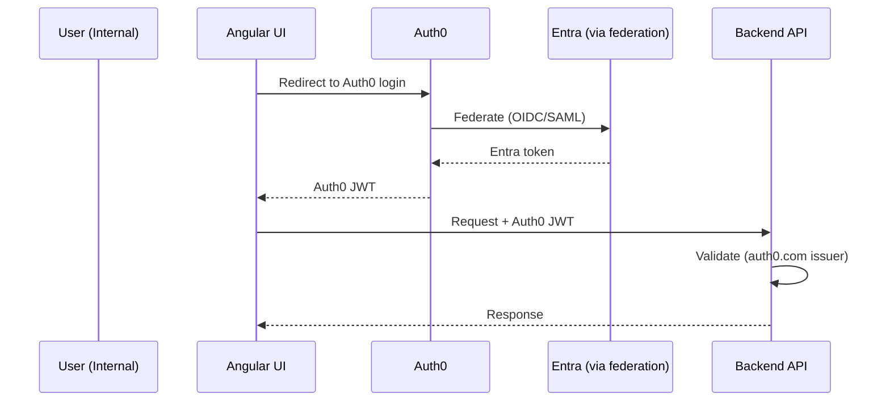
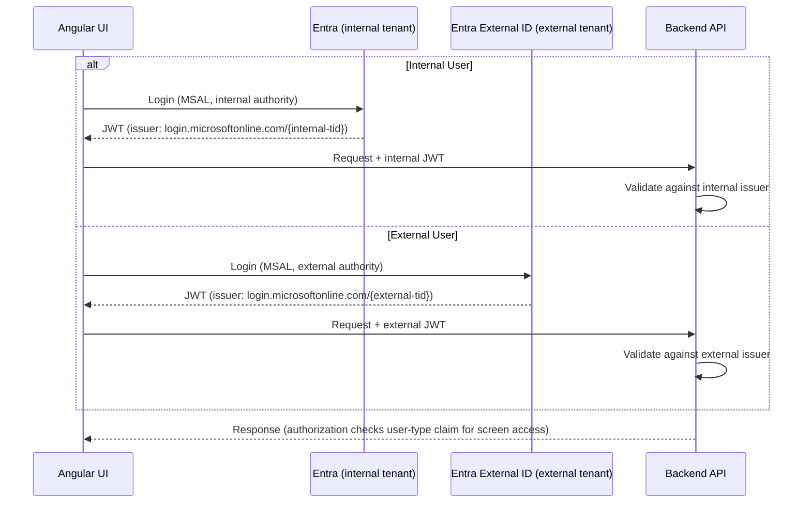
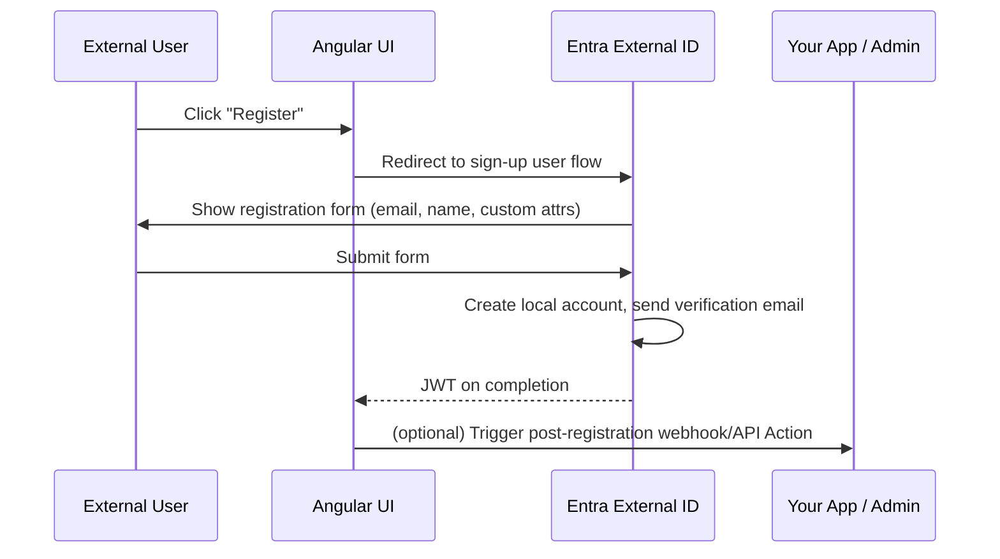
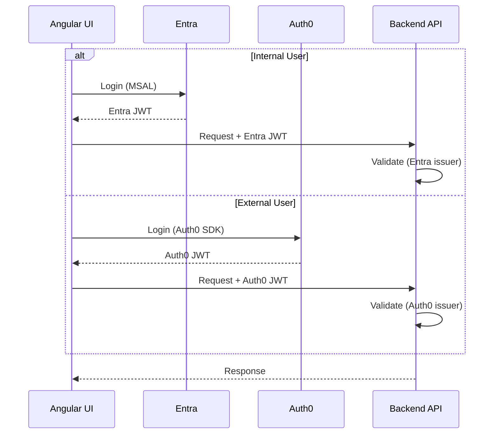

# Multi-Identity Provider Options

**Context:** Angular portal + backend API currently using Entra (Azure AD) for internal users. Goal: add external user access to select screens without breaking internal auth.

---

## Option A — Auth0 as Unified IdP (Entra federated into Auth0)

All users authenticate through Auth0. Auth0 federates to Entra behind the scenes for internal users. Single token issuer for the backend.



### User Storage

| User type | Where stored |
|---|---|
| Internal users | Entra tenant (unchanged) — Auth0 federates to it, users are NOT duplicated in Auth0 |
| External users | Auth0 user database (Auth0 Directory) — email/password or linked social identity |

### Estimated Cost (Auth0)

**Free plan — $0/month**
Up to 25,000 MAU. Limited features: no custom domains, basic MFA, limited social connections.

**Paid plans — move here when you need more features OR exceed 25,000 MAU**

You pick a MAU capacity bucket and pay the flat monthly fee regardless of exact count:

| MAU capacity bucket | Essentials ($/mo) | Professional ($/mo) |
|---|---|---|
| up to 500 | $35 | $240 |
| up to 2,500 | $175 | $545 |
| up to 5,000 | $350 | $1,000 |
| up to 10,000 | $700 | $1,600 |
| up to 20,000 | $1,400 | $3,200 |
| up to 30,000 | $2,100 | contact sales |
| 30,000+ | contact sales | contact sales |

> Source: [auth0.com/pricing](https://auth0.com/pricing). Yearly billing = 1 month free (~11× monthly rate).  
> Internal users federated via Entra count toward Auth0 MAU — factor this into your bucket selection.

**Pros:** Single JWT issuer, single SDK, clean BE validation.  
**Cons:** Internal users depend on Auth0 uptime. Lose native Entra features (Conditional Access, PIM, device compliance). Auth0 per-seat cost applies to all users including internal. High blast radius change.

---

## Option B — Entra External ID (Recommended)

Keep the existing internal Entra tenant unchanged. Add a separate **Entra External ID** tenant for external users. UI uses MSAL in both paths; BE adds a second valid issuer.



### User Storage

| User type | Where stored |
|---|---|
| Internal users | Existing Entra tenant (zero change) |
| External users | Entra External ID tenant — Microsoft-managed CIAM directory, fully isolated from internal tenant |

External user accounts are local accounts in the External ID tenant (`your-tenant.onmicrosoft.com`). Microsoft owns the storage, password hashing, and MFA — you own the tenant config and user flows.

### Estimated Cost (Entra External ID)

| MAU | Monthly cost |
|---|---|
| 0 – 50,000 | **Free** |
| 50,001+ | $0.00325 / MAU |
| MFA (TOTP/SMS) | +$0.0016 / MFA step per MAU |

> Significantly cheaper than Auth0 at scale. Internal users in the existing Entra tenant are not affected by External ID pricing.

### How External Users Are Created

**1. Self-service sign-up (primary path)**

Configure a **User Flow** in the External ID tenant. Users register themselves through your app's login page.



**2. Admin pre-provisioning via Microsoft Graph API**

For onboarding known clients or migrating existing user lists.

```http
POST https://graph.microsoft.com/v1.0/users
Authorization: Bearer {admin-token}
Content-Type: application/json

{
  "displayName": "Jane External",
  "identities": [{
    "signInType": "emailAddress",
    "issuer": "your-external-tenant.onmicrosoft.com",
    "issuerAssignedId": "jane@clientcompany.com"
  }],
  "passwordProfile": {
    "password": "Temp!Pass1",
    "forceChangePasswordNextSignIn": true
  }
}
```

**3. Invitation flow**

Admin sends invite → user receives email with magic link → clicks link → completes sign-up → account activated. No code required; built into Entra External ID.

**4. Just-in-time via social login (Google, Facebook, Apple)**

If social providers are enabled, a first-time social login auto-creates the user account in External ID linked to their social identity. Zero friction, no pre-registration.

---

**Pros:** Zero change to internal auth. MSAL stays — only `authority` config differs. BE change is adding one issuer to `ValidIssuers`. Free up to 50k MAU.  
**Cons:** User flows are less flexible than Auth0 for complex CIAM journeys (advanced progressive profiling, custom business logic during sign-up).

---

## Option C — Dual IdP, UI Handles Both

Two separate auth providers side by side. Login landing routes internal users to Entra (MSAL) and external users to Auth0 (Auth0 SDK). Backend validates both token issuers.



**Pros:** Clean IdP separation. No federation complexity. Use Auth0 CIAM features (progressive profiling, Actions, rich email flows) for external users only.  
**Cons:** Two SDKs in UI (MSAL + Auth0). Two token formats to guard in BE. Session/refresh token management is duplicated. Risk of accepting wrong token type on wrong route.

---

## Comparison

| | Option A | Option B | Option C |
|---|---|---|---|
| UI SDK changes | Full swap to Auth0 | None (MSAL stays) | Add Auth0 SDK alongside MSAL |
| BE changes | New issuer | Add 1 issuer | Add 1 issuer |
| Internal auth disruption | High | None | None |
| Entra features preserved | No | Yes | Yes |
| External CIAM flexibility | High (Auth0) | Medium (Entra External ID) | High (Auth0) |
| Operational complexity | Medium | Low | High |
| External user storage | Auth0 Directory | Entra External ID tenant | Auth0 Directory |
| Free tier | 25,000 MAU | **50,000 MAU** | 25,000 MAU |
| Cost at 10k external MAU | **Free** | **Free** | **Free** |
| Cost at 30k external MAU | $2,100/mo | **Free** | $2,100/mo |

---

## Conclusion

Use **Option B (Entra External ID)** unless you have specific requirements for advanced CIAM flows (custom onboarding, complex consent, rich email journeys). In that case, use **Option C** — keeping Auth0 strictly for external users with no impact on the internal Entra path.

**Option A** is viable only when Auth0 is already the org's strategic identity platform, internal Entra usage is shallow (no Conditional Access, no PIM), or external users will far outnumber internal users.
