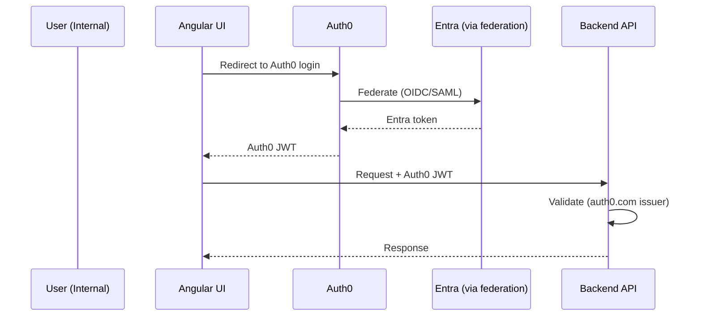
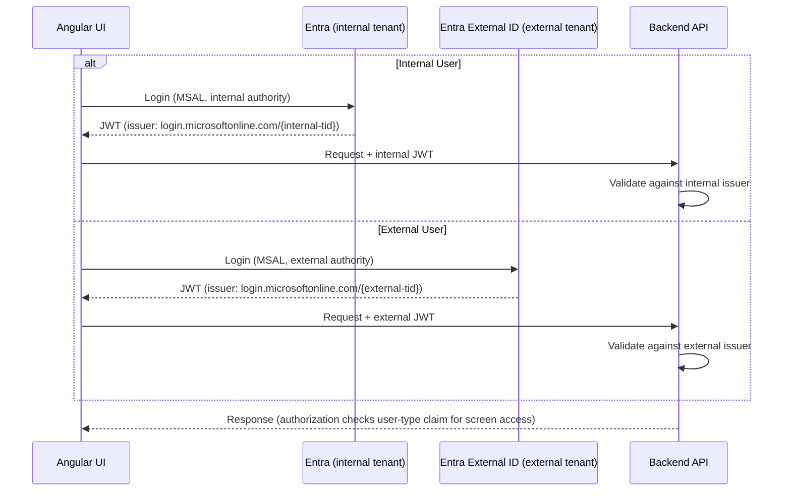
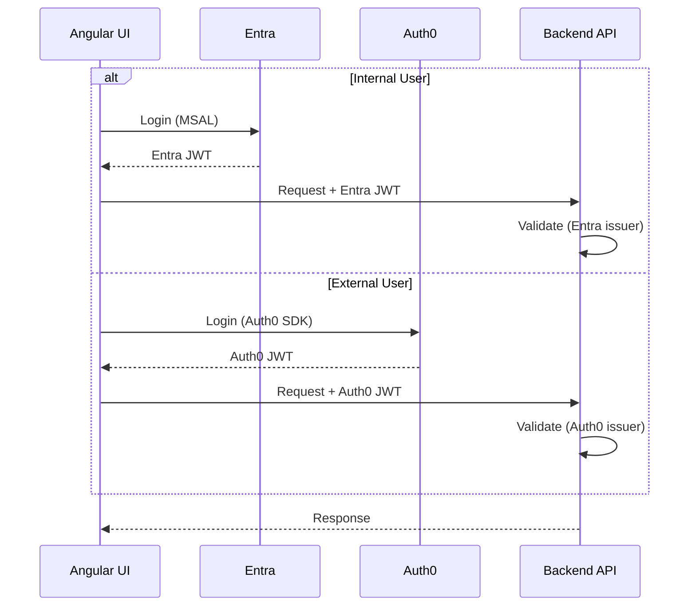

# Multi-Identity Provider Options

**Context:** Angular portal + backend API currently using Entra (Azure AD) for internal users. Goal: add external user access to select screens without breaking internal auth.

---

## Option A — Auth0 as Unified IdP (Entra federated into Auth0)

All users authenticate through Auth0. Auth0 federates to Entra behind the scenes for internal users. Single token issuer for the backend.

**Pros:** Single JWT issuer, single SDK, clean BE validation.  
**Cons:** Internal users depend on Auth0 uptime. Lose native Entra features (Conditional Access, PIM, device compliance). Auth0 per-seat cost applies to all internal users. High blast radius change.

---

## Option B — Entra External ID (Recommended)

Keep the existing internal Entra tenant unchanged. Add a separate **Entra External ID** tenant for external users. UI uses MSAL in both paths; BE adds a second valid issuer. Auth0 can optionally federate *into* Entra External ID for social logins.

**Pros:** Zero change to internal auth. MSAL stays — only `authority` config differs. BE change is adding one issuer to `ValidIssuers`. Auth0, Google, Facebook can federate into Entra External ID as social providers (config, not code).  
**Cons:** Entra External ID user flows are less flexible than Auth0 for complex CIAM journeys (progressive profiling, custom logic).

---

## Option C — Dual IdP, UI Handles Both

Two separate auth providers side by side. Login landing routes internal users to Entra (MSAL) and external users to Auth0 (Auth0 SDK). Backend validates both token issuers.

**Pros:** Clean IdP separation. No federation complexity. Use Auth0 CIAM features (progressive profiling, Actions, rich email flows) for external users only.  
**Cons:** Two SDKs in UI (MSAL + Auth0). Two token formats to guard in BE. Session/refresh token management is duplicated. Risk of accepting wrong token type on wrong route.

---

## Comparison

| | Option A | Option B | Option C |
|---|---|---|---|
| UI SDK changes | Full swap to Auth0 | None (MSAL stays) | Add Auth0 SDK alongside MSAL |
| BE changes | New issuer | Add 1 issuer | Add 1 issuer |
| Internal auth disruption | High | None | None |
| Entra features preserved | No | Yes | Yes |
| External CIAM flexibility | High (Auth0) | Medium (Entra External ID) | High (Auth0) |
| Operational complexity | Medium | Low | High |
| Cost | Auth0 for all users | Entra External ID pricing | Auth0 for external only |

---

## Conclusion

Use **Option B (Entra External ID)** unless you have specific requirements for advanced CIAM flows (custom onboarding, complex consent, rich email journeys). In that case, use **Option C** — keeping Auth0 strictly for external users with no impact on the internal Entra path.

**Option A** is viable in these specific scenarios:

1. Auth0 is already your org's strategic CIAM platform
Other products in the org already use Auth0 as the identity hub. Unifying under it is simplification, not added complexity.

2. Internal Entra usage is shallow
You're using Entra purely as a user directory — no Conditional Access policies enforced, no PIM, no device compliance checks, no Intune integration. If none of those are in play, federating Entra into Auth0 costs you nothing real.

3. External users will far outnumber internal users
When the app's primary audience becomes external, optimizing auth around the majority makes sense. Internal users become the "special case" handled via federation.

4. You need consistent identity features across both user types
Same MFA policy, same progressive profiling, same branding, same session management for internal and external. Entra External ID can't unify this; Auth0 as the hub can.