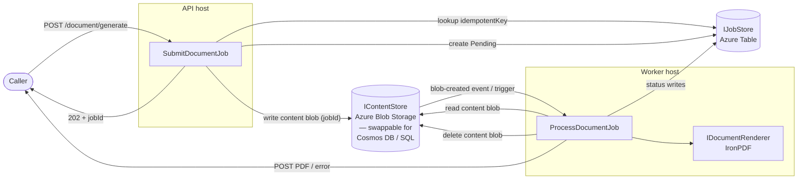

# ADR-001: Centralised PDF Generation Service

## Context and Problem Statement

PDF generation is a cross-cutting capability used by multiple teams and services in the portfolio. Today each team integrates IronPDF independently — referencing the NuGet package directly, managing their own license activation, and implementing their own rendering logic. This leads to duplicated license spend, inconsistent implementations, a scattered upgrade surface, and engine lock-in across every consumer.

A centralised, asynchronous PDF Generation Service is proposed: a single HTTP API all teams submit jobs to, with rendering running in one place under one license and results delivered to callers via HTTP callbacks.

A secondary question arises once the centralised service is chosen: **how does the API component hand the job content (HTML, assets, render options) to the Worker component?**

---

## Decision Drivers

- **License consolidation.** A single IronPDF license on one host eliminates duplicated commercial spend.
- **Engine replaceability.** If IronPDF is ever replaced, only one service changes — no consumer is affected.
- **Standardisation.** One implementation of asset injection, header/footer rendering, and error handling removes per-team variation.
- **Asynchronous by design.** PDF generation can be slow; callers must not block waiting for bytes.
- **Idempotency.** Network retries and duplicate submissions must not produce duplicate PDFs or callbacks.
- **Independent scaling.** The rendering workload must scale independently of any individual consumer.
- **Observability and auditability.** A centralised service provides a single place for metrics, alerts, and job-status auditing.
- **Payload size tolerance.** Job content can be large — complex HTML documents plus base64-encoded assets can easily exceed the message-size limits of typical transport systems.

---

## Considered Options

### Architecture

- Option A — Status quo: keep per-service IronPDF
- Option B — Shared NuGet wrapper
- Option C — Centralised PDF Generation Service (async, callback-based) ✅

### Content Transport (sub-decision, applies once Option C is chosen)

- Option 1 — Message bus (Azure Service Bus, Redis Streams, RabbitMQ)
- Option 2 — Content store + lightweight event (Azure Blob Storage + blob-created trigger) ✅

---

## Decision Outcome

**Chosen option: Option C — Centralised PDF Generation Service**, because it is the only option that consolidates the IronPDF license to a single deployment, removes engine lock-in from all consumers, and provides idempotency and status tracking across every team without additional per-team work.

**Chosen content transport: Option 2 — Content store + lightweight event**, because PDF generation payloads regularly exceed the message-size limits of mainstream message buses (Azure Service Bus Standard caps at 256 KB; a single medium-resolution logo encoded as base64 can exceed this on its own). Passing only a `jobId` in the trigger event and reading the full payload from blob storage avoids this ceiling entirely.

All new PDF generation work must go through this service. Existing services with embedded IronPDF are candidates for migration in a follow-on phase (not in scope for v1).

### Consequences

- Good, because IronPDF license cost is consolidated to one deployment regardless of consumer count.
- Good, because any future renderer switch changes one codebase and zero callers.
- Good, because rendering quality, asset handling, and header/footer behaviour are consistent across all consumers.
- Good, because the async design frees callers from rendering latency.
- Good, because idempotency, status tracking, and retry logic come for free to every consumer.
- Good, because blob storage imposes no practical size ceiling on job payloads, accommodating complex documents with many embedded assets.
- Good, because the content blob is ephemeral — deleted immediately after processing — so there is no long-lived storage cost.
- Bad, because consumers must adopt an async callback flow rather than a synchronous call-and-get-bytes pattern.
- Bad, because the service becomes a shared dependency; its availability directly affects all PDF-generating workflows. Resilience (retries, dead-lettering) must be in place before broad adoption.
- Bad, because there is operational overhead in running and monitoring an additional service.

---

## Confirmation

The decision is being followed if:

- No consumer service references the `IronPdf` NuGet package directly — all PDF generation goes through `POST /api/v1/document/generate`.
- The `IronPdf` NuGet is referenced **only** in `PdfService.Infrastructure` (the `IronPdfRenderer` adapter) and in no other project.
- Architecture tests (e.g. NetArchTest rules) assert that `PdfService.Application` has no dependency on `PdfService.Infrastructure` or any external rendering library.
- Job content is never placed in a message body — the content store blob is the only hand-off mechanism between the API and Worker.
- The content blob is absent from `IContentStore` after a job leaves `Processing` state (verified by integration tests).

---

## Pros and Cons of the Options

### Option A — Status quo: keep per-service IronPDF

- Good, because there is no migration cost.
- Bad, because license spend multiplies with every new consumer.
- Bad, because engine upgrades or replacements remain scattered across every service.
- Bad, because there is no standard contract or shared quality bar across implementations.

### Option B — Shared NuGet wrapper

- Good, because it reduces code duplication — asset injection, header/footer, and render options follow one implementation.
- Neutral, because the code path is consistent, but each service still manages its own rendering process and concurrency.
- Bad, because it does **not** consolidate the IronPDF license — every host that loads the package still activates a license seat.
- Bad, because engine replacement still touches every consumer.

### Option C — Centralised PDF Generation Service (async, callback-based)

- Good, because a single IronPDF deployment means a single license activation.
- Good, because callers interact only with the stable HTTP contract; the rendering engine is invisible to them.
- Good, because engine replacement is a single adapter change inside the service — no consumer is touched.
- Good, because the async + callback model prevents blocking callers on rendering latency.
- Good, because idempotency, status tracking, and retry logic are built in.
- Bad, because callers must implement a callback receiver rather than waiting synchronously for bytes.

---

### Option 1 — Message bus for content transport

`Azure Service Bus / Redis Streams / RabbitMQ — embed the full job payload in the message body`

- Good, because it is a familiar pattern and the bus already provides delivery guarantees and retry semantics.
- Bad, because every mainstream bus imposes a hard message-size ceiling that PDF payloads routinely exceed:

  | Bus | Limit |
  |---|---|
  | Azure Service Bus Standard | 256 KB |
  | Azure Service Bus Premium | 100 MB (requires Premium tier) |
  | Redis Pub/Sub | No hard limit, but large messages degrade throughput and memory |
  | RabbitMQ | Default 128 MB; large messages cause head-of-line blocking |

  A single medium-resolution logo encoded as base64 can exceed 256 KB on its own. Complex documents with multiple assets are larger still.

- Bad, because working around the limit by chunking or compressing the payload adds complexity with no architectural benefit.
- Bad, because it introduces an additional infrastructure component (the bus) on top of the storage already needed for the job store.

### Option 2 — Content store + lightweight event (chosen)

`Azure Blob Storage — write the full payload as a blob; publish only a jobId event to trigger the Worker`

- Good, because blob storage has no practical payload size ceiling — arbitrarily large HTML documents and asset collections are handled without special treatment.
- Good, because the trigger event is a lightweight notification (`jobId` only); no sensitive payload travels through the event system.
- Good, because `IContentStore` is behind an interface and can be swapped (Cosmos DB, SQL) without touching the trigger mechanism.
- Good, because a blob-created event from Azure Storage (via Event Grid) is a first-class Worker trigger — no separate queue infrastructure is needed.
- Good, because the content blob is ephemeral: the Worker deletes it immediately after reading, so there is no long-lived storage cost.
- Neutral, because the Worker must make a separate read call to `IContentStore` rather than consuming the payload inline from the event — this is one extra I/O hop that is negligible in practice.

---

## More Information

### High-Level Flow

```
Caller
  │
  │  POST /api/v1/document/generate
  │  { idempotentKey, inputType, successCallbackUrl, errorCallbackUrl, data: { ... } }
  ▼
┌──────────────────────────────────────────────────────────┐
│  API host                                                │
│  · Validate request                                      │
│  · Idempotency check → IJobStore (Azure Table Storage)   │
│  · Create job record (Pending)                           │
│  · Write content blob (jobId) → IContentStore (Blob)     │
│  · Return 202 Accepted + jobId + status link             │
└─────────────────────────┬────────────────────────────────┘
                          │  blob-created event
                          ▼
┌──────────────────────────────────────────────────────────┐
│  Worker host                                             │
│  · Read content blob from IContentStore                  │
│  · Mark Processing → IJobStore                           │
│  · IDocumentRenderer (IronPDF) → render PDF              │
│  · Delete content blob                                   │
│  · On success: mark Rendered → POST PDF to callback URL  │
│  · On failure: mark Failed  → POST error to callback URL │
│  · On callback success: mark Succeeded                   │
│  · On callback failure: mark NotifyFailed → retry        │
│    → DeadLettered once attempts exhausted                │
└──────────────────────────────────────────────────────────┘
                          │
                          │  HTTP POST (PDF bytes or error detail)
                          ▼
                       Caller (successCallbackUrl / errorCallbackUrl)
```



### API Contract

#### Endpoints

| Method | Path | Description |
|---|---|---|
| `POST` | `/api/v1/document/generate` | Submit a document generation job |
| `GET` | `/api/v1/document/jobs/{jobId}` | Poll job status |

#### Request

```jsonc
{
  "idempotentKey": "string",           // Caller-assigned dedup key — safe to retry
  "inputType": "Html | PlainText | HtmlUrl | RawPdf",
  "successCallbackUrl": "https://...",
  "errorCallbackUrl": "https://...",

  "data": {
    "content": "string",              // HTML string | plain text | URL | base64 PDF
    "assets": {                       // Named binary assets — substituted as data: URIs before rendering
      "logo": "<base64>",
      "signature": "<base64>"
    },
    "renderOptions": { /* see below */ },
    "header": { /* optional — see below */ },
    "footer": { /* optional — see below */ }
  }
}
```

**Response:** `202 Accepted`

```jsonc
{
  "jobId": "3fa85f64-5717-4562-b3fc-2c963f66afa6",
  "status": "Pending",
  "statusLink": "/api/v1/document/jobs/3fa85f64-5717-4562-b3fc-2c963f66afa6"
}
```

#### `renderOptions`

All fields are optional. Omitted fields use the renderer's defaults.

| Field | Type | Accepted values | Default | Notes |
|---|---|---|---|---|
| `paperSize` | string | `A0` `A1` `A2` `A3` `A4` `A5` `A6` `Letter` `Legal` `Tabloid` `Ledger` | `A4` | Standard paper size names |
| `orientation` | string | `Portrait` `Landscape` | `Portrait` | |
| `margins` | object | — | 20 mm all sides | See sub-fields below |
| `margins.top` | number | ≥ 0 | `20` | Millimetres |
| `margins.right` | number | ≥ 0 | `20` | Millimetres |
| `margins.bottom` | number | ≥ 0 | `20` | Millimetres |
| `margins.left` | number | ≥ 0 | `20` | Millimetres |
| `dpi` | integer | `72` `96` `150` `300` | `96` | Higher values increase output file size |
| `metadata` | object | key-value string pairs | — | Embedded as PDF document properties (Title, Author, Subject, Keywords, or custom XMP keys) |

```jsonc
"renderOptions": {
  "paperSize": "A4",
  "orientation": "Landscape",
  "margins": { "top": 15, "right": 20, "bottom": 15, "left": 20 },
  "dpi": 150,
  "metadata": {
    "Title": "Invoice #4521",
    "Author": "Billing Service",
    "Subject": "Monthly invoice"
  }
}
```

#### Header / Footer

Both `header` and `footer` share the same structure. All fields are optional.

| Field | Type | Description |
|---|---|---|
| `height` | number | Band height in millimetres |
| `left` | string | Content for the left zone (plain text or HTML fragment) |
| `center` | string | Content for the centre zone |
| `right` | string | Content for the right zone |

Token substitution at render time:

| Token | Replaced with |
|---|---|
| `{page}` | Current page number |
| `{total}` | Total page count |

```jsonc
"footer": {
  "height": 12,
  "left": "Confidential",
  "center": "Page {page} of {total}",
  "right": "Generated 2026-07-09"
}
```

#### Callback Payloads

**Success** (`POST successCallbackUrl`):

```jsonc
{
  "jobId": "3fa85f64-...",
  "idempotentKey": "invoice-4521-v1",
  "completedAt": "2026-07-09T10:00:00Z",
  "pdf": "<base64-encoded PDF bytes>"
}
```

**Error** (`POST errorCallbackUrl`):

```jsonc
{
  "jobId": "3fa85f64-...",
  "idempotentKey": "invoice-4521-v1",
  "failedAt": "2026-07-09T10:00:01Z",
  "error": {
    "code": "RenderFailed",
    "message": "..."
  }
}
```

### Job Status Lifecycle

| Status | Meaning | Terminal? |
|---|---|---|
| `Pending` | Job stored, blob written, worker not yet started | no |
| `Processing` | Worker dequeued the blob; rendering in progress | no |
| `Rendered` | PDF produced; callback delivery pending | no |
| `Succeeded` | Success callback delivered | ✅ |
| `Failed` | Render error; error callback delivered | ✅ |
| `NotifyFailed` | Rendered but callback delivery failed; retry eligible | no |
| `DeadLettered` | Max retry attempts exhausted; requires manual intervention | ✅ |

```
Pending ──► Processing ──► Rendered ──► Succeeded
                │              └──► NotifyFailed ──► (retry) ──► Succeeded
                │                        └──► DeadLettered
                └──► Failed
```

### Technology Defaults and Swap Paths

| Concern | Default (v1) | Swap path |
|---|---|---|
| PDF rendering engine | IronPDF via `IronPdfRenderer` (`IDocumentRenderer`) | Any library — new `IDocumentRenderer` impl + DI rebind; no consumer change |
| Content hand-off store | Azure Blob Storage via `AzureBlobContentStore` (`IContentStore`) | Cosmos DB / SQL — reimplement `IContentStore` |
| Job + idempotency store | Azure Table Storage via `AzureTableJobStore` (`IJobStore`) | Redis / SQL / Cosmos DB — reimplement `IJobStore` |
| Worker trigger | Blob Storage event (Event Grid) | Any event source — swap driving adapter only |
| Callback delivery | Single-attempt `HttpClient` POST | Add Polly retry/circuit-breaker to `HttpCallbackNotifier` |

### Related Documents

- **[pdf-generation-service-flow.md](pdf-generation-service-flow.md)** — Mermaid diagrams: submission sequence, processing sequence, job-status state machine, and hexagonal component dependency graph.
- **[pdf-generation-service-design.md](pdf-generation-service-design.md)** — Full design: component breakdown, project structure, idempotency rules, API contract detail (renderOptions, header/footer, callback payloads), image strategy, and verification approach.
