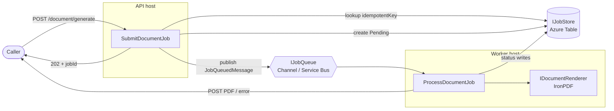
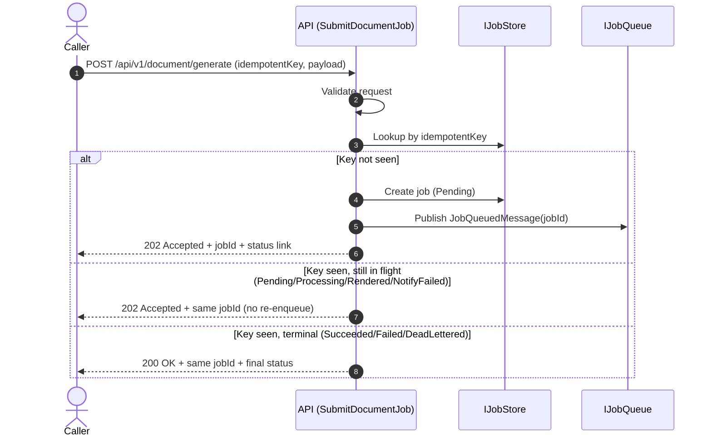
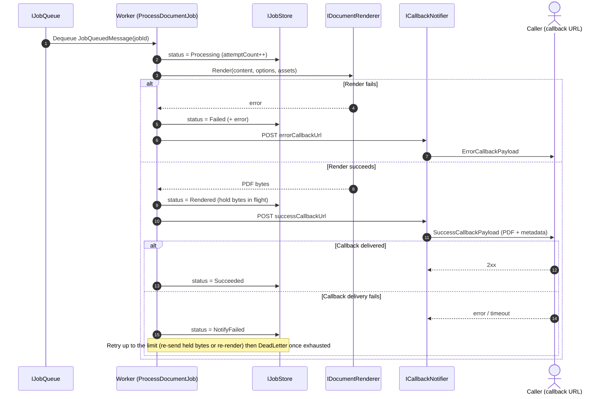
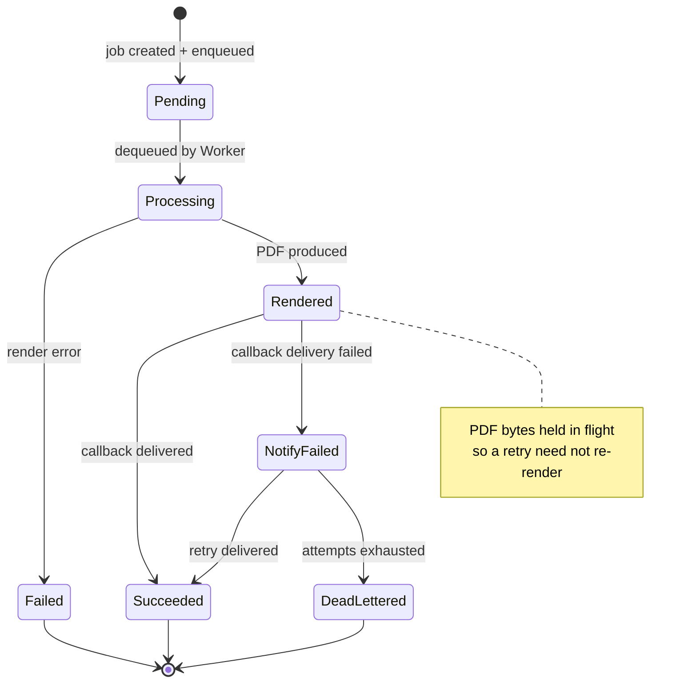
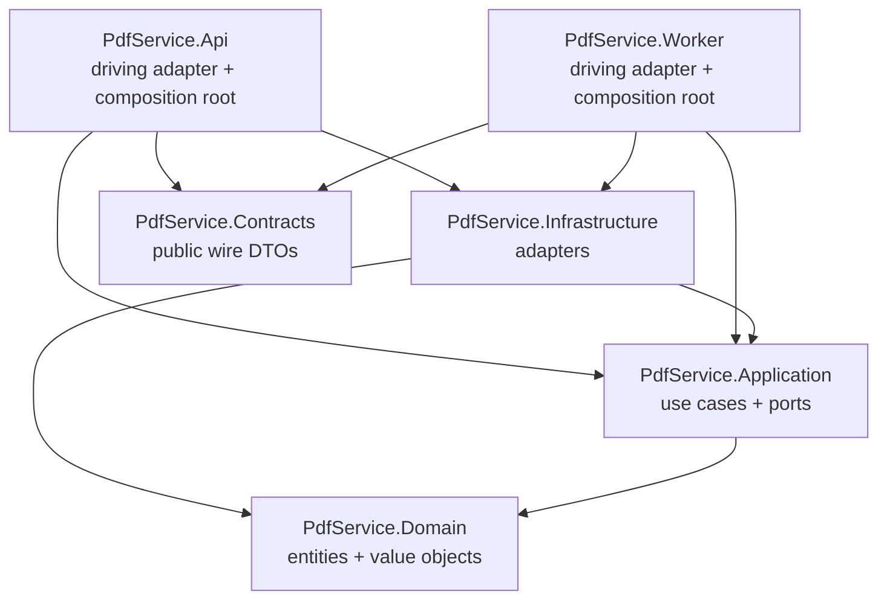

# PDF Generation Service — Process Flow

Mermaid diagrams for the PDF Generation Service. See [pdf-generation-service-design.md](pdf-generation-service-design.md) for the full design.

---

## 1. End-to-end flow (high level)

---

## 2. Submission + idempotency (API)

---

## 3. Processing + callback delivery (Worker)

---

## 4. Job status state machine

---

## 5. Component dependencies (hexagonal)

Arrows point in the direction of the dependency — everything points inward toward `Domain`.

