# APIM as Managed Identity Broker

## Overview

Using APIM as an intermediary that handles token acquisition and backend calls on behalf of the caller. Function A calls APIM with its managed identity token, then APIM uses its own managed identity to call Function B securely.

## Architecture Flow

```mermaid
sequenceDiagram
    participant FA as Function A<br/>(Caller)
    participant EntraID1 as Entra ID<br/>(OAuth)
    participant APIM as APIM<br/>(Broker)
    participant EntraID2 as Entra ID<br/>(OAuth)
    participant FB as Function B<br/>(Server)

    FA->>FA: 1. DefaultAzureCredential()<br/>uses managed identity
    
    FA->>EntraID1: 2. Request token<br/>Scope: https://apim-uri
    
    EntraID1->>EntraID1: 3. Validate Function A<br/>identity
    
    EntraID1->>FA: 4. Return JWT token
    
    FA->>APIM: 5. HTTP request<br/>Authorization: Bearer {token}
    
    APIM->>APIM: 6. Inbound Policy:<br/>validate-jwt<br/>Check token validity
    
    APIM->>APIM: 7. Extract caller identity<br/>from token claims
    
    APIM->>EntraID2: 8. Request token for Function B<br/>Scope: https://functionb-uri<br/>Using APIM's managed identity
    
    EntraID2->>EntraID2: 9. Validate APIM<br/>identity
    
    EntraID2->>APIM: 10. Return JWT token<br/>(APIM's identity)
    
    APIM->>APIM: 11. Backend Policy:<br/>authentication-managed-identity<br/>Inject token in request
    
    APIM->>FB: 12. HTTP request<br/>Authorization: Bearer {APIM-token}
    
    FB->>FB: 13. Validate token<br/>signature & scope
    
    FB->>FB: 14. Check caller identity<br/>(sees APIM as caller)
    
    FB->>APIM: 15. ✅ 200 OK
    
    APIM->>FA: 16. ✅ 200 OK<br/>Response from Function B

    Note over FA,FB: Function A doesn't know about<br/>Function B's identity or URI<br/>APIM is the identity intermediary
```



## Implementation Steps

### 1. Create APIM Instance (if not already)
- Deploy APIM in the same subscription or accessible network
- Assign system-assigned or user-assigned managed identity

### 2. Register Both Functions as Enterprise Applications
- Function A: For APIM to validate tokens from Function A
- Function B: For APIM to acquire tokens for Function B

### 3. Assign Role to APIM's Managed Identity on Function B
- Go to Function B → Enterprise Application
- Users and groups → Assign APIM's managed identity a role (e.g., "api.reader")

### 4. Configure APIM Inbound Policy

Go to APIM → API → All Operations → Inbound Policy:

```xml
<policies>
    <inbound>
        <!-- Validate token from caller (Function A) -->
        <validate-jwt>
            <openid-config url="https://login.microsoftonline.com/{tenant-id}/v2.0/.well-known/openid-configuration" />
            <audiences>
                <audience>{apim-app-id}</audience>
            </audiences>
            <issuers>
                <issuer>https://sts.windows.net/{tenant-id}/</issuer>
            </issuers>
        </validate-jwt>
        
        <!-- Extract caller identity for logging/audit -->
        <set-variable name="caller-appid" value="@(context.Request.Headers.GetValueOrDefault("Authorization", "").Split(' ')[1])" />
        
        <base />
    </inbound>
    <backend>
        <!-- Other backend policies -->
        <base />
    </backend>
    <outbound>
        <base />
    </outbound>
    <on-error>
        <base />
    </on-error>
</policies>
```

### 5. Configure APIM Backend Policy

In the same API policy, Backend section:

```xml
<backend>
    <!-- APIM uses its managed identity to acquire token for Function B -->
    <authentication-managed-identity resource="https://{functionb-uri}" />
    
    <!-- Forward request to Function B -->
    <forward-request />
</backend>
```

### 6. Set Backend URL in APIM

- API → Backend → Add/Edit
- Runtime URL: `https://{functionb-uri}/api/...`
- Managed identity: Enable (uses APIM's managed identity)

### 7. Function A Code

```csharp
using Azure.Identity;
using Azure.Core;

// Function A uses its managed identity to call APIM
var credential = new DefaultAzureCredential();
var token = await credential.GetTokenAsync(
    new TokenRequestContext(new[] { "https://{apim-uri}/.default" })
);

var client = new HttpClient();
client.DefaultRequestHeaders.Authorization = 
    new AuthenticationHeaderValue("Bearer", token.Token);

// Call APIM endpoint (not Function B directly)
var response = await client.GetAsync("https://{apim-uri}/api/function-b-endpoint");
```

### 8. Function B Code (Azure Function)

```csharp
[FunctionName("MySecureFunction")]
public async Task<IActionResult> Run(
    [HttpTrigger(AuthorizationLevel.Anonymous, "get", Route = null)] HttpRequest req,
    ILogger log)
{
    // Token is from APIM's identity
    var caller = req.HttpContext.User.FindFirst("appid")?.Value;
    log.LogInformation($"Request from APIM (on behalf of Function A): {caller}");
    
    // Validate token (APIM's token)
    var roles = req.HttpContext.User.FindAll("roles").Select(c => c.Value);
    if (!roles.Contains("api.reader"))
        return new UnauthorizedResult();
    
    return new OkObjectResult(new { message = "Success" });
}
```

## Key Differences from Direct Call

| Aspect | Direct Call | APIM Broker |
|--------|-------------|------------|
| **Caller knows Backend** | Yes (Function A knows Function B URI) | No (Function A only knows APIM) |
| **Token Validation** | Function B validates caller | APIM validates caller, Function B validates APIM |
| **Identity Chain** | Function A → Function B | Function A → APIM → Function B |
| **APIM Policies** | N/A | Throttling, versioning, logging, transformation |
| **Backend Encapsulation** | Function B exposed to caller | Function B hidden behind APIM |
| **Caller Token** | Scoped to Function B | Scoped to APIM |
| **Backend Token** | N/A | APIM's token, acquired on-behalf |

## Benefits

✅ **Decoupling**: Function A doesn't need to know about Function B's identity or URI  
✅ **API Management**: APIM provides throttling, versioning, logging, transformations  
✅ **Security Layers**: Two levels of authentication (caller→APIM, APIM→backend)  
✅ **Audit Trail**: APIM logs all calls with caller identity  
✅ **Consistent Policies**: All policies enforced at APIM level  
✅ **No Credentials**: Both functions use managed identities  

## Trade-offs

⚠️ **Extra Hop**: Additional network call to APIM  
⚠️ **Token Loss**: Function B sees APIM as caller, not original caller (auditing harder)  
⚠️ **APIM Cost**: Additional infrastructure and operational overhead  
⚠️ **Complexity**: More moving parts (policies, role assignments)  

## When to Use

- ✅ Need API management features (throttling, versioning, transformations)
- ✅ Want to hide backend implementation details
- ✅ Need consistent security policies across multiple backends
- ✅ Require audit trail at API gateway level
- ❌ Simple point-to-point communication (use direct call instead)
- ❌ High-latency sensitive workloads (extra hop adds latency)

## Comparison: Direct vs APIM Broker

**Choose Direct** if:
- Simple service-to-service communication
- No need for API management
- Function A can know about Function B

**Choose APIM** if:
- Need API gateway features
- Want backend encapsulation
- Multiple callers calling same backend
- Need consistent policies and logging
