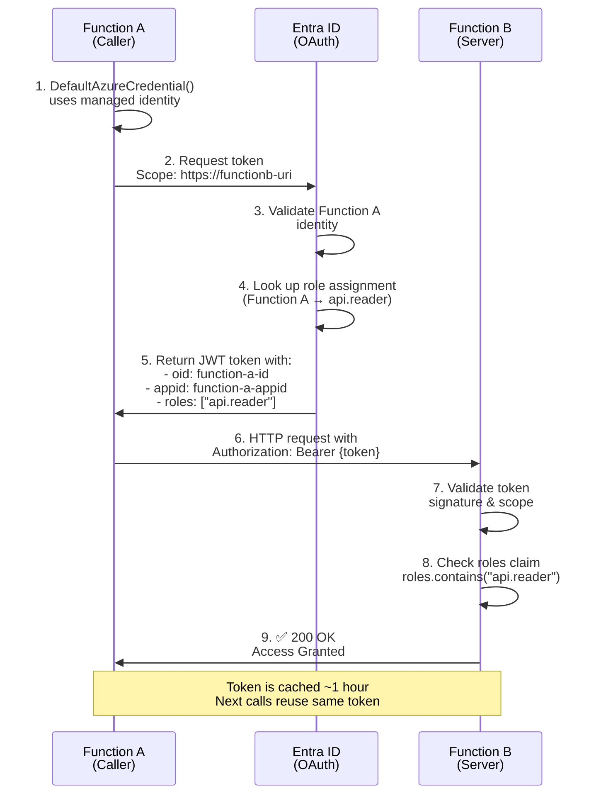

# Managed Identity Service-to-Service Communication

## Overview

Secure communication between Azure Functions using managed identities and Entra ID without storing credentials or secrets.

## Architecture Flow



## Implementation Steps

### 1. Register Function B as Enterprise Application (if not already)

- Function B needs an Entra ID registration
- Define App Roles in the manifest (e.g., "api.reader", "api.writer")

### 2. Assign Managed Identity to Function A

- System-assigned or User-assigned managed identity

### 3. Configure Role Assignment in Azure Portal

- Go to Function B → Enterprise Application
- Users and groups → Assign role to Function A's managed identity
- Select the appropriate role (e.g., "api.reader")

### 4. Function A Code

```csharp
using Azure.Identity;
using Azure.Core;

var credential = new DefaultAzureCredential();
var token = await credential.GetTokenAsync(
    new TokenRequestContext(new[] { "https://{functionb-uri}/.default" })
);

var client = new HttpClient();
client.DefaultRequestHeaders.Authorization =
    new AuthenticationHeaderValue("Bearer", token.Token);

var response = await client.GetAsync("https://{functionb-uri}/api/endpoint");
```

### 5. Function B Code (Azure Function)

```csharp
[FunctionName("MySecureFunction")]
public async Task<IActionResult> Run(
    [HttpTrigger(AuthorizationLevel.Anonymous, "get", Route = null)] HttpRequest req,
    ILogger log)
{
    // Entra ID validates token automatically
    var identity = req.HttpContext.User.Identity as ClaimsIdentity;

    // Check roles
    var roles = req.HttpContext.User.FindAll("roles").Select(c => c.Value);
    if (!roles.Contains("api.reader"))
        return new UnauthorizedResult();

    var functionAId = req.HttpContext.User.FindFirst("appid")?.Value;
    log.LogInformation($"Authorized call from {functionAId}");

    return new OkObjectResult(new { message = "Success" });
}
```

## Key Benefits

| Aspect         | Benefit                                            |
| -------------- | -------------------------------------------------- |
| **No Secrets** | Managed identity handles credentials automatically |
| **No Config**  | Role assignment done in portal, not in code        |
| **Secure**     | JWT token from Entra ID, role-based access control |
| **Scalable**   | Works across subscriptions and tenants             |
| **Auditable**  | All calls logged with caller identity              |

## Security Properties

✅ **Authentication**: Token proves Function A's identity  
✅ **Authorization**: Role claim controls access  
✅ **No Token Sharing**: Each function gets its own token  
✅ **Expiration**: Tokens have short TTL (~1 hour)  
✅ **Credential-less**: No secrets stored anywhere
